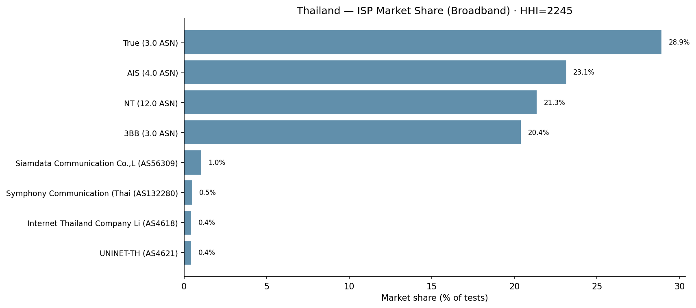

# งานที่เกี่ยวข้อง และวิธีวิเคราะห์ข้อมูล

เอกสารนี้แยกออกมาจาก `results_th.md` ซึ่งเก็บเฉพาะผลลัพธ์
ตรงนี้เป็นสองส่วนที่อยู่หน้าผลลัพธ์ในเปเปอร์ คือ **งานที่เกี่ยวข้อง** กับ **วิธีวิเคราะห์ข้อมูล**

ข้อมูลเป็น 9 ประเทศ ไทย เวียดนาม ฟิลิปปินส์ สิงคโปร์ อินโดนีเซีย มาเลเซีย กัมพูชา เมียนมา ลาว
ช่วงเวลา Q1/2023 ถึง Q4/2025 รวม 12 ไตรมาส

> **08-14: กลับมาเป็น 9 ประเทศแล้ว** เอกสารรุ่นก่อนหน้า (13 ส.ค.) ตัดสิงคโปร์ออกเพราะ RQ4 ขาดข้อมูล ASN
> แต่นั่นเป็นข้อจำกัดเฉพาะ RQ4 ไม่ใช่เหตุผลที่จะตัดทั้งประเทศออกจาก RQ1–RQ3 น้องกำลังตาม ASN ของสิงคโปร์อยู่
> ระหว่างนี้สิงคโปร์เข้าทุกส่วนยกเว้น RQ4 (ดูหัวข้อ 2.3)

---

# ส่วนที่ 1 งานที่เกี่ยวข้อง

งานวัดคุณภาพเน็ตระดับประเทศมีเยอะ แต่งานที่ถามว่าตัวเลขที่วัดได้นั้นเชื่อได้แค่ไหนมีน้อยกว่ามาก
งานนี้ยืนอยู่บนสี่กลุ่มด้านล่าง

## 1.1 การเทียบระหว่างแพลตฟอร์มวัดผล

MacMillan และคณะ เอา Ookla Speedtest ไปเทียบกับ NDT7 ของ M-Lab แล้วพบว่า NDT7 รายงานความเร็วต่ำกว่า Ookla อยู่ 12 ถึง 56% แล้วแต่เงื่อนไข

สาเหตุไม่ใช่ความบังเอิญ แต่มาจากการออกแบบของสองระบบที่ต่างกันตั้งแต่ต้น Ookla เป็นการทดสอบที่ผู้ใช้กดเอง ยิงไปที่เซิร์ฟเวอร์ใกล้ที่สุด ส่วน NDT7 เป็นการส่ง TCP สายเดียวไปยังเซิร์ฟเวอร์ที่มีจำนวนน้อยกว่ามาก

ข้อสรุปที่ได้จากงานนั้นคือ **เอาตัวเลขสองแหล่งมารวมกันตรงๆ ไม่ได้** แต่ยังเอา**อันดับ**มาเทียบกันได้ ซึ่งเป็นวิธีที่งานนี้ใช้ คือไม่เคยเอาค่าจากสองแหล่งมาบวกกัน แต่ดูว่าจัดอันดับประเทศออกมาแล้วตรงกันไหม

## 1.2 เกณฑ์ความต้องการของแอปพลิเคชัน — งานที่ใกล้กับงานนี้ที่สุด

ตัวเลขความเร็วดิบๆ ตีความยาก ถ้าบอกว่า 60 Mbps ก็ยังตอบไม่ได้อยู่ดีว่าดีหรือไม่ดี จะเทียบเป็นเปอร์เซ็นไทล์กับประเทศอื่นก็แค่ย้ายปัญหาไปอีกที่

Lübben กับ Misfeld แก้ด้วยการเปลี่ยนคำถาม แทนที่จะถามว่าเร็วพอไหม เขาไปรวบรวมว่าแอปแต่ละประเภทต้องการความเร็วกับความหน่วงเท่าไหร่ แล้ววัดว่าผ่านหรือไม่ผ่าน คำถาม "60 Mbps ดีไหม" เลยกลายเป็น "60 Mbps ใช้ทำอะไรได้บ้าง" ซึ่งตอบได้ งานนี้เอาตาราง 5 ของเขามาใช้เป็นเกณฑ์ของ RQ1 ตรงๆ

แต่งานของเขาไม่ได้เป็นแค่แหล่งตัวเลข มันเป็นงานที่ศึกษาเน็ตเยอรมนีบนชุดข้อมูล M-Lab NDT ตัวเดียวกับที่งานนี้ใช้ และยังให้วิธีของ RQ3 มาด้วย หัวข้อ 4.2 ของเขาหาชั่วโมงเร่งด่วนจากปริมาณการทดสอบก่อน แล้วค่อยถามว่าความเร็วตกในชั่วโมงนั้นไหม รวมถึงวิธีแยกทราฟฟิกจากบอตออกจากทราฟฟิกคนจริง งานนี้ใช้วิธีเดียวกันทั้งชุด

พูดอีกแบบคือ **งานนี้คือการต่อยอดงานของเขาไปสามทิศ** จากประเทศเดียวเป็นเก้าประเทศ จากแหล่งข้อมูลเดียวเป็นสองแหล่งที่เอามาเทียบความไม่ตรงกันได้ และจากระดับประเทศลงไปถึงระดับจังหวัดกับโครงสร้างตลาดผู้ให้บริการ ซึ่งงานเดิมไม่ได้แตะ

## 1.3 ความเหลื่อมล้ำภายในประเทศ

งานกลุ่มนี้พบตรงกันมานานว่าค่าเฉลี่ยระดับประเทศกลบความต่างภายในประเทศไว้ และการลงทุนโครงสร้างพื้นฐานมักจะกระจุกที่เมืองหลวงก่อน

ตรงนี้เป็นเหตุผลที่งานนี้แยกเมืองหลวงออกจากส่วนที่เหลือใน RQ1 แต่พอแยกจริงกลับได้ผลที่ไม่ตรงกับที่คาด เมียนมาเป็นประเทศที่เมืองหลวงไม่ได้นำ สิงคโปร์ก็เช่นกันแต่ด้วยเหตุผลตรงข้าม เป็นนครรัฐที่ไม่มี periphery ให้เทียบ ทั้งสองกรณีเป็นข้อมูลที่มีค่ามากกว่าการยืนยันสิ่งที่รู้อยู่แล้ว

## 1.4 การกระจุกตัวของตลาด

เรื่องการกระจุกตัวของตลาดโทรคมนาคมมีคนศึกษาเยอะ แต่ส่วนใหญ่วัดผลออกมาเป็นราคาหรือเม็ดเงินลงทุน คนเชื่อมมันเข้ากับคุณภาพเน็ตที่วัดได้จริงน้อยกว่ามาก และเท่าที่ตรวจสอบ ยังไม่มีใครเอามาอธิบายช่องว่างระหว่างค่าเฉลี่ยประเทศกับความรู้สึกของผู้ใช้

RQ4 ของงานนี้เชื่อสองอย่างนั้นเข้าหากัน ตรรกะคือถ้าค่ายที่ครองตลาดเป็นค่ายที่ช้ากว่า ค่าเฉลี่ยประเทศที่ถ่วงน้ำหนักด้วยจำนวนครั้งที่ทดสอบจะกลายเป็นตัวเลขที่อธิบายเน็ตที่ดีของตลาด ไม่ใช่เน็ตที่คนส่วนใหญ่ใช้จริง

จุดที่สำคัญคือค่าเฉลี่ยที่ Ookla ประกาศเองก็ถ่วงน้ำหนักแบบนี้ **อคติตัวนี้เลยฝังอยู่ในตัวเลขที่ฝ่ายนโยบายหยิบไปอ้างอิง**

## 1.5 สรุปว่าเอาอะไรมาจากใคร

| เอามาจาก | เอาอะไรมา | ใช้ตรงไหน |
|---|---|---|
| Lübben & Misfeld | ตารางเกณฑ์แอปพลิเคชัน | RQ1 |
| Lübben & Misfeld | วิธีหาชั่วโมงเร่งด่วน | RQ3 |
| MacMillan และคณะ | เหตุผลที่ต้องเทียบเป็นอันดับ ไม่ใช่ค่าดิบ | ส่วนตรวจสอบข้ามแหล่ง |
| งานความเหลื่อมล้ำภายในประเทศ | เหตุผลที่ต้องแยกเมืองหลวง | RQ1 |
| งานการกระจุกตัวของตลาด | กลไกที่เอามาทดสอบ | RQ4 |

---

# ส่วนที่ 2 การวิเคราะห์ข้อมูล

## 2.1 ข้อมูลที่ใช้

### Ookla Open Data

ให้ข้อมูลรายไตรมาสทั้ง fixed broadband และมือถือ เป็นรูปแบบ tile ขนาดประมาณ 610 × 610 เมตร (Quadkey zoom 16) แต่ละ tile มีความเร็วดาวน์โหลด อัปโหลด ความหน่วง และจำนวนครั้งที่ทดสอบของ tile นั้น ครบ 12 ไตรมาส ทุกประเทศ ทั้งสองประเภท สัญญาอนุญาตเป็น CC BY-NC-SA 4.0

มีเรื่องที่ต้องบันทึกไว้ ไปป์ไลน์รุ่นก่อนทำ 2025-Q3 หายไปจากไฟล์ส่งออกทุกไฟล์ ทั้งที่ไตรมาสนั้นมีอยู่ในข้อมูลดิบของ Ookla ตอนนี้สร้างใหม่แล้วและได้ไตรมาสนั้นกลับมา ตัวเลขทุกตัวในเปเปอร์เป็นตัวเลขหลังแก้

### M-Lab NDT7

ให้ข้อมูลระดับรายครั้งที่ทดสอบ ในช่วงเวลาเดียวกัน สิ่งที่ NDT7 มีแล้ว Ookla ไม่มีคือ **เวลาที่ทดสอบ** กับ **ผู้ให้บริการ** ซึ่งข้อมูลแบบ tile ของ Ookla ทิ้งไปตอนรวมยอด สองอย่างนี้คือเหตุผลที่ RQ3 กับ RQ4 เกิดขึ้นได้เลย

NDT7 ไม่ได้แยกว่าเป็น fixed หรือมือถือมาให้ ต้องแยกเองด้วยการเอา IP ของผู้ทดสอบไปเทียบกับ flag `mobile` ของ ip-api ทีละช่วง IP

ตรงนี้มีรายละเอียดที่ต้องบอก การเรียกข้อมูล ip-api ของทุกประเทศทำภายในหน้าต่างเวลาเดียวยาว 11.49 ชั่วโมง เพื่อให้ป้ายกำกับทั้งชุดเป็นภาพ ณ เวลาเดียวกัน ของเดิมทำกระจายกัน 12 วัน ซึ่งเอามาเทียบข้ามประเทศไม่ได้

### ข้อมูลอ้างอิง

ประชากร ความหนาแน่น และ GDP ต่อหัวรายจังหวัด มาจากสำนักงานสถิติของแต่ละประเทศถ้ามีข้อมูลระดับจังหวัด เช่นมาเลเซีย ส่วนประเทศที่ไม่มีก็ใช้ตัวเลขระดับประเทศของธนาคารโลกแทน กัมพูชาเป็นกรณีนี้ สำนักงานสถิติแห่งชาติของกัมพูชาไม่เผยแพร่ GRDP รายจังหวัด เลยต้องใช้ค่าระดับประเทศค่าเดียวซ้ำทุกจังหวัด

ขอบเขตจังหวัดใช้ geoBoundaries ADM1 ยกเว้นไทยที่ใช้ชั้นข้อมูล 77 จังหวัดของไทยเอง มีสามจุดที่ขอบเขตทำให้ผลเพี้ยนได้ ต้องรู้ไว้

- geoBoundaries รวมเนปยีดอเข้ากับภูมิภาคมัณฑะเลย์ เมียนมาเลยไม่มีจังหวัดเมืองหลวงแยกออกมา งานนี้ใช้ย่างกุ้งแทน
- GADM 4.1 ใช้ขอบเขตปี 2022 อินโดนีเซียเลยได้ 34 จังหวัด ไม่ใช่ 38 จังหวัดแบบปัจจุบัน
- สิงคโปร์ไม่มีจังหวัดเมืองหลวงเหมือนกัน ใช้เขต Central Region เป็นตัวแทน central-business-district แทน

### ตารางที่ 1 ปริมาณข้อมูล

Ookla เป็นผลรวมจำนวนครั้งที่ทดสอบ NDT7 เป็นจำนวนแถวก่อนกรอง ส่วน "จังหวัด-ไตรมาสที่ใช้ได้" คือจำนวนที่ผ่านเกณฑ์ในหัวข้อ 2.2

| ประเทศ | จำนวนจังหวัด | Ookla fixed | Ookla มือถือ | NDT7 แถว | จังหวัด-ไตรมาสที่ใช้ได้ | อยู่ใน RQ4 |
|---|---|---|---|---|---|---|
| อินโดนีเซีย | 34 | 54.2M | 20.1M | 367.2M | 402 | ใช่ |
| ฟิลิปปินส์ | 17 (ดิบ 80) | 48.8M | 7.1M | 262.1M | 204 | ใช่ |
| เวียดนาม | 63–64 | 25.9M | 3.5M | 24.7M | 698 | ใช่ |
| ไทย | 77 | 20.8M | 10.5M | 60.2M | 872 | ใช่ |
| มาเลเซีย | 16 | 15.7M | 11.8M | 6.6M | 165 | ใช่ |
| สิงคโปร์ | 5 เขต | 4.5M | 0.9M | 36.1M | 52 | **ยัง — ขาด ASN** |
| กัมพูชา | 22–25 | 2.4M | 0.5M | 0.77M | 33 | ใช่ |
| เมียนมา | 14 | 1.75M | 0.25M | 2.12M | 76 | ใช่ |
| ลาว | 14–18 | 0.37M | 0.50M | 0.14M | 37 | ใช่ |

**ข้อจำกัดที่ใหญ่ที่สุดอยู่ในตารางนี้** ขนาดตัวอย่างของ NDT7 ไม่เท่ากันเลย กัมพูชากับลาวมีแค่ 33 กับ 37 จังหวัด-ไตรมาส เทียบกับไทยที่มี 872 ตัวเลขทุกตัวที่มาจาก NDT7 ต้องอ่านโดยนึกถึงข้อนี้ไว้เสมอ

ช่วงจำนวนจังหวัดที่เขียนเป็นสองตัวเลข เกิดจากบางจังหวัดไม่มีการทดสอบ NDT7 เลย เลยหายไปเฉพาะฝั่ง NDT7

สิงคโปร์เป็นประเทศเดียวที่ยังไม่เข้า RQ4 พาร์เกอร์ IP ของ NDT7 ฝั่งสิงคโปร์มีคอลัมน์ `isp` แต่ไม่มี `asn` / `as_name` / `operator` เหมือนประเทศอื่น ซึ่ง RQ4 ต้องจัดกลุ่มด้วย ASN เท่านั้น (เหตุผลอยู่ในหัวข้อ 2.3) น้องกำลังดึง ASN ต่อ IP ของ 433,000 IP ในชุดสิงคโปร์อยู่ ระหว่างรอ สิงคโปร์เข้าทุกส่วนอื่นตามปกติ

## 2.2 การรวมยอดและการกรองข้อมูล

### รวมจาก tile ขึ้นเป็นจังหวัด

tile ของ Ookla ถูกจับเข้าจังหวัดด้วยการดูว่าจุดกึ่งกลางของ tile ตกในเขตไหน แล้วรวมขึ้นเป็นจังหวัด-ไตรมาส โดยถ่วงน้ำหนักด้วยจำนวนครั้งที่ทดสอบของ tile นั้นเอง

```
ค่าของจังหวัด = Σ(ค่าเฉลี่ยของ tile × จำนวนทดสอบของ tile) / Σ(จำนวนทดสอบของ tile)
```

การถ่วงน้ำหนักตรงนี้จำเป็น ไม่ใช่ทางเลือก เพราะจำนวนครั้งที่ทดสอบของแต่ละ tile ต่างกันเป็นหลักสิบเท่าร้อยเท่า ถ้าเฉลี่ยแบบไม่ถ่วงน้ำหนัก tile ชนบทที่มีคนทดสอบไม่กี่ครั้งจะมีน้ำหนักเท่ากับ tile ในเมืองที่มีคนทดสอบเป็นหมื่น

ฝั่ง NDT7 รวมจากข้อมูลรายครั้งขึ้นมาตรงๆ ได้เลย ตรงนี้ตรวจสอบแล้วว่าให้ผลเท่ากับการรวมสองขั้นผ่าน tile ทดสอบกับมาเลเซียแล้วตรงกันถึงทศนิยม 12 ตำแหน่ง

### ความหน่วงต้องมีขั้นตอนพิเศษหนึ่งขั้น

NDT7 มีค่า round-trip time ที่เป็นค่าหลอกอยู่ คือ 4,294,967 มิลลิวินาที ซึ่งก็คือ 2³²/1000 ขั้นตอนทำความสะอาดข้อมูลเดิมกรองแค่ค่าติดลบเลยปล่อยค่าพวกนี้ผ่านมา

ผลคือแถวแบบนี้แค่ 21 แถว ดันค่าความหน่วงเฉลี่ยของเวียงจันทน์จาก 116 เป็น 539 มิลลิวินาที

วิธีแก้คือตัดแถวที่ `min_rtt ≥ 2000 ms` ทิ้ง ไม่ใช่ปรับค่าให้เท่ากับ 2000 และทำเหมือนกันหมดทุกประเทศ

**Ookla ไม่มีขั้นตอนนี้** สองแหล่งเลยไม่สมมาตรกันตรงจุดนี้ ซึ่งบันทึกไว้ตรงๆ ดีกว่าปล่อยผ่าน

### เกณฑ์คัดว่าจังหวัด-ไตรมาสไหนใช้ได้

ทุกจังหวัด-ไตรมาสต้องผ่านเกณฑ์ด้านล่างก่อน ถึงจะเอาไปคำนวณอะไรได้

| แหล่ง | เกณฑ์ |
|---|---|
| Ookla | ทดสอบรวม ≥ 100 ครั้ง **และ** มี tile ≥ 5 |
| NDT7 | ทดสอบรวม ≥ 100 ครั้ง อย่างเดียว |

ที่ไม่เท่ากันเป็นความตั้งใจ พิกัดของ NDT7 มาจากจุดกึ่งกลางเมืองของ MaxMind การทดสอบทุกครั้งในเมืองเดียวกันเลยยุบลงมาอยู่ tile เดียวกันหมด ตัวนับ tile ของ NDT7 จึงนับ "จำนวนเมืองใน MaxMind" ไม่ได้นับการกระจายตัวเชิงพื้นที่จริง

ลาวเห็นภาพชัดสุด มีข้อมูล 139,693 แถว แต่กระจุกอยู่แค่ 33 พิกัด และทั้งประเทศมีค่า tile สูงสุดแค่ 3 เกณฑ์ ≥5 เลยเป็นเกณฑ์ที่ผ่านไม่ได้โดยหลักการ ไม่ใช่ผ่านไม่ได้เพราะข้อมูลน้อย

ถ้าเอาเกณฑ์ของ Ookla มาใช้กับ NDT7 ทั้งดุ้น ลาวกับกัมพูชาจะเหลือศูนย์ทั้งประเทศ ส่วนไทยจะเหลือ 564 จาก 1,225 จังหวัด-ไตรมาส

อีกอย่างที่งานลักษณะนี้มักไม่บอก แต่ควรบอก **ฝั่ง Ookla เกณฑ์นี้ไม่ได้ตัดอะไรออกเลย** เข้าไป 3,222 จังหวัด-ไตรมาส ผ่านออกมา 3,222 เท่าเดิม ทั้ง fixed และมือถือ

พูดง่ายๆ คือเกณฑ์นี้เป็นข้อจำกัดจริงกับ NDT7 แต่เป็นแค่พิธีกรรมกับ Ookla งานนี้เลยอ้างมันเฉพาะตอนที่มันมีผลจริง

## 2.3 วิธีวิเคราะห์แต่ละคำถามวิจัย

### RQ1 ผ่านเกณฑ์การใช้งานไหม

ดูสี่เกณฑ์ต่อหนึ่งจังหวัด-ไตรมาส เอามาจากตาราง 5 ของ Lübben กับ Misfeld และตรวจสอบกับตัวเปเปอร์จริงแล้ว

ตารางของเขาเป็นการรวบรวมจากหลายแหล่ง ซึ่งน้ำหนักไม่เท่ากัน ตรงนี้สำคัญเพราะมันกำหนดว่าข้อสรุปแต่ละอันแบกน้ำหนักได้แค่ไหน

| แอปพลิเคชัน | เกณฑ์ | แหล่งที่มา | น้ำหนัก |
|---|---|---|---|
| เสียง | ≤ 200 ms | ITU-T G.114 | มาตรฐานสากล |
| วิดีโอ HD | ≥ 5 Mbps | คำแนะนำของ Netflix | คำแนะนำผู้ให้บริการ |
| วิดีโอ UHD | ≥ 25 Mbps | คำแนะนำของ Netflix | คำแนะนำผู้ให้บริการ และแก้ไปแล้ว |
| Cloud gaming | ≥ 44 Mbps **และ** ≤ 25 ms | Di Domenico และคณะ (2021); Flinck Lindström และคณะ (2020) | ผ่านการตรวจทานทางวิชาการ |

อัตราผ่านของประเทศคือสัดส่วนจังหวัด-ไตรมาสที่ผ่านเกณฑ์ ถ่วงน้ำหนักด้วยจำนวนครั้งที่ทดสอบ ตัวเลขที่ได้เลยสะท้อนผู้ใช้ที่วัดได้จริง ไม่ใช่สะท้อนหน่วยการปกครอง

เกณฑ์เสียงใช้เฉพาะเงื่อนไขความหน่วง ส่วนเงื่อนไข 64 kbps ไม่ได้ใช้ เพราะทุกจังหวัด-ไตรมาสผ่านเกินไปหลักพันเท่า

#### ข้อควรระวัง เกณฑ์ที่มาจาก Netflix ไม่นิ่ง

คำแนะนำของผู้ให้บริการเปลี่ยนตาม codec ที่ดีขึ้น และ **ตอนนี้ Netflix ประกาศ UHD ที่ 15 Mbps ไม่ใช่ 25 Mbps แบบตอนที่ตารางนั้นถูกรวบรวม**

ตารางที่ 2 อัตราผ่าน UHD ที่เกณฑ์ต่างๆ ประเทศที่ไม่อยู่ในตารางผ่าน 100% ทุกเกณฑ์

| ประเทศ | ≥15 | ≥20 | ≥25 |
|---|---|---|---|
| เมียนมา | 98.5 | 82.0 | **22.1** |
| อินโดนีเซีย | 100.0 | 97.7 | **88.1** |
| กัมพูชา | 100.0 | 99.8 | 97.6 |
| ลาว | 100.0 | 100.0 | 99.4 |

ดูตารางนี้แล้วจะเห็นว่า **UHD แบกข้อสรุปเองไม่ได้** ถ้าใช้ตัวเลขปัจจุบันของ Netflix ปัญหาของเมียนมากับอินโดนีเซียหายไปเลย

งานนี้เลยคงเกณฑ์ 25 Mbps ไว้เพื่อให้เทียบกับผลของเยอรมนีได้ แต่ปฏิบัติกับ UHD เป็นแค่เส้นแบ่งเชิงพรรณนา แล้วให้ **cloud gaming เป็นตัวแบก RQ1 แทน** ด้วยเหตุผลสามข้อ เกณฑ์ทั้งสองด้านผ่านการตรวจทานทางวิชาการ เป็นเกณฑ์เดียวที่บังคับทั้งความเร็วขั้นต่ำและเพดานความหน่วงพร้อมกัน และเป็นเกณฑ์เดียวที่แยกประเทศออกจากกันได้จริง

#### ค่าความหน่วงของ cloud gaming ใช้ Ookla อย่างเดียว

เกณฑ์ cloud gaming ต้องการความหน่วงไม่เกิน 25 มิลลิวินาที ซึ่ง **วัดด้วย NDT7 ไม่ได้** สำหรับประเทศส่วนใหญ่ในชุดนี้

เหตุผลอยู่ที่ตำแหน่งเซิร์ฟเวอร์ การทดสอบ NDT7 ของไทย 52.9% วิ่งไปเซิร์ฟเวอร์ `sin01` ที่สิงคโปร์เอง และไม่มี `bkk01` ติด 10 อันดับแรกเลย มาเลเซีย 68.0% กับกัมพูชา 66.2% ก็ไปสิงคโปร์เหมือนกัน ลาว 58.3% กับเวียดนาม 47.4% ไปฮ่องกง เมียนมาไปเจนไนรวม 62.2%

ระยะทางไปสิงคโปร์อย่างเดียว คิดที่ความเร็วแสงก็กินไปราว 20 มิลลิวินาทีแล้ว เพดาน 25 มิลลิวินาทีเลยเป็นสิ่งที่วัดไม่ได้ในทางกายภาพสำหรับประเทศที่ทดสอบวิ่งข้ามพรมแดน สิ่งที่วัดได้จริงในกรณีนั้นคือระยะทางไปสิงคโปร์หรือฮ่องกง ไม่ใช่คุณภาพเน็ตในประเทศ สิงคโปร์เองไม่ติดปัญหานี้ เพราะการทดสอบวิ่งเข้า `sin01` ซึ่งอยู่ในประเทศตัวเอง — เป็นจุดที่ทำให้สิงคโปร์กลายเป็นกรณีอ้างอิงอีกกรณีไปโดยปริยาย เหมือนฟิลิปปินส์

Ookla ไม่มีปัญหานี้เพราะเลือกเซิร์ฟเวอร์ตามความใกล้ **ค่าความหน่วงทุกค่าที่ใช้ในเกณฑ์ cloud gaming จึงมาจาก Ookla ล้วน**

ฟิลิปปินส์เป็นข้อยกเว้นที่มีประโยชน์ เป็นประเทศเดียวที่การทดสอบ 94.6% วิ่งเข้าเซิร์ฟเวอร์ในประเทศตัวเอง (mnl01 กับ mnl02) เลยใช้เป็นกรณีควบคุมได้

### RQ2 การเติบโต

คิดเป็นการเปลี่ยนแปลงเป็นเปอร์เซ็นต์ของ **ค่ามัธยฐานของความเร็วดาวน์โหลดรายจังหวัด** จาก 2023-Q1 ถึง 2025-Q4

ที่ใช้มัธยฐานข้ามจังหวัด ไม่ใช่ค่าเฉลี่ยถ่วงน้ำหนักด้วยจำนวนทดสอบ เพราะถ้าถ่วงน้ำหนัก เมืองหลวงจะครอบงำตัวเลข แล้ว RQ2 จะปนกับคำถามเชิงพื้นที่ของ RQ1

### RQ3 ชั่วโมงเร่งด่วน

หาชั่วโมงเร่งด่วนจากปริมาณการทดสอบก่อน แล้วค่อยถามว่าความเร็วตกในชั่วโมงนั้นไหม ตามวิธีของ Lübben กับ Misfeld

มีสองวิธีนับที่ให้ตัวเลขไม่เท่ากัน ต้องแยกให้ชัด

| วิธี | นิยาม | ใช้ที่ไหน |
|---|---|---|
| ชั่วโมงของแต่ละประเทศเอง | เอาชั่วโมงเร่งด่วนจริงของประเทศนั้นหารด้วยชั่วโมงเงียบของประเทศนั้น | รูปประกอบ |
| หน้าต่างเวลาคงที่ | 19–22 น. เทียบกับ 03–05 น. เหมือนกันหมดทุกประเทศ | **ตารางในเปเปอร์** |

ตัวที่ใช้อ้างอิงในเปเปอร์คือแบบหน้าต่างคงที่ เพราะเทียบข้ามประเทศได้ตรงกว่า เช่นเมียนมา วิธีแรกได้ 0.18 วิธีที่สองได้ 0.262

**สิ่งที่ RQ3 วัดคืออัตราส่วน ไม่ใช่ค่าสัมบูรณ์** ตรงนี้สำคัญ เพราะเป็นเหตุผลที่ RQ3 ยังใช้ NDT7 ได้ทั้งที่เซิร์ฟเวอร์อยู่นอกประเทศ ชั่วโมงเร่งด่วนกับชั่วโมงเงียบวิ่งผ่านเส้นทางเดียวกัน ส่วนที่เป็นระยะทางคงที่เลยหักล้างกันไปตอนหาร แต่ **ค่า RTT สัมบูรณ์ใน RQ3 อ่านเป็นความหน่วงในประเทศไม่ได้** ต้องอ่านเป็นการเปลี่ยนแปลงเทียบตัวเองเท่านั้น

**เมืองหลวงเทียบกับส่วนที่เหลือ** เดิมทำแค่ 5 ประเทศใหญ่ (ไทย เวียดนาม ฟิลิปปินส์ อินโดนีเซีย มาเลเซีย) เพราะเข้าใจผิดว่าเมืองหลวงของกัมพูชา ลาว เมียนมามีข้อมูลไม่พอ ตรวจกับข้อมูลดิบแล้วไม่จริง — พนมเปญ 70.8%, เวียงจันทน์ 65.1%, ย่างกุ้ง 48.3% ของการทดสอบทั้งประเทศ ข้อมูลหนาพอทั้งสามที่ ตอนนี้เลยครบ 8 ประเทศ (ไม่รวมสิงคโปร์ ซึ่งไม่มี periphery ให้เทียบตามที่บอกไว้ในหัวข้อ 1.3)

### RQ4 โครงสร้างตลาด

**จัดกลุ่มผู้ให้บริการด้วย ASN เท่านั้น ไม่ใช้ชื่อ** ข้อนี้ไม่ใช่ความพิถีพิถันเกินเหตุ การจัดกลุ่มด้วยชื่อพังจริงในข้อมูลชุดนี้

- ip-api คืนชื่อ**องค์กรลูกค้า**สำหรับช่วง IP ที่เป็นสายเช่า AS4750 เลขเดียวเลยมีสตริงชื่อ "ผู้ให้บริการ" ถึง 420 ชื่อ รวมถึงชื่อแบบ `dermatology` กับ `waterflow`
- ชื่อของ AS เองก็เชื่อไม่ได้ AS9534 ถูกรายงานว่าเป็น "Binariang Berhad" แต่จริงๆ คือ Maxis

ป้ายชื่อแบรนด์ที่แสดงในผลลัพธ์เลยต้องพ่วง ASN ไว้เสมอ เพราะแบรนด์เดียวถือหลาย ASN ได้ ของไทยเช่น True ถือ 2, AIS ถือ 3, NT ถือ 3, 3BB ถือ 2

นิยามที่ใช้

| ตัวชี้วัด | นิยาม |
|---|---|
| การกระจุกตัว | HHI คำนวณจากส่วนแบ่งของ ASN ในจำนวนครั้งที่ทดสอบ นับเฉพาะ ASN ที่มีชื่อ |
| ค่ายใหญ่ | ผู้ให้บริการที่ถือ ≥ 5% ของการทดสอบในประเทศ-ประเภทนั้น |
| ช่องว่างในประเทศ | อัตราส่วนความเร็วดาวน์โหลดระหว่างค่ายใหญ่ที่เร็วสุดกับช้าสุด |

**ไม่รวมค่ายที่ควบรวมกันเข้าด้วยกัน** (dtac/True ปี 2023, 3BB/AIS ปี 2023, Celcom/Digi ปี 2022) เหตุผลตรงไปตรงมา รวมทีหลังยังทำได้ แต่แยกกลับทำไม่ได้

**สิงคโปร์ยังไม่เข้า RQ4 ตอนนี้** ไฟล์ NDT7 ของสิงคโปร์มี `isp` แต่ไม่มี `asn` / `as_name` / `operator` เหมือนอีกแปดประเทศ ที่ผ่านมามีคนลองจัดกลุ่มด้วยชื่อ `isp` ตรงๆ แต่พังตามเหตุผลด้านบน — AS4750 เลขเดียวมี 420 ชื่อ ดังนั้นชื่อ `isp` ของสิงคโปร์เชื่อไม่ได้เช่นกัน ต้องรอ ASN ต่อ IP มาก่อน ระหว่างรอ สถิติภาพรวมของ RQ4 คำนวณจากแปดประเทศที่เหลือ ไม่ใช่เก้า

## 2.4 การทดสอบทางสถิติ

ความต่างระหว่างประเทศทดสอบด้วย Kruskal-Wallis ก่อนเพื่อดูภาพรวม แล้วตามด้วย Mann-Whitney รายคู่ที่แก้ค่า p ด้วยวิธี Holm

ส่วนความเร็วรายจังหวัดสร้างเป็นแบบจำลอง OLS

```
mean_dl ~ log(GDP ต่อหัว) + log(1 + ความหนาแน่น) + C(country)
```

มีตัวแปรหุ่นรายประเทศ และใช้ standard error แบบจัดกลุ่มรายจังหวัด

### ผลรวมเก้าประเทศ (รันซ้ำ 14 ส.ค. ยืนยันตัวเลข)

| | Ookla | NDT7 |
|---|---|---|
| n | 3,222 | 2,539 |
| R² | 0.870 | 0.653 |
| Kruskal-Wallis H | 2,810.07 | 1,605.25 |
| p | < 10⁻¹⁵ | < 10⁻¹⁵ |
| คู่ที่ต่างกันอย่างมีนัยสำคัญ | 35 จาก 36 | 35 จาก 36 |

ประเทศฐานของแบบจำลองคือกัมพูชาทั้งสองแหล่ง ค่าสัมประสิทธิ์ของประเทศอื่นเลยอ่านเป็นส่วนต่างจากกัมพูชา สัมประสิทธิ์เรียงจากมากไปน้อยตรงกันทั้งสองแหล่ง สิงคโปร์นำ (Ookla +275.3, NDT7 +126.6) ตามด้วยไทย มาเลเซีย เวียดนาม ฟิลิปปินส์ ลาวใกล้ศูนย์ ส่วนเมียนมากับอินโดนีเซียติดลบ

### การตรวจสอบข้ามแหล่ง

เอาอันดับของค่าสัมประสิทธิ์รายประเทศจาก Ookla ไปเทียบกับของ NDT7 ด้วย Spearman ได้ **ρ = 0.97 จากเก้าประเทศ**

> **ระวังสับสน ในเอกสารชุดนี้มีค่า ρ อยู่สองตัว คนละวิธี ไม่ใช่ตัวเลขที่ขัดกัน**
>
> | ค่า | เรียงอันดับประเทศด้วยอะไร | อยู่ในไฟล์ไหน |
> |---|---|---|
> | **ρ = 0.97** (n=9) | ค่าสัมประสิทธิ์รายประเทศจากแบบจำลอง OLS | ไฟล์นี้ |
> | **ρ = 0.90** (n=9) | อัตราผ่านเกณฑ์ UHD บนเน็ตบ้าน | `abstract_th.md`, `paper_draft.md` §8.3 |
>
> ทั้งสองตัววัดเรื่องเดียวกันคือสองแหล่งจัดอันดับประเทศตรงกันไหม แต่ใช้ตัวตั้งในการจัดอันดับคนละตัว เลยได้เลขไม่เท่ากันเป็นเรื่องปกติ ตัวที่ใช้ในบทคัดย่อคือตัวที่เรียงด้วย UHD เพราะอธิบายให้คนนอกเข้าใจง่ายกว่า

ที่เทียบเป็นอันดับ ไม่ใช่เทียบค่าดิบ เป็นไปตามเหตุผลในหัวข้อ 1.1 คือสองแพลตฟอร์มวัดคนละอย่าง เอาค่ามารวมกันไม่ได้ แต่ถ้าจัดอันดับประเทศออกมาแล้วตรงกัน ก็แปลว่าอันดับนั้นไม่ได้เป็นของแพลตฟอร์มใดแพลตฟอร์มหนึ่ง

### ตรวจความทนทาน — ถ้าตัดสิงคโปร์ออก

ทำไว้ตอน 13 ส.ค. ตอนพิจารณาตัดสิงคโปร์จริงจัง แล้วเก็บผลไว้เป็นการตรวจความทนทานของแบบจำลอง แม้จะไม่ได้ตัดจริงแล้วก็ตาม

| | Ookla (9→8) | NDT7 (9→8) |
|---|---|---|
| n | 3,222 → 3,162 | 2,539 → 2,487 |
| R² | 0.870 → 0.869 | 0.653 → 0.568 |
| ρ (สัมประสิทธิ์) | 0.97 → 0.95 | |
| ρ (UHD) | 0.90 → 0.91 | |

**ฝั่ง Ookla แทบไม่ขยับเลย ส่วน NDT7 ตกจาก 0.653 เหลือ 0.568** ตรงนี้ไม่ใช่ความผิดพลาด แต่เป็นผลที่มีความหมาย สิงคโปร์เป็นจุดสุดขั้วทั้ง GDP และความเร็ว พอเอาออก อำนาจอธิบายของตัวแปร GDP ในแบบจำลองฝั่ง NDT7 ก็หายไปเยอะ แปลว่าความสัมพันธ์ระหว่าง GDP กับความเร็วที่วัดด้วย NDT7 **ถูกขับด้วยสิงคโปร์ประเทศเดียวเป็นหลัก** ส่วนฝั่ง Ookla ไม่ได้พึ่งสิงคโปร์เลย เป็นเหตุผลอีกข้อที่สนับสนุนว่าสิงคโปร์ควรอยู่ในชุดข้อมูลหลัก ไม่ใช่เหตุผลให้ตัดออก

## 2.5 ข้อจำกัดที่ต้องบอกไว้

| ข้อจำกัด | ผลกระทบ |
|---|---|
| NDT7 ขนาดตัวอย่างไม่เท่ากันมาก | กัมพูชา 33 และลาว 37 จังหวัด-ไตรมาส เทียบกับไทย 872 ผลฝั่ง NDT7 ของสองประเทศนี้ต้องอ่านอย่างระวัง |
| เซิร์ฟเวอร์ NDT7 อยู่นอกประเทศ (ยกเว้นสิงคโปร์กับฟิลิปปินส์) | ค่าความหน่วงสัมบูรณ์ใช้ไม่ได้กับประเทศอื่น ใช้ได้เฉพาะอัตราส่วน |
| GDP ของกัมพูชาเป็นค่าระดับประเทศ | ตัวแปร GDP ในแบบจำลองไม่มีความแปรปรวนภายในกัมพูชา |
| สัดส่วนตลาดเป็นสัดส่วนของการทดสอบ | ไม่ใช่สัดส่วนผู้ใช้บริการ อคติที่มีคือคนไม่พอใจน่าจะทดสอบบ่อยกว่า ซึ่งทำงานสวนทางกับข้อสรุป เลยไม่ทำให้ผลเกินจริง |
| เมียนมาไม่มีจังหวัดเมืองหลวง | ใช้ย่างกุ้งแทนเนปยีดอ |
| อินโดนีเซียใช้ขอบเขตปี 2022 | ได้ 34 จังหวัด ไม่ใช่ 38 |
| Ookla ไม่มีขั้นตอนตัดค่าผิดปกติของความหน่วง | สองแหล่งไม่สมมาตรตรงจุดนี้ |
| สิงคโปร์ยังไม่มี ASN ใน NDT7 | RQ4 คำนวณจากแปดประเทศ ไม่ใช่เก้า จนกว่า ASN จะมา |

## 2.6 รูปที่น่าสนใจ (คัดจากทั้งโปรเจกต์ ไม่ใช่ทุกรูปที่มี)

โปรเจกต์นี้มีรูปหลายร้อยรูป (EDA รายประเทศ ~400 รูป, แผนที่เขตกรุงเทพฯ ฯลฯ) ส่วนใหญ่เป็นรูปสำรวจข้อมูลเบื้องต้น
ไม่ได้ผูกกับ RQ ไหนโดยตรง และบางชุดยังมีปัญหาที่มาของตัวเลข (ดูหัวข้อ "equal-scope" ในเปเปอร์) — รูปพวกนี้ตัดออก

ที่เหลือคือทุกรูปที่ **ตอบ RQ ข้อใดข้อหนึ่งได้ตรงๆ และอธิบายให้อาจารย์ฟังได้** ไม่ใช่แค่ตัวที่ headline ที่สุด
เอาไว้เยอะก่อน ให้อาจารย์เป็นคนคัดเหลือจริงตอนทำสไลด์/หน้าเปเปอร์ ยืนยันแล้วว่าเป็นเก้าประเทศปัจจุบัน
(หรือแปด ในจุดที่บอกไว้ชัดว่าทำไมไม่ครบเก้า) เรียงตาม RQ

> พบ 1 จุดระหว่างคัดรูป — ไฟล์ `outputs/ookla/cross_country/02, 04–09` (7 จาก 9 ไฟล์) ยังเป็นเวอร์ชัน
> 8 ประเทศจากตอนตัดสิงคโปร์ (13 ส.ค.) การ revert ตอน 08-14 แก้ `paper_draft.md` กลับ แต่ไม่ได้แตะรูปชุดนี้
> เพราะสร้างจากสคริปต์แยก ไม่ได้อยู่ใน git diff ของ revert แก้แล้ววันนี้ (เติมสิงคโปร์เข้า `build_extra_figs_8c.py`
> แล้วรันใหม่) รูปทุกรูปด้านล่างเป็นเวอร์ชันหลังแก้

### RQ1 — ผ่านเกณฑ์การใช้งานไหม

- **รูป** `outputs/ookla/cross_country/01_all_country_fixed_dl.png`
  
- **แกน x/y** x = ประเทศ (9, เรียงเร็ว→ช้า), y = ความเร็วดาวน์โหลดเฉลี่ยถ่วงน้ำหนัก (Mbps)
- **ทำไมน่าสนใจ** ภาพเปิดเรื่อง เห็นทันทีว่าประเทศเร็วสุด (สิงคโปร์) กับช้าสุด (เมียนมา) ต่างกันเป็นสิบเท่า เป็นฐานให้คำถามว่าทำไมค่าเฉลี่ยสูงแล้วคนยังบ่น

- **รูป** `outputs/ookla/cross_country/06_province_spread.png`
  
- **แกน x/y** x = ประเทศ, y = ความเร็วรายจังหวัด (Mbps, log scale), กล่อง boxplot ต่อประเทศ, เพชรส้ม = ค่าเฉลี่ยประเทศ
- **ทำไมน่าสนใจ** ตัวเลขในเปเปอร์บอกว่า Thailand/Vietnam เหลือจังหวัดข้อมูลหนาแค่ 2 จังหวัดถ้าใช้เกณฑ์ ≥5% รูปนี้เห็นภาพรวมว่าความเหลื่อมล้ำภายในประเทศ (RQ1 ส่วนภูมิศาสตร์) ใหญ่แค่ไหนจริงๆ

- **รูป** `outputs/ookla/cross_country/09_capital_vs_top5.png`
  
- **แกน x/y** x = ประเทศ, y = ความเร็วจังหวัด (Mbps, log scale), จุดเทา = ท็อป 5 จังหวัดเร็วสุด, เพชรส้ม = เมืองหลวง, วงกลมกลวง = จังหวัดข้อมูลบาง (<5% ของ tests)
- **ทำไมน่าสนใจ** ผลลัพธ์ที่ขัดสมมติฐานทั่วไป — **สิงคโปร์เอง เขต Central Region (ตัวแทนเมืองหลวง) มาเป็นอันดับ 5 จาก 5 เขต** ส่วนเมียนมา ย่างกุ้งอยู่อันดับ 9/14 เมืองหลวงไม่ได้นำเสมอไปแม้แต่ในประเทศที่พัฒนาแล้ว

- **รูป** `outputs/ookla/cross_country/05_fixed_vs_mobile.png`
  
- **แกน x/y** x = ประเทศ, y = ความเร็วเฉลี่ย (Mbps), แท่งคู่ fixed/มือถือ, ตัวเลขบนแท่ง = อัตราส่วน fixed/มือถือ
- **ทำไมน่าสนใจ** ตั้งคำถามของหัวข้อ 4.3 ตรงๆ ว่ามือถือตามหลัง fixed แค่ไหนในแต่ละประเทศ ก่อนจะไปเจาะที่ cloud gaming

- **รูป** `outputs/ookla/cross_country/02_all_country_mobile_dl.png`
  
- **แกน x/y** x = ประเทศ (9, เรียงเร็ว→ช้า), y = ความเร็วดาวน์โหลดมือถือเฉลี่ยถ่วงน้ำหนัก (Mbps)
- **ทำไมน่าสนใจ** คู่ของรูป 01 แต่เป็นฝั่งมือถือ ใช้พูดคู่กันได้ง่าย ๆ ว่าอันดับประเทศเปลี่ยนไหมเมื่อสลับจาก fixed เป็นมือถือ

- **รูป** `outputs/ookla/cross_country/03_capital_vs_national.png`
  
- **แกน x/y** x = ประเทศ, y = ความเร็วเฉลี่ย (Mbps), แท่งส้ม = เมืองหลวง, เพชรดำ = ค่าเฉลี่ยทั้งประเทศ
- **ทำไมน่าสนใจ** เวอร์ชันภาพรวมของรูป 09 อ่านง่ายกว่า เห็นทันทีว่าเมืองหลวงอยู่เหนือหรือใต้เส้นค่าเฉลี่ยประเทศ เหมาะเป็นรูปเปิดหัวข้อความเหลื่อมล้ำก่อนไปลงรายละเอียดที่ 06/09

- **รูป** `outputs/ookla/cross_country/04_top5_provinces_per_country.png`
  
- **แกน x/y** 9 แผงย่อยต่อประเทศ x = ความเร็ว (Mbps, log scale), y = ชื่อจังหวัด (5 จังหวัดเร็วสุด), แท่งลายทาง = จังหวัดข้อมูลบาง (<5% ของ tests ในประเทศนั้น)
- **ทำไมน่าสนใจ** เห็นรายละเอียดระดับจังหวัดที่รูป 06/09 สรุปมาเป็นตัวเลขเดียว ใช้ตอบคำถามอาจารย์ถ้าถามว่า "จังหวัดไหนบ้างที่ขึ้นมาเป็นที่ 1" ได้ทันที แต่เป็นรูปใหญ่ 9 แผง เหมาะเป็นภาคผนวกมากกว่าเนื้อหลัก

### RQ2 — เติบโตแค่ไหน

- **รูป** `outputs/ookla/cross_country/07_growth_trajectory.png`
  
- **แกน x/y** x = ไตรมาส (2023-Q1 ถึง 2025-Q4), y = ความเร็วดาวน์โหลด median รายจังหวัด (Mbps), เส้นแยกตามประเทศ
- **ทำไมน่าสนใจ** ทุกประเทศโตต่อเนื่อง ไม่มีใครแบนหรือลด แต่ระยะห่างระหว่างประเทศแทบไม่แคบลงเลยตลอด 3 ปี

- **รูป** `outputs/ookla/cross_country/08_growth_vs_base.png`
  
- **แกน x/y** x = ความเร็ว ณ 2023-Q1 (Mbps), y = % การเติบโตถึง 2025-Q4
- **ทำไมน่าสนใจ** ทดสอบว่า "ประเทศฐานต่ำโตเร็วกว่า" จริงไหม ส่วนใหญ่จริง (เมียนมา +163.8% กัมพูชา +144.1%) แต่ **สิงคโปร์ที่ฐานสูงสุดอยู่แล้วยังโต +96.4% เร็วกว่าไทย (+42.0%) กับฟิลิปปินส์ (+23.6%)** แปลว่าฐานสูงไม่ได้แปลว่าโตช้าเสมอไป

### RQ3 — ชั่วโมงเร่งด่วน

- **รูป** `outputs/ndt7/comparison/rq3_busyhour_heatmap.png`
  
- **แกน x/y** x = ชั่วโมงท้องถิ่น 0–23, y = ประเทศ (เรียงตาม UTC offset), สี = ปริมาณการทดสอบเทียบกับพีคของประเทศนั้นเอง, ดาวฟ้า = ชั่วโมงพีคจริง
- **ทำไมน่าสนใจ** รูปเปิดของทั้งหัวข้อ RQ3 เห็นทีเดียวทั้ง 9 ประเทศว่าใครพีคช่วงเย็นจริง ใครหลุดกรอบ (เวียดนาม/กัมพูชา) เอาไว้ตั้งคำถามก่อนไปดู bot diagnostic

- **รูป** `outputs/ndt7/comparison/rq3_throughput_diurnal.png`
  
- **แกน x/y** 9 แผงย่อยต่อประเทศ x = ชั่วโมงท้องถิ่น 0–23, y = ความเร็วดาวน์โหลด median (Mbps), เส้นแยก broadband/มือถือ, แถบเทา = ช่วง busy 19–22 น.
- **ทำไมน่าสนใจ** ตอบคำถามหลักของ RQ3 ตรงๆ ระดับประเทศทีละประเทศ ว่าความเร็วตกช่วงเย็นไหม เห็นรูปทรงเส้นจริงก่อนสรุปเป็นตัวเลขในรูป degradation

- **รูป** `outputs/ndt7/comparison/rq3_demand_overlay.png`
  
- **แกน x/y** x = ชั่วโมงท้องถิ่น, แกนซ้าย = ปริมาณการทดสอบ (แท่งเทา), แกนขวา = ความเร็ว broadband median (เส้นน้ำเงิน)
- **ทำไมน่าสนใจ** เห็น cause-effect ตรงๆ ในรูปเดียว ช่วงคนใช้เยอะ (แท่งพุ่ง) ตรงกับช่วงความเร็วตก (เส้นจม) พอดี เป็นหลักฐานภาพของ congestion ก่อนไปดูตัวเลข

- **รูป** `outputs/ndt7/comparison/rq3_rtt_diurnal.png`
  
- **แกน x/y** 9 แผงย่อยต่อประเทศ x = ชั่วโมงท้องถิ่น, y = ความหน่วง median (ms, ยิ่งต่ำยิ่งดี), เส้นแยก broadband/มือถือ
- **ทำไมน่าสนใจ** เป็นหลักฐานที่สองที่ไม่ขึ้นกับความเร็ว ถ้า RTT ขึ้นพร้อมความเร็วตกช่วงเดียวกัน แปลว่าเป็น congestion จริง ไม่ใช่ผลจาก mix ของผู้ใช้ที่เปลี่ยนไปตามชั่วโมง

- **รูป** `outputs/ndt7/comparison/rq3_degradation_fixed.png`
  
- **แกน x/y** x = ประเทศ (9), y = อัตราส่วน busy(19–22น.)/off-peak(03–05น.), แท่งแยก broadband/มือถือ
- **ทำไมน่าสนใจ** ตัวเลขหลักที่ตาราง 7 ในเปเปอร์ใช้อ้างอิงตรงๆ มือถือตกหนักกว่า broadband **ทุกประเทศไม่มีข้อยกเว้น**

- **รูป** `outputs/ndt7/comparison/rq3_degradation_p10.png`
  
- **แกน x/y** เหมือนรูปก่อน แต่ y = อัตราส่วนของ p10 (10% ที่ช้าที่สุด) แทน median
- **ทำไมน่าสนใจ** ตอบข้อโต้แย้งหลักของเปเปอร์ที่ว่า complaints มาจากหางการกระจาย ไม่ใช่ค่าเฉลี่ย กัมพูชาตกไปถึง 0.122 (เหลือไม่ถึง 1 ใน 8 ของกลางคืน)

- **รูป** `outputs/ndt7/comparison/rq3_degradation_empirical.png`
  
- **แกน x/y** x = ประเทศ, y = อัตราส่วน busy/quiet แบบใช้ชั่วโมงพีคจริงของประเทศนั้นเอง (ไม่ใช่หน้าต่างคงที่ 19–22)
- **ทำไมน่าสนใจ** ใช้เช็คว่าผลจากหน้าต่างคงที่ไม่ได้เป็นการเลือกช่วงเวลาที่เข้าทางตัวเอง ถ้าอาจารย์ถามว่า "ทำไมใช้ 19–22 ตายตัว" รูปนี้ตอบได้ว่าใช้วิธีไหนก็ได้ทิศทางเดียวกัน

- **รูป** `outputs/ndt7/comparison/rq3_weekday_weekend.png`
  
- **แกน x/y** 9 แผงย่อยต่อประเทศ x = ชั่วโมงท้องถิ่น, y = ความเร็ว broadband median, เส้นแยกวันธรรมดา/สุดสัปดาห์
- **ทำไมน่าสนใจ** เช็คว่ารูปแบบ diurnal ที่ใช้ทั้งเปเปอร์มาจากพฤติกรรมวันทำงานจริง ไม่ใช่ artifact เฉพาะบางวัน เป็นรูป robustness ที่อธิบายง่าย

- **รูป** `outputs/ndt7/comparison/rq3_capital_vs_rest.png`
  
- **แกน x/y** x = ชั่วโมงท้องถิ่น, y = ความเร็ว broadband median, เส้นแยกเมืองหลวง/ส่วนที่เหลือ — **8 ประเทศ ไม่รวมสิงคโปร์** (ไม่มี periphery ให้เทียบ)
- **ทำไมน่าสนใจ** แก้ equal-scope วันนี้ เพิ่มกัมพูชา ลาว เมียนมาเข้ามา (เดิมมีแค่ 5 ประเทศใหญ่) ทำให้เห็นครบว่าเมืองหลวงคับคั่งกว่าจริงไหมในทุกประเทศที่มีข้อมูลพอ ไม่ใช่แค่ 5 ประเทศที่สะดวกคำนวณ

- **รูป** `outputs/ndt7/comparison/rq3_capital_degradation.png`
  
- **แกน x/y** x = ประเทศ (8), y = อัตราส่วน busy/off-peak เฉพาะ broadband, แท่งแยกเมืองหลวง/ส่วนที่เหลือ
- **ทำไมน่าสนใจ** เวอร์ชันตัวเลขของรูปก่อน ตอบตรงว่าเมืองหลวงที่คนแน่นกว่าเจอ congestion หนักกว่าส่วนอื่นไหม กัมพูชากลับตรงข้าม (rest แย่กว่า capital ช่วง busy) เป็นข้อยกเว้นที่อธิบายได้และน่าคุยกับอาจารย์

- **รูป** `outputs/ndt7/comparison/rq3_bot_diagnostic.png`
  
- **แกน x/y** x = ชั่วโมงท้องถิ่น, y = จำนวนทดสอบต่อ IP ไม่ซ้ำ (สูง/แหลม = ทดสอบอัตโนมัติ), เส้นแยกตามประเทศ
- **ทำไมน่าสนใจ** อธิบายจุดที่แปลกที่สุดในข้อมูล — เวียดนามกับกัมพูชาพีคตอน 11 โมง/เที่ยง ไม่ใช่ตอนเย็นแบบประเทศอื่น รูปนี้ชี้ว่าเป็น bot ไม่ใช่คนจริง ทำให้ตีความ RQ3 ของสองประเทศนี้ต้องระวัง

### RQ4 — โครงสร้างตลาด (8 ประเทศ ไม่รวมสิงคโปร์ ขาด ASN)

- **รูป** `outputs/ndt7/comparison/rq4_within_gap.png`
  
- **แกน x/y** x = ความเร็วดาวน์โหลดเฉลี่ย (Mbps), y = ประเทศ×ประเภทเครือข่าย, เส้นเชื่อมจุดแดง(ค่ายแย่สุด)กับจุดน้ำเงิน(ค่ายดีสุด) เฉพาะค่ายที่ถือ ≥5% ส่วนแบ่ง ตัวเลขท้ายเส้น = อัตราส่วนเร็วสุด/ช้าสุด
- **ทำไมน่าสนใจ** เป็นรูปที่ตอบ RQ4 ตรงที่สุด ช่องว่างระหว่างค่ายในประเทศเดียวกันบางทีมากกว่าช่องว่างระหว่างประเทศเสียอีก แปลว่า "อยู่ประเทศไหน" สำคัญน้อยกว่า "ใช้ค่ายไหน" ในบางกรณี

- **รูป** `outputs/ndt7/comparison/rq4_fastest_major_compare.png`
  
- **แกน x/y** x = ประเทศ, y = ความเร็วเฉลี่ยของค่ายที่เร็วสุด (เฉพาะค่ายใหญ่ ≥5% ส่วนแบ่ง), แยกแผง broadband/มือถือ
- **ทำไมน่าสนใจ** เทียบกับ `rq4_leader_speed_compare.png` (ค่ายที่คน**ใช้เยอะสุด**) แล้วเห็นว่าค่ายที่คนใช้เยอะสุดกับค่ายที่เร็วสุดเป็นคนละเจ้ากันในหลายประเทศ — ตรงกับตรรกะของหัวข้อ 1.4 ที่ว่าค่าเฉลี่ยถ่วงน้ำหนักด้วยจำนวนทดสอบสะท้อนเน็ตของ "ตลาด" ไม่ใช่เน็ตที่ดีที่สุดที่มี

- **รูป** `outputs/ndt7/comparison/rq4_leader_speed_compare.png`
  
- **แกน x/y** x = ประเทศ, y = ความเร็วเฉลี่ยของค่ายที่คน**ใช้เยอะสุด** (ไม่ใช่เร็วสุด), แยกแผง broadband/มือถือ
- **ทำไมน่าสนใจ** คู่ตรงข้ามของ fastest_major ใช้เล่าคู่กันได้ทันที ถ้าเอาแค่รูปเดียวใน RQ4 ให้เลือก within_gap ก่อน ถ้ามีพื้นที่พอค่อยใส่คู่นี้เสริม

- **รูป** `outputs/ndt7/comparison/rq4_marketshare_<ประเทศ>_{broadband,cellular}.png` (16 ไฟล์ — 8 ประเทศ × 2 ประเภทเครือข่าย, ไม่รวมสิงคโปร์)
  ตัวอย่าง: 
- **แกน x/y** x = ส่วนแบ่งตลาด (% ของจำนวนทดสอบ), y = ชื่อค่าย (ท็อป 8 ค่าย), หัวรูปมีค่า HHI กำกับ
- **ทำไมน่าสนใจ** เป็นรายละเอียดเบื้องหลัง HHI ที่ใช้สรุปในตาราง RQ4 ของเปเปอร์ ไม่ต้องเอาเข้าเปเปอร์ทั้ง 16 รูป แต่เก็บไว้เผื่ออาจารย์อยากเห็นตัวอย่างจริงของประเทศที่กระจุกตัวสูงสุด/ต่ำสุด — เลือกโชว์ 1–2 ประเทศที่ HHI ต่างกันชัดพอ

- **รูป** `outputs/ndt7/comparison/rq4_top5_<ประเทศ>.png` (8 ไฟล์ — 8 ประเทศ, ไม่รวมสิงคโปร์)
  ตัวอย่าง: 
- **แกน x/y** 2 แผงต่อไฟล์ (broadband/cellular) x = ความเร็วเฉลี่ย (Mbps), y = ชื่อค่าย 5 อันดับแรกตามจำนวนทดสอบ
- **ทำไมน่าสนใจ** เวอร์ชันราย ISP ของ within_gap ก่อนสรุปเป็นแค่ "ดีสุด/แย่สุด" เก็บไว้ตอบคำถามเจาะจงถ้าอาจารย์ถามถึงค่ายใดค่ายหนึ่งในประเทศไหน

---

## สิ่งที่ยังไม่ได้ทำ (ปรับสถานะ 14 ส.ค. 2569)

- **ASN ของสิงคโปร์** — น้องกำลังดึงอยู่ ยังไม่มีกำหนดส่งชัดเจน บล็อก RQ4 ที่เก้าประเทศ
- **§8.2 การตรวจสอบแบบยุบเหลือหนึ่งแถวต่อจังหวัด** — ตัวเลขที่อ้างในเปเปอร์ (H = 248.83, n = 270) ยังไม่มีโค้ดใน repo รองรับ ต้องเขียนใหม่หรือยืนยันว่ามาจากไหน ก่อนส่ง
- **`paper_draft.md` ภาษาอังกฤษ** — ตัวเลขนับสี่จุดที่ผิดถูกแก้กลับแล้ว (14 ส.ค.) แต่ยังต้องตัดความยาวลงราว 1,600 คำ ยากขึ้นกว่าตอนที่คิดจะตัดสิงคโปร์ทิ้ง เพราะตอนนี้กลับมาเก้าประเทศเต็ม
- **`figures_th.md` ชุดกราฟสำหรับอาจารย์** — ยังเป็นเวอร์ชัน 8 ประเทศจากคืน 13 ส.ค. ต้องตัดสินใจว่าจะสร้างใหม่ทั้งชุดหรือทำเฉพาะจุดที่เปลี่ยน
- **พอร์ตเป็น `paper.tex`** — ยังไม่เริ่ม เป็นสเกเลตันเดิมที่หัวเรื่องยังเป็น "Thailand-only" ต้องรอให้ตัวเลขนิ่งก่อน (พอร์ตทีเดียวดีกว่าพอร์ตสองรอบ)
- **RQ3-7/RQ3-8 เมืองหลวงเทียบส่วนที่เหลือ** — แก้ equal-scope แล้ว (เพิ่มกัมพูชา ลาว เมียนมา, รันซ้ำ 14 ส.ค.) แต่ยังไม่ได้เอาผลไปเขียนเข้า `paper_draft.md` เพราะเดิมไม่เคยอ้างอิงส่วนนี้ในเปเปอร์ภาษาอังกฤษเลย ต้องตัดสินใจว่าจะเอาเข้าไปไหม
- ~~`outputs/ookla/cross_country/02,04–09` ยังเป็น 8 ประเทศ~~ ✅ **แก้แล้ว 14 ส.ค.** เติมสิงคโปร์เข้า `build_extra_figs_8c.py` (ยังใช้ชื่อไฟล์เดิม โค้ดข้างในเป็น 9 ประเทศแล้ว) รันใหม่ครบ 9 รูป
- **ผลใหม่จากหัวข้อ 2.6 ยังไม่ได้เขียนเข้า `paper_draft.md`** โดยเฉพาะ 09 (สิงคโปร์เอง Central Region รั้งท้าย 5/5 เขต) และ 08 (สิงคโปร์ฐานสูงสุดแต่ยังโต +96.4% เร็วกว่าไทย/ฟิลิปปินส์) ทั้งคู่เป็นผลที่แข็งพอจะใส่ในเปเปอร์แต่ยังไม่มีประโยคไหนอ้างถึง

**อัปเดตล่าสุด** 14 ส.ค. 2569
