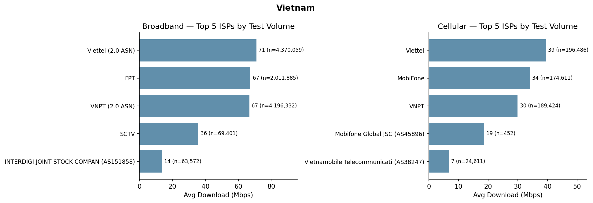
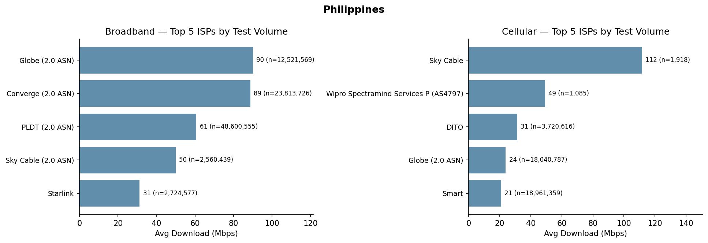
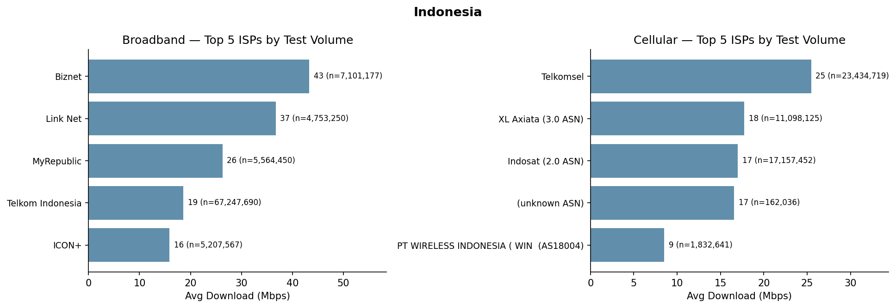
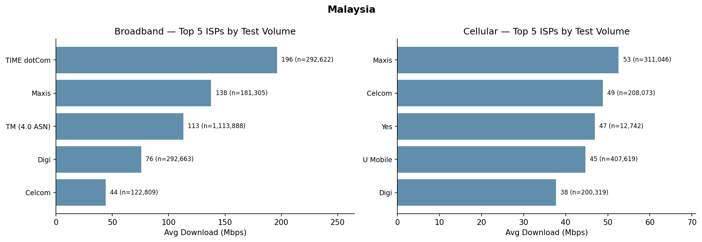
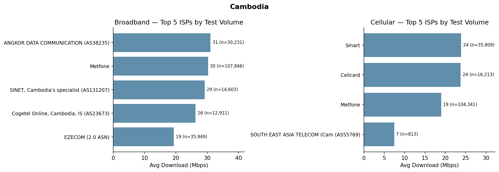
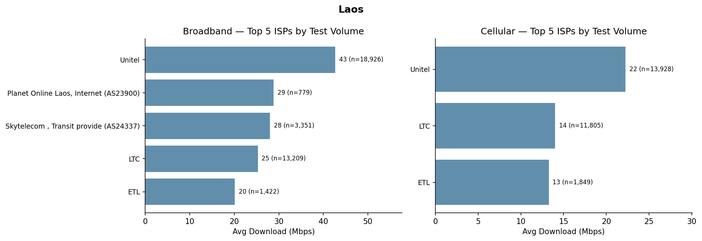
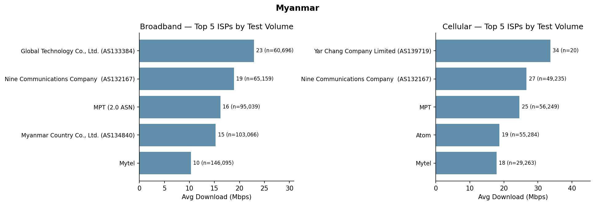

# ชุดกราฟเสนออาจารย์ — 8 ประเทศ

เอกสารนี้แยกออกมาจาก `results_th.md` ตั้งใจให้เป็น**ชุดกราฟให้อาจารย์คัด** ตามที่อาจารย์บอกว่า "ใส่กราฟที่ชอบ ใส่เยอะๆ ไว้ก่อน เดี๋ยวคัดออกอีกที"

ทุกใบผูกกับคำถามวิจัยข้อใดข้อหนึ่ง และมีบรรทัด **"ให้ดูตรงไหน"** กำกับ ถ้าอ่านบรรทัดนั้นแล้วยังไม่เห็นประเด็น แปลว่ารูปนั้นควรตัดทิ้ง

> **ข้อสมมติของเอกสารนี้** ทำเป็นไฟล์ใหม่ ไม่ได้ไปแก้ `results_th.md` หรือ `analysis_th.md` ถ้าอาจารย์อยากให้ยุบรวมเข้าไปในเอกสารเดิมก็ย้ายได้ทีหลัง
>
> **เลขรูปในเอกสารนี้คนละชุดกับ `results_th.md`** ที่นี่ใช้ `RQ1-1` `RQ3-4` แบบนี้ เพื่อไม่ให้ชนกับ "รูปที่ 1–6" ของเอกสารนั้น ตารางเทียบเลขอยู่ท้ายเอกสาร

---

## กฎที่ใช้คัดก่อนส่ง

ตัดสิงคโปร์ออกไปเมื่อ 13 ส.ค. รูปเก่าบางใบยังมีสิงคโปร์อยู่ข้างใน เลยตั้งกฎว่ารูปจะเข้าเอกสารนี้ได้ต้องผ่านข้อใดข้อหนึ่ง

1. **สร้างใหม่หลัง 14 ส.ค. 2569** หลังตัดสิงคโปร์แล้ว หรือ
2. **เป็นรูปของประเทศเดียว** และไม่ใช่สิงคโปร์ หรือ
3. **พิสูจน์ได้ว่าไม่เคยมีสิงคโปร์ตั้งแต่ต้น** และบอกเหตุผลได้เป็นประโยคเดียว

รูปที่ไม่ผ่านสามข้อนี้อยู่ในหัวข้อ "ที่ตัดทิ้งแล้ว" ท้ายเอกสาร พร้อมเหตุผล

อีกกฎหนึ่งที่ถือมาตลอดทั้งเปเปอร์ **ขอบเขตเท่ากันทุกประเทศ** รูปแบบไหนที่เป็นรูปรายประเทศ ต้องใส่ครบทั้ง 8 ประเทศ หรือไม่ใส่เลย ใส่เฉพาะประเทศที่เราอธิบายได้ไม่ได้

⚠️ **ตัวเลขใหม่ในเอกสารนี้ยังไม่ผ่านการเช็กข้ามกับร่างภาษาอังกฤษ** รูป 6 ใบที่ทำเมื่อ 14 ส.ค. (RQ1-2, RQ1-3, RQ1-4, RQ1-6, RQ2-1, RQ2-2) พาตัวเลขใหม่ราว 20 ตัวเข้ามา — ตารางการกระจายของ RQ1-4, อันดับของ RQ1-6, อัตราส่วน bb/มือถือ 8 ตัวของ RQ1-3, และ 172.8 / 31.5 / 5.5× ของ RQ1-2 ตัวเลขพวกนี้**ยังไม่มีอยู่ใน `paper_draft.md`** และ `scripts/verify_8country_consistency.py` ตรวจให้ไม่ได้ เพราะมันตรวจได้เฉพาะสถิติที่มันรู้จักอยู่แล้ว และไฟล์นี้ยังไม่อยู่ในรายการที่มันสแกน (จงใจ เพราะเอกสารนี้พูดคำว่า "สิงคโปร์" หลายที่ในหัวข้อที่อธิบายว่าตัดอะไรออกไป ถ้าเอาเข้าไปสแกนจะเด้ง false positive) — รันแล้วเมื่อ 14 ส.ค. ผ่าน 20 จาก 20 ข้อ **ตอนพอร์ตเป็น `paper.tex` ต้องคัดลอกจากไฟล์นี้ ไม่ใช่พิมพ์ตามความจำ** ตัวเลขที่ยืนยันแล้วคือชุดการเติบโตของ RQ2 ซึ่งตรงกับตารางที่ 4 ทุกตัว

---

# RQ1 ผ่านเกณฑ์ใช้งานไหม — "ที่ไหน"

## RQ1-1 ความเร็วบรอดแบนด์รายประเทศ


**ให้ดูตรงไหน** ระยะห่างระหว่างแท่งซ้ายสุดกับขวาสุด ไทย 277 Mbps เมียนมา 25 Mbps ต่างกัน 11.3 เท่า

**ทำไมต้องมี** นี่คือหน้าตาของ "อันดับความเร็วโลก" ที่เปเปอร์จะแย้งว่ามันไม่พอ ต้องมีไว้เป็นจุดตั้งต้นก่อนจะพังมันทีหลัง

*ซ้ำกับรูปที่ 1 ใน `results_th.md` — ถ้าเอกสารสองอันไปด้วยกัน ให้ใช้ใบเดียว*

## RQ1-2 ความเร็วมือถือรายประเทศ ★ ใหม่


**ให้ดูตรงไหน** ลำดับประเทศไม่เหมือนรูป RQ1-1 มาเลเซียขึ้นมาที่ 1 (172.8 Mbps) แซงไทย ทั้งที่ฝั่งบรอดแบนด์ไทยนำอยู่ และช่วงห่างแคบกว่ามาก 5.5 เท่า เทียบกับ 11.3 เท่าของบรอดแบนด์

**ทำไมต้องมี** เดิมฝั่งมือถือมีแต่ตาราง ไม่มีรูปเลย ทั้งที่ RQ1 ครึ่งหนึ่งเป็นเรื่องมือถือ

## RQ1-3 บรอดแบนด์เทียบมือถือ ★ ใหม่


**ให้ดูตรงไหน** ตัวเลขเทาบนหัวแท่งคืออัตราส่วน bb/มือถือ ไทยห่างสุด 3.2 เท่า **เมียนมาได้ 0.8 เท่า คือมือถือเร็วกว่าบรอดแบนด์** ประเทศเดียวในชุด

**ทำไมต้องมี** ตรงกับข้อสรุปในตารางที่ 3 ของ `results_th.md` ที่ว่าเมียนมา mobile UHD ผ่าน 68.8% แต่ fixed ผ่านแค่ 22.1% รูปนี้ทำให้เห็นทันทีว่าที่ไหนโครงสร้าง fixed อ่อนสุด มือถือไม่ใช่ของทดแทน แต่เป็นเครือข่ายที่ดีกว่าไปเลย

## RQ1-4 การกระจายรายจังหวัดในแต่ละประเทศ ★ ใหม่ — ใบนี้เสนอให้เก็บแน่ๆ


**ให้ดูตรงไหน** ความสูงของ**กล่อง** ไม่ใช่ปลายหนวดและไม่ใช่จุด outlier เพชรส้มคือค่าเฉลี่ยประเทศ กล่องคือช่วงที่จังหวัดส่วนใหญ่กระจายอยู่ ฟิลิปปินส์กล่องยาวสุด อินโดนีเซียรองลงมา

| ประเทศ | จำนวนจังหวัด | ช้าสุด–เร็วสุด (ทุกจังหวัด) | ต่างกัน | ช่วงเฉพาะจังหวัดข้อมูลหนา | ต่างกัน |
|---|---|---|---|---|---|
| ฟิลิปปินส์ | 17 | 47.7 – 159.6 | 3.3× | 101.4 – 159.6 *(5 จังหวัด)* | **1.6×** |
| เมียนมา | 14 | 16.3 – 43.2 | 2.7× | 21.9 – 34.5 *(5)* | **1.6×** |
| ไทย | 77 | 134.3 – 320.3 | 2.4× | 276.9 – 298.8 *(2)* | 1.1× |
| อินโดนีเซีย | 34 | 28.0 – 63.4 | 2.3× | 29.3 – 63.4 *(5)* | **2.2×** |
| ลาว | 18 | 32.7 – 66.4 | 2.0× | 43.9 – 55.6 *(4)* | 1.3× |
| เวียดนาม | 64 | 117.8 – 186.8 | 1.6× | 161.4 – 186.8 *(2)* | 1.2× |
| กัมพูชา | 25 | 37.3 – 61.3 | 1.6× | 48.0 – 57.5 *(5)* | 1.2× |
| มาเลเซีย | 16 | 155.1 – 212.3 | 1.4× | 175.7 – 212.3 *(5)* | 1.2× |

**อ่านตารางนี้ยังไง** สองคอลัมน์ขวาคือคำตอบที่ระวังตัวแล้ว จังหวัดที่ถือทราฟฟิกน้อยกว่า 5% ของประเทศถูกตัดออกทั้งสองปลาย (ดูเหตุผลใน RQ1-6) **ช่วงจริงอยู่ระหว่างสองคอลัมน์นี้ ไม่ใช่ที่ปลายใดปลายหนึ่ง**
- ตัวเลขดิบเกินจริง เพราะทั้งจังหวัดช้าสุดและเร็วสุดมักเป็นจังหวัดเล็กที่ทดสอบน้อย เช่นลาว 2.0× มาจากบ่อแก้ว (2.8%) กับสาละวัน (1.9%) ทั้งคู่
- ตัวเลขคอลัมน์ขวาต่ำเกินจริงสำหรับประเทศที่มีจังหวัดเยอะ เพราะเกณฑ์ 5% ของประเทศ 77 จังหวัดโหดกว่าของประเทศ 14 จังหวัดมาก ไทยกับเวียดนามเลยเหลือแค่ 2 จังหวัด ซึ่งไม่พอจะเรียกว่าช่วง
- **ที่ยืนยันได้แน่นอนคืออินโดนีเซีย** 2.3× → 2.2× แทบไม่ขยับ เพราะทั้งชวากลาง (14.5%) และจาการ์ตา (10.5%) เป็นจังหวัดข้อมูลหนาทั้งคู่ **ความเหลื่อมล้ำ 2.2 เท่าในตลาดใหญ่สุดของภูมิภาคเป็นของจริง** ถ้าต้องยกตัวเลขเดียวจากรูปนี้ ยกตัวนี้
- ฟิลิปปินส์กับเมียนมาก็ยังเหลือ 1.6× หลังกรอง ซึ่งก็ยังมาก

**ทำไมต้องมี** นี่คือรูปที่พูดประเด็นหลักของเปเปอร์ตรงที่สุด คือค่าเฉลี่ยหนึ่งตัวแทนประเทศทั้งประเทศไม่ได้ เพชรส้มลอยอยู่คนละที่กับเส้นกลางกล่องในหลายประเทศ แปลว่าค่าเฉลี่ยถูกดันโดยจังหวัดที่ทดสอบเยอะ ไม่ใช่จังหวัดทั่วไป

*แกน y เป็น log scale เพราะไทย 277 กับเมียนมา 25 อยู่ในรูปเดียวกันไม่ได้ถ้าใช้สเกลปกติ*

⚠️ ค่าในตารางเป็นค่าเฉลี่ยถ่วงน้ำหนักด้วยจำนวนครั้งทดสอบ ไม่ใช่ค่ากลางแบบตารางที่ 2 ของ `results_th.md` เลยไม่ตรงกันโดยนิยาม

**ตัวรูปเองไม่ต้องแก้** กล่องกับเส้นกลางใช้จังหวัดทุกจังหวัดเท่ากันหมด ไม่ได้ถ่วงน้ำหนัก จังหวัดข้อมูลบางเลยไปโผล่เป็นจุด outlier กับปลายหนวด ไม่ได้ดันกล่อง ที่ต้องระวังคือ**ตัวเลข min–max ในตาราง** ไม่ใช่รูป

## RQ1-5 เมืองหลวงเทียบค่าเฉลี่ยประเทศ


**ให้ดูตรงไหน** ทุกประเทศแท่งสูงกว่าเพชร ยกเว้นเมียนมาประเทศเดียวที่แท่งต่ำกว่า ย่างกุ้ง 22.0 เทียบค่าเฉลี่ยประเทศ 24.6 Mbps

*ซ้ำกับรูปที่ 2 ใน `results_th.md`*

## RQ1-6 เมืองหลวงเทียบ 5 จังหวัดที่เร็วที่สุด ★ ใหม่


**ให้ดูตรงไหน** เพชรส้มคือเมืองหลวง **จุดเทาทึบ**คือจังหวัดที่ถือทราฟฟิกตั้งแต่ 5% ของประเทศขึ้นไป **วงกลมกลวง**คือจังหวัดที่ถือน้อยกว่านั้น ป้ายบนหัวมีสองบรรทัดเมื่ออันดับสองแบบไม่ตรงกัน บรรทัดบนคืออันดับดิบ บรรทัดล่างคืออันดับเมื่อนับเฉพาะจังหวัดข้อมูลหนา

**อย่าอ่านอันดับดิบอย่างเดียว** อันดับดิบบอกว่ากรุงเทพฯ เป็นที่ 6 จาก 77 แต่ 5 จังหวัดที่แซงมี 4 จังหวัดที่ถือทราฟฟิกไม่ถึง 5% ของประเทศ พอนับเฉพาะจังหวัดข้อมูลหนา **กรุงเทพฯ กลับมาเป็นที่ 1**

| ประเทศ | เมืองหลวง | อันดับดิบ | อันดับเฉพาะจังหวัดข้อมูลหนา | จังหวัดที่แซงจริง |
|---|---|---|---|---|
| ไทย | กรุงเทพฯ | 6 / 77 | **1 / 2** | — (นนทบุรีถือ 4.8% ก้ำกึ่ง) |
| มาเลเซีย | กัวลาลัมเปอร์ | 1 / 16 | 1 / 5 | — |
| ฟิลิปปินส์ | NCR | 1 / 17 | 1 / 5 | — |
| อินโดนีเซีย | จาการ์ตา | 1 / 34 | 1 / 5 | — |
| ลาว | เวียงจันทน์ | 3 / 18 | **1 / 4** | — (บ่อแก้วถือ 2.8%) |
| **เวียดนาม** | **ฮานอย** | 11 / 64 | **2 / 2** | **โฮจิมินห์** 186.8 เทียบ 161.4 |
| **กัมพูชา** | **พนมเปญ** | 4 / 25 | **3 / 5** | บันเตียเมียนเจย 57.5 · พระสีหนุ 55.7 เทียบ 55.6 |
| **เมียนมา** | **ย่างกุ้ง** | 9 / 14 | **4 / 5** | **ฉาน 34.5 · สะกาย 34.2 · มัณฑะเลย์ 24.1** เทียบ 22.0 |

**ข้อสรุปที่กล้าเขียนลงเปเปอร์** เมืองหลวงเป็นจังหวัดที่เร็วที่สุดใน **5 จาก 8 ประเทศ** ที่ไม่ใช่มี 3 ประเทศ และหนักไม่เท่ากัน
- **เวียดนามชัดที่สุด** โฮจิมินห์ทั้งเร็วกว่าและทดสอบเยอะกว่าฮานอย (5.78 ล้านครั้ง เทียบ 4.69 ล้าน) ไม่มีทางเป็นผลของข้อมูลบาง
- **เมียนมารองลงมา** ย่างกุ้งแพ้ 3 จังหวัด รวมมัณฑะเลย์ซึ่งถือ 12% ของทราฟฟิกประเทศ สอดคล้องกับรูป RQ1-5 ที่ย่างกุ้งเป็นเมืองหลวงเดียวที่ต่ำกว่าค่าเฉลี่ยประเทศ
- **กัมพูชาก้ำกึ่ง** ห่างแค่ 1.9 Mbps ไม่ควรเอาไปเล่าเป็นข้อค้นพบ

**ทำไมต้องมี** ขยาย RQ1-5 โดยไม่ขัดกัน เมืองหลวงชนะ**ค่าเฉลี่ยประเทศ** เกือบทุกที่ แต่ชนะ**ทุกจังหวัด**แค่ 5 จาก 8 และรูปนี้ยังทำหน้าที่ที่สองคือแสดงว่าอันดับจังหวัดในประเทศที่ข้อมูลน้อยเชื่อไม่ได้ ซึ่งเป็นข้อจำกัดที่ควรพูดไว้เองก่อนโดนถาม

⚠️ **สองข้อควรระวังของรูปนี้**
1. **เกณฑ์ 5% เป็นเส้นที่เราขีดเอง** ไม่ใช่มาตรฐาน เลือกเพราะมันแยกกรณีที่ชัด (บ่อแก้ว 2.8% n=10,477 เทียบเวียงจันทน์ n=191,022 คือต่างกัน 18 เท่า) ออกจากกรณีจริงได้พอดี นนทบุรีที่ 4.8% หล่นใต้เส้นแบบก้ำกึ่ง ทั้งที่มีเกือบล้านครั้ง ถ้าอาจารย์อยากได้เกณฑ์อื่นเปลี่ยนค่า `THIN` ใน `scripts/build_extra_figs_8c.py` บรรทัดเดียว
   **ข้ออ่อนที่รู้ตัวอยู่** เกณฑ์แบบสัดส่วนไม่สเกลข้ามประเทศ 5% ของประเทศ 77 จังหวัดโหดกว่า 5% ของประเทศ 14 จังหวัดมาก ไทยกับเวียดนามเลยเหลือจังหวัดผ่านเกณฑ์แค่ 2 ส่วนเมียนมาเหลือ 5 ถ้าจะทำให้เทียบข้ามประเทศได้จริง ต้องใช้**เกณฑ์สัมบูรณ์** เช่นทดสอบตั้งแต่ 100,000 ครั้งขึ้นไป ไม่ใช่สัดส่วน — ยังไม่ได้ทำ เพราะไม่คุ้มเวลาก่อนกำหนดส่ง 21 ส.ค.
2. **อ่านคู่กับตารางที่ 2 ของ `results_th.md` ต้องระวัง** รูปนี้ใช้ค่าเฉลี่ยถ่วงน้ำหนักด้วยจำนวนครั้งทดสอบ (กรุงเทพฯ 298.8) ตารางที่ 2 ใช้ค่ากลาง (กรุงเทพฯ 296.7) ต่างกันเพราะนิยาม ไม่ใช่เพราะคำนวณผิด

## RQ1-7 ห้าจังหวัดที่เร็วที่สุดของแต่ละประเทศ ★ สร้างใหม่แทนของเดิม


**ให้ดูตรงไหน** แท่งลายทางคือจังหวัดที่ถือทราฟฟิกน้อยกว่า 5% ของประเทศ **ให้ดูว่าแต่ละแผงมีลายทางเยอะแค่ไหน** ลาวลายทาง 4 จาก 5 เวียดนามลายทาง 4 จาก 5 ไทยลายทาง 4 จาก 5 แปลว่าอันดับ "จังหวัดเร็วสุด" ในประเทศพวกนี้แทบไม่มีความหมาย ส่วนฟิลิปปินส์ทึบ 4 จาก 5 อ่านได้จริง

**ทำไมต้องมี** ใบนี้เป็นฉบับสร้างใหม่ของรูปเก่าที่มีแผงสิงคโปร์และไม่มีอินโดนีเซีย โครงเดิมทุกอย่าง เปลี่ยนแค่ประเทศกับการทำเครื่องหมายข้อมูลบาง ถ้าอาจารย์เคยเห็นใบเก่าแล้วชอบ ใบนี้คือใบเดียวกันแต่เชื่อถือได้

⚠️ **ใบนี้กับ RQ1-6 ทับซ้อนกันมาก** ทั้งคู่พูดเรื่องอันดับจังหวัด RQ1-6 เน้นตำแหน่งของเมืองหลวง ใบนี้เน้นชื่อจังหวัดกับปริมาณข้อมูล **เอาเข้าเปเปอร์ใบเดียวพอ** ถ้าเน้นข้อสรุปให้เอา RQ1-6 ถ้าเน้นให้เห็นข้อมูลดิบให้เอาใบนี้

---

# RQ2 การเติบโต 2023–2025 — "โตขึ้นหรือแย่ลง"

เดิม RQ2 ไม่มีรูปเลย มีแต่ตารางที่ 4 สองใบนี้สร้างใหม่ทั้งคู่

## RQ2-1 เส้นการเติบโตรายไตรมาส ★ ใหม่


**ให้ดูตรงไหน** ไม่มีเส้นไหนหักหัวลง ทุกเส้นชี้ขึ้นตลอด 12 ไตรมาส กลุ่มบนสี่ประเทศแทบไม่สลับอันดับกันเลยใน 3 ปี มีที่เดียวคือเวียดนามแซงฟิลิปปินส์ตั้งแต่ 2023-Q3 (104 เทียบ 97) แล้วทิ้งห่างเรื่อยๆ ส่วนกลุ่มล่างสี่ประเทศเบียดกันตลอดและสลับอันดับกันหลายรอบ

**ทำไมต้องมี** ผลสำคัญของ RQ2 เป็น**ผลเชิงลบ** คือไม่มีประเทศไหนแย่ลง เพราะงั้นจะอ้างว่าคนบ่นเพราะเน็ตแย่ลงไม่ได้ รูปพิสูจน์ข้อนี้ได้ในวินาทีเดียว ตารางต้องอ่านทีละแถว

## RQ2-2 โตเร็วแค่ไหน เทียบกับฐานที่เริ่ม ★ ใหม่


**ให้ดูตรงไหน** ถ้ารูปแบบไล่กวดเป็นจริงล้วนๆ จุดทุกจุดต้องเรียงจากซ้ายบนลงขวาล่าง มี **2 จุดที่หลุดรูปแบบ** มาเลเซียฐานสูง (124.6) แต่โตถึง 79.5% ส่วนฟิลิปปินส์ฐานต่ำ (96.4) แต่โตแค่ 23.6% ต่ำสุดในภูมิภาค

**ทำไมต้องมี** แยกสองเรื่องที่คนมักปนกัน "โตเร็ว" กับ "ไปถึงระดับไหน" ไทยกับฟิลิปปินส์โตช้าสุดสองอันดับ แต่จบคนละปลายเลย 294.0 กับ 119.1 Mbps

---

# RQ3 ชั่วโมงเร่งด่วน — "ตอนไหน"

ส่วนนี้ใช้ NDT7 ทั้งหมด อ่านได้เฉพาะ**อัตราส่วนเทียบตัวเอง** ไม่ใช่ค่าสัมบูรณ์ เหตุผลอยู่ท้ายเอกสาร

## RQ3-1 ความเร็วรายชั่วโมง


**ให้ดูตรงไหน** ทุกกราฟดิ่งลงตรงแถบเทา (19–22 น.) และเส้นแดง (มือถือ) ดิ่งลึกกว่าเส้นน้ำเงิน (บรอดแบนด์) เสมอ เวียดนามเป็นข้อยกเว้น ชั่วโมงเร่งด่วนไปอยู่ 10–11 น.

*ซ้ำกับรูปที่ 3 ใน `results_th.md`*

## RQ3-2 ความต้องการใช้กับความเร็ว ซ้อนกัน ★ ใบนี้เสนอให้เก็บแน่ๆ


**ให้ดูตรงไหน** แท่งเทาคือจำนวนการทดสอบ (ใช้แทนปริมาณคนออนไลน์) เส้นน้ำเงินคือความเร็ว **เส้นดิ่งลงตรงที่แท่งสูงสุดพอดี** ทุกประเทศ

**ทำไมต้องมี** รูปอื่นบอกว่า "ตอนเย็นช้า" รูปนี้บอกว่า "ช้า**เพราะ**คนใช้เยอะ" คือใบเดียวที่แสดงกลไก ไม่ใช่แค่ผลลัพธ์ ถ้าอาจารย์จะเลือกรูป RQ3 ได้ใบเดียว ควรเป็นใบนี้

เวียดนามกับกัมพูชาก็เห็นชัดในรูปนี้ว่าทำไมถึงโดนกัน แท่งสูงสุดไปอยู่ 11 น. กับ 12 น. ไม่ใช่ตอนเย็น

## RQ3-3 อัตราส่วนการทรุด ชั่วโมงเร่งด่วนของแต่ละประเทศเอง


**ให้ดูตรงไหน** แท่งแดง (มือถือ) ต่ำกว่าแท่งน้ำเงิน (บรอดแบนด์) ทุกประเทศ ไม่มีข้อยกเว้น เส้นประ 1.0 คือไม่เปลี่ยน

*ซ้ำกับรูปที่ 4 ใน `results_th.md`*

## RQ3-4 อัตราส่วนการทรุด หน้าต่างเวลาคงที่


**ให้ดูตรงไหน** เหมือน RQ3-3 แต่บังคับใช้ 19–22 น. เทียบ 03–05 น. เท่ากันทุกประเทศ **ตัวเลขบนแท่งคือตัวที่ใช้ในเปเปอร์** (ตารางที่ 5) ไม่ใช่ตัวเลขของ RQ3-3

**ทำไมต้องมี** เป็นรูปของตารางที่ 5 ตรงๆ ถ้าเอาเข้าเปเปอร์แทนตารางได้ ก็ช่วยเรื่องความยาวที่ยังเกินอยู่ราว 1,600 คำ

⚠️ **ห้ามใส่ RQ3-3 กับ RQ3-4 คู่กันโดยไม่อธิบาย** เลขไม่ตรงกันโดยตั้งใจ เมียนมาได้ 0.18 ในใบหนึ่ง 0.58 ในอีกใบ เพราะนิยามชั่วโมงคนละแบบ ถ้าเลือกใบเดียวให้เลือก RQ3-4

## RQ3-5 การทรุดของเซสชันที่แย่ที่สุด 10%


**ให้ดูตรงไหน** แท่งทุกแท่งต่ำกว่าในรูป RQ3-4 คือหางของการกระจายทรุดหนักกว่าค่ากลางทุกประเทศทุกเทคโนโลยี กัมพูชามือถือเหลือ 0.12 คือช้าลง 8 เท่า

**ทำไมต้องมี** ตอบคำถามตั้งต้นของเปเปอร์โดยตรง สถิติวัดเซสชันเฉลี่ย แต่ความไม่พอใจมาจากหาง ซึ่งกว้างสุดพอดีตอนคนออนไลน์เยอะสุด

## RQ3-6 ความหน่วงรายชั่วโมง


**ให้ดูตรงไหน** เส้นพุ่งขึ้นตรงแถบเทา ทั้งบรอดแบนด์และมือถือ ขึ้นพร้อมกันกับที่ความเร็วดิ่งในรูป RQ3-1 คือหลักฐานสองตัวที่ขยับไปทางเดียวกัน

⚠️ **อ่านค่าสัมบูรณ์บนแกน y ไม่ได้** เมียนมาอยู่ราว 95–105 ms ไม่ได้แปลว่าเน็ตในเมียนมาหน่วง 100 ms แต่แปลว่าเส้นทางไปเซิร์ฟเวอร์ที่เจนไนหน่วงเท่านั้น ที่อ่านได้คือ**การเปลี่ยนแปลงเทียบตัวเอง** ตามที่อาจารย์ติงไว้

*ช่องล่างขวาว่าง เพราะเหลือ 8 ประเทศแต่กริดเป็น 3×3*

## RQ3-7 เมืองหลวงเทียบส่วนที่เหลือ รายชั่วโมง


**ให้ดูตรงไหน** ดูความชันตอนดิ่งในแถบเทา ไม่ใช่ดูว่าเส้นไหนสูงกว่า เมืองหลวงเร็วกว่าโดยรวมอยู่แล้ว แต่พอโหลดเข้ามามันดิ่งลึกกว่า กรุงเทพฯ ชัดสุด

*ซ้ำกับรูปที่ 5 ใน `results_th.md` · มี 5 ประเทศเพราะมีแค่ 5 ประเทศที่ข้อมูลระดับเมืองหลวงมากพอ*

## RQ3-8 เมืองหลวงเทียบส่วนที่เหลือ เป็นแท่ง


**ให้ดูตรงไหน** แท่งแดง (เมืองหลวง) ต่ำกว่าแท่งน้ำเงิน (ส่วนที่เหลือ) ใน 4 จาก 5 ประเทศ ยิ่งต่ำยิ่งทรุดหนัก ไทยห่างสุด 0.80 เทียบ 0.96 ฟิลิปปินส์เป็นข้อยกเว้นเดียว

**ทำไมต้องมี** เป็นรูปของตารางที่ 6 และเป็นจุดที่เปเปอร์ขัดกับตัวเองโดยตั้งใจ เมืองหลวงชนะ RQ1 แต่แพ้ RQ3 ข้อได้เปรียบของเมืองหลวงเป็นข้อได้เปรียบแบบกรณีเฉลี่ย พอมีโหลดจริงมันแคบลง

## RQ3-9 ชั่วโมงที่คนใช้เยอะสุดของแต่ละประเทศ


**ให้ดูตรงไหน** ดาวฟ้าคือชั่วโมงที่ทดสอบเยอะสุด 6 ประเทศอยู่ที่ 20–21 น. **เวียดนามอยู่ 11 น. กัมพูชาอยู่ 12 น.**

**ทำไมต้องมี** เป็นหลักฐานว่าทำไมสองประเทศนั้นถึงถูกกันออกจากข้อสรุปเรื่องความแออัด ไม่ได้กันเพราะตัวเลขไม่สวย แต่เพราะชั่วโมงเร่งด่วนไม่ตรงกับพฤติกรรมผู้ใช้จริง ถ้าอาจารย์ถามว่า "ทำไมตัดเวียดนามออก" ตอบด้วยรูปนี้ใบเดียวจบ

## RQ3-10 วันธรรมดาเทียบวันหยุด — *เสนอให้ตัด*


**ให้ดูตรงไหน** สองเส้นทับกันเกือบหมดในแถบเทา แปลว่าการทรุดตอนเย็นไม่ได้มาจากพฤติกรรมวันทำงาน

**ทำไมถึงเสนอให้ตัด** เป็นการเช็กความถูกต้อง ไม่ใช่ผลการวิจัย ผลออกมาว่า "ไม่ต่างกัน" ซึ่งดีสำหรับความน่าเชื่อถือแต่ไม่มีอะไรให้เล่า เก็บไว้ตอบถ้าถูกถามก็พอ

---

# RQ4 โครงสร้างตลาด — "ของใคร"

**ทุกใบในส่วนนี้ไม่เคยมีสิงคโปร์** เพราะสิงคโปร์ไม่มีข้อมูล ASN จึงถูกตัดจาก RQ4 ตั้งแต่ก่อนมีการตัดสิงคโปร์ทั้งเปเปอร์ ตรวจแล้วจาก `data/exports/rq4_within_gap.csv` และ `rq4_leaders.csv` ทั้งสองไฟล์มี 8 ประเทศพอดี ไม่มีสิงคโปร์ มีอินโดนีเซีย

## RQ4-1 ช่องว่างระหว่างค่ายใหญ่ในประเทศเดียวกัน


**ให้ดูตรงไหน** ความยาวของเส้น ไม่ใช่ตำแหน่ง มาเลเซียยาวสุด ต่างกัน 4.4 เท่า จาก Celcom 44 Mbps ถึง TIME dotCom 196 Mbps ของไทยต่างกัน 1.9 เท่า **ซึ่งมากกว่าช่องว่างกรุงเทพฯ กับต่างจังหวัดที่ 1.21 เท่า**

**ทำไมต้องมี** ประโยคเดียวที่สรุปได้จากรูปนี้คือ **เลือกค่ายไหนสำคัญกว่าอยู่จังหวัดไหน** ซึ่งเป็นข้อสรุปที่แรงที่สุดของ RQ4

*ซ้ำกับรูปที่ 6 ใน `results_th.md`*

## RQ4-2 ค่ายที่คนใช้เยอะสุดของแต่ละประเทศ


**ให้ดูตรงไหน** ความเร็วของค่ายที่แบกทราฟฟิกเยอะสุด พร้อม n ที่ทดสอบ อินโดนีเซีย Telkom ได้ 19 Mbps จาก 67.2 ล้านครั้ง คือค่ายที่คนใช้เยอะที่สุดในตลาดใหญ่ที่สุดของภูมิภาค

## RQ4-3 ค่ายใหญ่ที่เร็วที่สุดของแต่ละประเทศ


**ให้ดูตรงไหน** อ่านคู่กับ RQ4-2 ประเทศไหนสองรูปเป็นค่ายเดียวกันแปลว่าค่ายใหญ่ก็เป็นค่ายที่ดีสุด (ลาว เวียดนาม) ประเทศไหนคนละค่ายแปลว่าค่าเฉลี่ยประเทศถูกดันขึ้นโดยค่ายเล็ก (อินโดนีเซีย Telkom 19 → Biznet 43 ที่ถือแค่ 5%)

**ทำไมต้องมี** RQ4-2 กับ RQ4-3 คู่กันคือหลักฐานของกลไกทั้งหมด แยกใบเดียวไม่ได้เรื่อง

⚠️ **เสนอให้รวม RQ4-2 กับ RQ4-3 เป็นรูปเดียวถ้ามีเวลา** สองใบนี้เป็นแท่งชุดเดียวกันคนละสี ยัดในรูปเดียวได้ ประหยัดพื้นที่ในเปเปอร์ที่ยังยาวเกินอยู่ ถ้าไม่มีเวลาก็ใส่สองใบไปก่อน

## RQ4-4 ค่าย 5 อันดับแรกรายประเทศ — ชุด 8 ใบ

ครบทั้ง 8 ประเทศ ตามกฎขอบเขตเท่ากัน จะเอาเข้าเปเปอร์ทั้งชุดหรือไปภาคผนวกก็ได้ แต่ไม่ควรหยิบมาแค่บางประเทศ










**ให้ดูตรงไหน** ในแต่ละใบ ให้ดูว่าแท่งที่ n สูงสุดอยู่อันดับที่เท่าไหร่ ของอินโดนีเซียชัดสุด Telkom n=67.2M แต่อยู่อันดับ 4 จาก 5

**ทำไมต้องมี** เป็นรายละเอียดที่รองรับตารางที่ 7 ถ้าอาจารย์ถามว่า "ค่ายที่เหลือเป็นยังไง" ตอบได้ทันที

*ถ้าจะตัด เสนอให้ตัดทั้งชุดแล้วเก็บแค่ RQ4-2/RQ4-3 ไว้ อย่าตัดทีละใบ*

## RQ4-5 ส่วนแบ่งตลาด 16 ใบ — *เสนอให้ตัดทั้งชุด*

มีอยู่ที่ `outputs/ndt7/comparison/rq4_marketshare_<ประเทศ>_broadband.png` และ `_cellular.png` ครบ 8 ประเทศ × 2 = 16 ใบ

**ทำไมถึงเสนอให้ตัด** ส่วนแบ่งเป็นตัวเลขในตารางที่ 7 อยู่แล้ว และ 16 ใบไม่มีทางลงเปเปอร์ 9 หน้าได้ ถ้าอาจารย์อยากดู เปิดจากโฟลเดอร์ได้เลย ไม่ต้องแปะในเอกสาร

---

# ภาคผนวก รูปสำหรับตอบคำถามเรื่องความน่าเชื่อถือ

ไม่ใช่ผลการวิจัย แต่เป็นรูปที่เตรียมไว้ตอบตอนถูกซัก

## V-1 การทดสอบซ้ำจาก IP เดิม


**ให้ดูตรงไหน** ค่าคือจำนวนครั้งทดสอบต่อ IP หนึ่งตัว ถ้าค่าพุ่งขึ้นสูงหรือแหลมผิดปกติในแถบเทา แปลว่าที่เห็นตอนเย็นอาจเป็นเครื่องทดสอบอัตโนมัติ ไม่ใช่คนจริง **ในรูปนี้ไม่พุ่ง** เส้นทุกประเทศราบตลอด ยกเว้นฟิลิปปินส์กับอินโดนีเซียที่ค่าสูงกว่าคนอื่นทั้งวัน ซึ่งเป็นระดับพื้นฐานของประเทศ ไม่ใช่การพุ่งเฉพาะชั่วโมงเร่งด่วน

**ทำไมต้องมี** ปิดคำอธิบายทางเลือกที่ว่า "การทรุดตอนเย็นเป็นผลของ bot" ตามแนวที่ Lübben & Misfeld ใช้

---

# ที่ตัดทิ้งแล้ว พร้อมเหตุผล

**ทำความสะอาดโฟลเดอร์แล้วเมื่อ 14 ส.ค.** เดิมโฟลเดอร์ `outputs/` เป็นของผสม รูป 8 ประเทศกับรูป 9 ประเทศอยู่ปนกันในไดเรกทอรีเดียวกัน แยกด้วยตาไม่ได้ ตอนนี้จัดใหม่แล้ว **โฟลเดอร์หลักทุกอันเป็น 8 ประเทศล้วน** ของเดิมฉบับ 9 ประเทศย้ายไป `outputs/archive_9c/` ทั้งหมด

| อะไร | เดิมอยู่ที่ไหน | ทำอะไรไป |
|---|---|---|
| รูปรายประเทศของสิงคโปร์ 49 ใบ | `outputs/ndt7/singapore/` · `outputs/ookla/singapore/` | **ลบทิ้งแล้ว** เป็นรูปของสิงคโปร์เดี่ยวๆ ไม่มีอะไรให้ตัดออก กู้คืนได้จาก git commit `d7735c2` |
| รูป RQ3 8 ใบใน `ndt7/comparison/` ที่ยังเป็น 9 ประเทศ | `outputs/ndt7/comparison/` (ลง 30 ก.ค.) | **ทับด้วยฉบับ 8 ประเทศแล้ว** ของเดิมเก็บไว้ที่ `archive_9c/ndt7_comparison/` — จุดนี้เป็นกับดัก เพราะโฟลเดอร์เดียวกันมีทั้งไฟล์ 14 ส.ค. (8 ประเทศ) และไฟล์ 30 ก.ค. (9 ประเทศ) ปนกันอยู่ |
| `02_all_country_mobile_dl.png` ฉบับเก่า | `outputs/ookla/cross_country/` (ลง 20 ก.ค.) | **สร้างใหม่ทับแล้วเป็น 8 ประเทศ** ของเดิมอยู่ `archive_9c/ookla_cross_country/` ฉบับเก่ามีสิงคโปร์และไม่มีอินโดนีเซีย และตัวเลขไม่ตรงกับข้อมูลจริง (ไทย 72 เทียบของใหม่ 86) เพราะมาจากสคริปต์ที่ hardcode |
| `04_top5_provinces_per_country.png` ฉบับเก่า | `outputs/ookla/cross_country/` (ลง 20 ก.ค.) | **สร้างใหม่ทับแล้วเป็น 8 ประเทศ** = RQ1-7 ของเดิมอยู่ `archive_9c/` ฉบับเก่ามีแผงสิงคโปร์ ไม่มีอินโดนีเซีย และมาจาก `capital_top5_comparison.csv` ซึ่งเป็นไฟล์ยุค 9 ประเทศ ฉบับใหม่คำนวณจาก province_quarterly โดยตรง |
| โฟลเดอร์ `*_8c` ที่เคยแยกไว้ | `ookla/cross_country_8c/` · `ndt7/comparison_8c/` | **ลบแล้ว** ย้ายเนื้อในไปเป็นโฟลเดอร์หลัก ไม่ต้องมีสองชุดอีก |
| แผนที่/อันดับระดับอำเภอของไทย ~40 ใบ | `outputs/ookla/*_district_*.png` | **ยังอยู่ ไม่ได้ลบ** ไม่มีสิงคโปร์ปนอยู่แล้ว แต่ไม่เอาเข้าเอกสารนี้เพราะผิดกฎขอบเขตเท่ากัน ไทยเป็นแค่ตัวอย่างตั้งต้นในบทนำ |
| รูป EDA รายประเทศ ~400 ใบ (7 ประเทศที่เหลือ) | `outputs/ndt7/<ประเทศ>/` · `outputs/ookla/<ประเทศ>/` | **ยังอยู่ ไม่ได้ลบ** เป็นรูปของประเทศเดียว ไม่มีสิงคโปร์ปน แต่ยังไม่เอาเข้าเอกสารเพราะที่มาไม่ชัด บางส่วนมาจาก `build_slides_all_countries.py` ซึ่ง **hardcode ตัวเลขไว้ในสคริปต์** ต้องไล่ตรวจทีละใบก่อน |

⚠️ **ที่ยังไม่ได้แตะ เป็นไฟล์ข้อมูล ไม่ใช่รูป** ตั้งใจไม่แตะ เพราะรอบนี้ทำเฉพาะรูปตามที่สั่ง

| ไฟล์ | ปัญหา |
|---|---|
| `data/exports/capital_top5_comparison.csv` | ยุค 9 ประเทศ มีสิงคโปร์ ไม่มีอินโดนีเซีย **นี่คือไฟล์ที่ทำให้รูป 04 ฉบับเก่าผิด** อย่าใช้สร้างรูปใหม่ |
| `data/exports/ndt7_peakhour_flags.csv` | ยังมีแถวสิงคโปร์ ตัวเลข RQ3 ที่ใช้ได้มาจาก `rq3_peakhour_8c.ipynb` ไม่ใช่ไฟล์นี้ |
| `data/exports/*singapore*.csv` | ข้อมูลดิบของสิงคโปร์ ยังอยู่ครบ ไม่มีสคริปต์ไหนอ่านมันแล้ว ลบได้ถ้าต้องการ แต่ลบแล้วสร้างรูปฉบับ 9 ประเทศซ้ำไม่ได้อีก |

---

# ตารางเทียบเลขรูป

| ในเอกสารนี้ | ใน `results_th.md` | สถานะ |
|---|---|---|
| RQ1-1 | รูปที่ 1 | เดิม |
| RQ1-2 | — | **ใหม่** |
| RQ1-3 | — | **ใหม่** |
| RQ1-4 | — | **ใหม่** |
| RQ1-5 | รูปที่ 2 | เดิม |
| RQ1-6 | — | **ใหม่** |
| RQ1-7 | — | สร้างใหม่แทนรูปเก่าที่มีสิงคโปร์ |
| RQ2-1 | — | **ใหม่** |
| RQ2-2 | — | **ใหม่** |
| RQ3-1 | รูปที่ 3 | เดิม |
| RQ3-2 | — | มีอยู่แล้ว แต่ยังไม่เคยใส่ในเอกสารไหน |
| RQ3-3 | รูปที่ 4 | เดิม |
| RQ3-4 ถึง RQ3-6 | — | มีอยู่แล้ว ยังไม่เคยใส่ |
| RQ3-7 | รูปที่ 5 | เดิม |
| RQ3-8 ถึง RQ3-10 | — | มีอยู่แล้ว ยังไม่เคยใส่ |
| RQ4-1 | รูปที่ 6 | เดิม |
| RQ4-2 ถึง RQ4-5 | — | มีอยู่แล้ว ยังไม่เคยใส่ |
| V-1 | — | มีอยู่แล้ว ยังไม่เคยใส่ |

---

# ถ้าต้องคัดเหลือน้อยที่สุด

เปเปอร์ ACM sigconf 9 หน้ายังยาวเกินอยู่ราว 1,600 คำ ใส่รูปได้จริงราว 4–6 ใบ ถ้าต้องเลือกแค่นั้น เสนอชุดนี้

| ลำดับ | รูป | เพราะ |
|---|---|---|
| 1 | **RQ1-4** การกระจายรายจังหวัด | พูดประเด็นหลักของเปเปอร์ตรงที่สุด — ค่าเฉลี่ยหนึ่งตัวแทนประเทศไม่ได้ **ยกตัวเลขอินโดนีเซีย 2.2× (หลังกรองข้อมูลบางแล้ว) อย่ายกช่วง min–max ดิบ** |
| 2 | **RQ3-2** ความต้องการซ้อนความเร็ว | ใบเดียวที่แสดงกลไก ไม่ใช่แค่ผลลัพธ์ |
| 3 | **RQ3-4** อัตราส่วนการทรุด | แทนตารางที่ 5 ได้ทั้งตาราง ช่วยเรื่องความยาว |
| 4 | **RQ3-8** เมืองหลวงทรุดหนักกว่า | จุดที่เปเปอร์ขัดกับตัวเองโดยตั้งใจ เป็นแกนของงาน |
| 5 | **RQ4-1** ช่องว่างระหว่างค่าย | เลือกค่ายไหนสำคัญกว่าอยู่จังหวัดไหน |
| 6 | **RQ2-1** เส้นการเติบโต | ปิดคำอธิบาย "เน็ตแย่ลง" ด้วยรูปเดียว |

ที่เหลือไปภาคผนวก หรือเก็บไว้ตอบตอนนำเสนอ

---

# ที่มาของรูป

| รูป | สร้างจาก | เมื่อไหร่ |
|---|---|---|
| RQ1-1, RQ1-5 | `scripts/build_cross_country_figs_8c.py` | 14 ส.ค. 2569 |
| RQ1-2, RQ1-3, RQ1-4, RQ1-6, RQ1-7, RQ2-1, RQ2-2 | `scripts/build_extra_figs_8c.py` | 14 ส.ค. 2569 |
| RQ3-1 ถึง RQ3-6, RQ3-8, RQ3-9, RQ3-10, V-1 | `notebooks/comparison/rq3_peakhour_8c.ipynb` | 14 ส.ค. 2569 |
| RQ3-7 | ของเดิม ไม่ได้แตะ | ใช้ 5 ประเทศที่ไม่มีสิงคโปร์อยู่แล้ว |
| RQ4-1 ถึง RQ4-5 | ของเดิม ไม่ได้แตะ | RQ4 ไม่เคยมีสิงคโปร์ (ไม่มีข้อมูล ASN) |

**โครงโฟลเดอร์หลัง 14 ส.ค.** ทุกโฟลเดอร์ด้านล่างเป็น 8 ประเทศล้วน ไม่ต้องเช็กวันที่ไฟล์อีก

```
outputs/ookla/cross_country/     รูป 01–09 ทั้งหมด 8 ประเทศ
outputs/ndt7/comparison/         rq3_* กับ rq4_* ทั้งหมด 8 ประเทศ
outputs/ookla/<ประเทศ>/          7 ประเทศ (ลบสิงคโปร์แล้ว)
outputs/ndt7/<ประเทศ>/           7 ประเทศ (ลบสิงคโปร์แล้ว)
outputs/archive_9c/              ของเดิมฉบับ 9 ประเทศ เก็บไว้อ้างอิง ไม่ได้ลบ
```

สร้างรูปทั้งหมดใหม่ได้ด้วย

```
python scripts/build_cross_country_figs_8c.py
python scripts/build_extra_figs_8c.py
```

สร้างไฟล์ docx

```
pandoc figures_th.md -o figures_th.docx --resource-path=.:.. --toc --toc-depth=2
```
