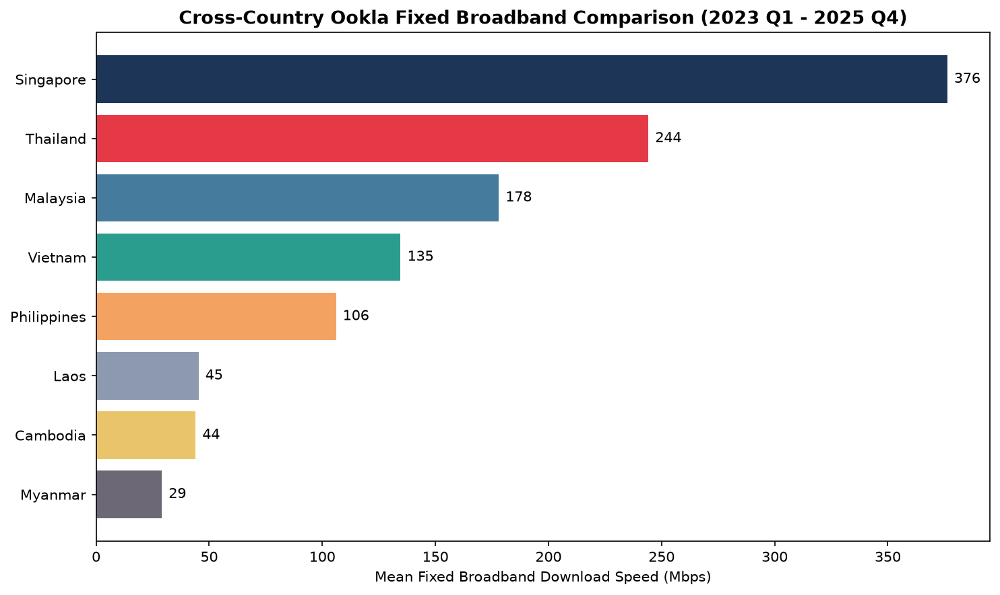
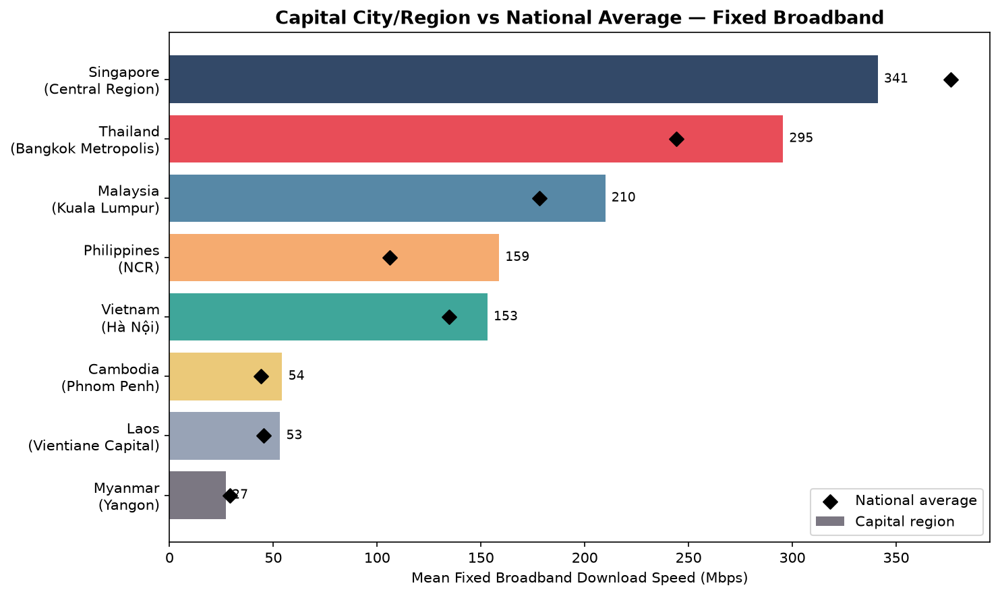
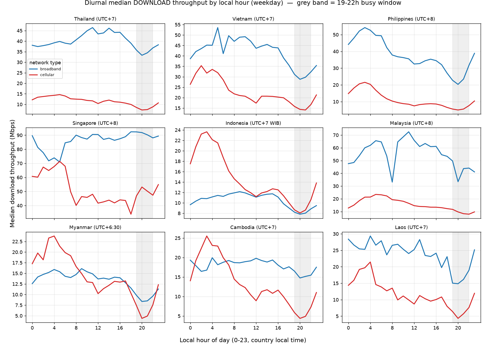
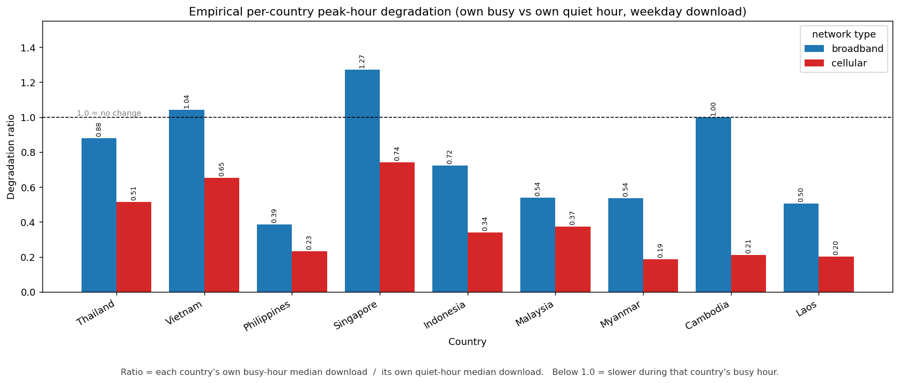
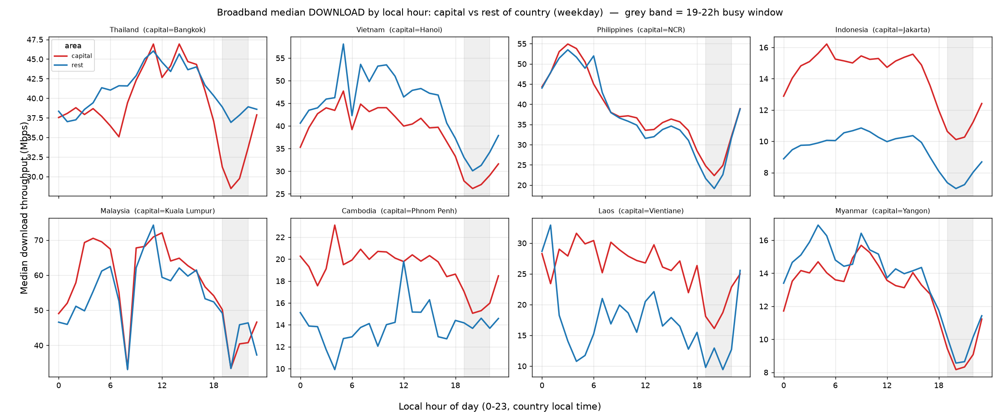
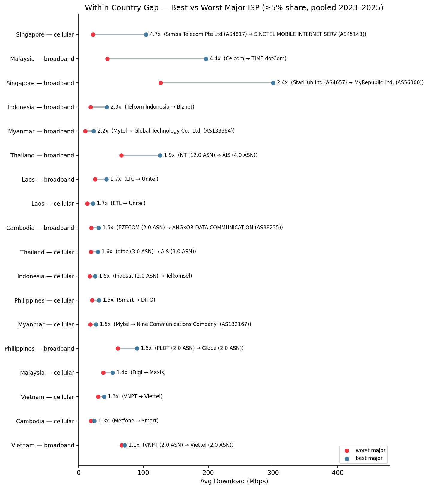

# ผลวิเคราะห์บรอดแบนด์เอเชียตะวันออกเฉียงใต้ 8 ประเทศ

ข้อมูล Ookla Open Data ระดับจังหวัด กับ M-Lab NDT7 อีก 760 ล้านรายการทดสอบ ช่วง Q1/2023 ถึง Q4/2025
ประเทศที่ดู: ไทย มาเลเซีย เวียดนาม ฟิลิปปินส์ อินโดนีเซีย กัมพูชา ลาว เมียนมา

> **แก้ไข 13 ส.ค. 2569 สองเรื่อง**
> **1. ตัดสิงคโปร์ออกทั้งหมด** เหลือ 8 ประเทศ เลขรวมทุกตัวคำนวณใหม่แล้ว รายละเอียดว่าอะไรเปลี่ยนบ้างอยู่ใน `sg-cut-numbers-delta.md`
> **2. เกณฑ์ cloud gaming ใช้ค่าความหน่วงของ Ookla อย่างเดียว** ไม่เอา NDT7 มาคิด เหตุผลอยู่ในหัวข้อ "หมายเหตุ" ท้ายเอกสาร

---

## สรุปก่อน

คนใช้อันดับความเร็วระดับประเทศแทนคำว่า "เน็ตดีหรือไม่ดี" แต่ในแถบนี้สองอย่างนี้มันไม่ตรงกัน ต้นปี 2025 Ookla จัดไทยอันดับ 13 ของโลก ขณะที่ผลสำรวจผู้บริโภคบอกว่ากว่า 81% เจอปัญหาใช้งาน

งานนี้เลยไปดูว่าทำไมสองอย่างนี้เป็นจริงพร้อมกันได้ วิธีคือไม่วัดความเร็วเฉลี่ยเฉยๆ แต่วัดว่าผ่านเกณฑ์ที่แอปต้องการจริงไหม

คำตอบสั้นๆ คือค่าเฉลี่ยประเทศมันกลบของอยู่สามอย่าง

| กลบอะไร | คำถาม | ที่เจอ |
|---|---|---|
| ที่ไหน (RQ1) | เน็ตไม่ผ่านตรงไหน | เกือบทั้งหมดอยู่นอกเมืองหลวง 5 ใน 8 เมืองหลวงผ่านหมดทุกเกณฑ์ |
| ตอนไหน (RQ3) | ช่วงไหนแย่ | ตอนเย็น มือถือเหลือ 0.23 ถึง 0.56 เท่าของตอนดึก |
| ของใคร (RQ4) | ค่ายไหน | 6 ใน 8 ประเทศ ค่ายที่คนใช้เยอะสุดไม่ใช่ค่ายที่เร็วสุด |

อันที่น่าสนใจสุดคือเมืองหลวงชนะแกนแรก แต่แพ้แกนที่สอง คือดีสุดตอนวัดผ่านไม่ผ่าน แต่ทรุดหนักสุดตอนคนใช้เยอะ สามอย่างนี้เลยยุบรวมกันไม่ได้

---

## RQ1 ผ่านเกณฑ์ใช้งานไหม

### ความเร็วรายประเทศก่อน



รูปที่ 1 ความเร็วดาวน์โหลดเฉลี่ย fixed broadband รายประเทศ ถ่วงน้ำหนักด้วยจำนวนครั้งที่ทดสอบ ห่างกันเยอะมาก ไทยสูงสุดที่ 277 Mbps เมียนมาต่ำสุดที่ 25 Mbps ต่างกัน 11.3 เท่า นี่คือแบบที่อันดับโลกใช้ และเป็นตัวที่เอกสารนี้จะแสดงว่ามันไม่พอ

✅ สร้างใหม่แล้ว 8 ประเทศ **มีอินโดนีเซียครบแล้ว** ซึ่งรูปเดิมไม่มี

### อัตราผ่านเกณฑ์ fixed

ตารางที่ 1 อัตราผ่านเกณฑ์เป็น % ถ่วงน้ำหนักด้วยจำนวนครั้งที่ทดสอบ

| ประเทศ | HD | UHD | Cloud gaming | Voice | จำนวนทดสอบ |
|---|---|---|---|---|---|
| เวียดนาม | 100.0 | 100.0 | 100.0 | 100.0 | 25.9M |
| ไทย | 100.0 | 100.0 | 99.5 | 100.0 | 20.8M |
| มาเลเซีย | 100.0 | 100.0 | 97.6 | 100.0 | 15.7M |
| ฟิลิปปินส์ | 100.0 | 100.0 | 92.6 | 100.0 | 48.8M |
| กัมพูชา | 100.0 | 97.6 | 64.9 | 100.0 | 2.4M |
| ลาว | 100.0 | 99.4 | 64.2 | 100.0 | 0.37M |
| อินโดนีเซีย | 100.0 | 88.1 | 35.6 | 100.0 | 54.2M |
| เมียนมา | 100.0 | 22.1 | 0.0 | 98.2 | 1.75M |

ดูตารางนี้ตรงไหน: HD ผ่านหมดทุกที่ ไม่ใช่ข้อจำกัด เสียงก็ผ่านเกือบหมด ตัวที่แยกประเทศออกจากกันคือ cloud gaming เพราะเป็นเกณฑ์เดียวที่บังคับทั้งความเร็วขั้นต่ำและเพดานความหน่วง

ค่าความหน่วงในตารางนี้มาจาก Ookla ทั้งหมด ไม่ได้ใช้ NDT7 เลย เหตุผลอยู่ท้ายเอกสาร

เมียนมาได้ 0.0% ไม่ใช่เพราะเน็ตช้า เพราะ 82% ของจังหวัด-ไตรมาสก็เกิน 20 Mbps อยู่แล้ว ปัญหาอยู่ที่ latency

อินโดนีเซียน่าสนใจ เป็นตลาดใหญ่สุดของภูมิภาค ทดสอบ 54.2 ล้านครั้ง แต่ทำได้แย่เป็นอันดับสอง

### เมืองหลวงเทียบต่างจังหวัด



รูปที่ 2 แท่งคือเมืองหลวง เพชรดำคือค่าเฉลี่ยทั้งประเทศ ทุกประเทศแท่งยาวกว่าเพชร **ยกเว้นเมียนมาประเทศเดียวที่แท่งต่ำกว่าเพชร** คือย่างกุ้ง 22.0 เทียบค่าเฉลี่ยประเทศ 24.6 Mbps

ระวังอย่าสับสนกับตารางที่ 2 ข้างล่าง ตัวเลขไม่เท่ากันเพราะนิยามคนละแบบ รูปนี้เทียบเมืองหลวงกับ**ค่าเฉลี่ยทั้งประเทศ** ซึ่งรวมเมืองหลวงเข้าไปด้วย ส่วนตารางที่ 2 เทียบเมืองหลวงกับ**ส่วนที่เหลือ** ซึ่งไม่รวมเมืองหลวง

✅ สร้างใหม่แล้ว 8 ประเทศ **มีอินโดนีเซียครบแล้ว** ซึ่งรูปเดิมไม่มี

ตารางที่ 2 เมืองหลวง อัตราผ่าน cloud gaming กับความเร็วกลาง เทียบกับส่วนที่เหลือ

| ประเทศ | เมืองหลวง | Cloud gaming % | เมืองหลวง Mbps | ต่างจังหวัด Mbps | ต่างกัน |
|---|---|---|---|---|---|
| ฟิลิปปินส์ | NCR | 100.0 | 164.4 | 102.2 | +62.2 |
| ไทย | กรุงเทพฯ | 100.0 | 296.7 | 245.0 | +51.8 |
| มาเลเซีย | กัวลาลัมเปอร์ | 100.0 | 224.2 | 181.6 | +42.5 |
| อินโดนีเซีย | จาการ์ตา | 100.0 | 63.8 | 36.3 | +27.4 |
| เวียดนาม | ฮานอย | 100.0 | 150.7 | 127.5 | +23.3 |
| กัมพูชา | พนมเปญ | 66.8 | 60.5 | 45.3 | +15.2 |
| ลาว | เวียงจันทน์ | 77.6 | 54.4 | 43.0 | +11.4 |
| เมียนมา | ย่างกุ้ง | 0.0 | 24.2 | 24.6 | −0.4 |

5 ใน 8 เมืองหลวงผ่านหมดทุกเกณฑ์ อินโดนีเซียเปลี่ยนแรงสุด ทั้งประเทศผ่าน cloud gaming แค่ 35.6% แต่จาการ์ตาผ่าน 100%

มีประเทศเดียวที่ไม่เข้าพวกคือเมียนมา กราฟแบนราบ ย่างกุ้งเท่ากับค่ากลางประเทศเลย แปลว่าการลงทุนไม่ได้กระจุกที่เมืองหลวงแบบที่อื่น

### fixed เทียบ mobile

ตารางที่ 3 อัตราผ่านเกณฑ์ mobile กับส่วนต่างจาก fixed

| ประเทศ | UHD | Cloud gaming | Fixed CG | ต่างกัน (pp) |
|---|---|---|---|---|
| ไทย | 100.0 | 21.6 | 99.5 | 77.9 |
| เวียดนาม | 100.0 | 27.9 | 100.0 | 72.1 |
| มาเลเซีย | 100.0 | 33.5 | 97.6 | 64.1 |
| ลาว | 98.6 | 1.4 | 64.2 | 62.8 |
| กัมพูชา | 87.7 | 10.5 | 64.9 | 54.4 |
| ฟิลิปปินส์ | 99.6 | 43.2 | 92.6 | 49.4 |
| อินโดนีเซีย | 90.5 | 13.9 | 35.6 | 21.7 |
| เมียนมา | 68.8 | 0.0 | 0.0 | 0.0 |

mobile cloud gaming พังทุกประเทศ ดีสุดคือฟิลิปปินส์ 43.2% ไทยได้แค่ 21.6% ทั้งที่ fixed ผ่าน 99.5% ส่วนต่างเกิน 50 จุดใน 5 จาก 8 ประเทศ ตัวที่ติดคือ latency ไม่ใช่แบนด์วิดท์

*(หมายเหตุ ร่างเดิมเขียนว่า "7 จาก 9" ซึ่งนับผิดมาแต่แรก ตอนมีสิงคโปร์อยู่ก็เป็น 6 จาก 9 ไม่ใช่ 7 ตัวที่เกิน 50 จุดคือไทย เวียดนาม มาเลเซีย ลาว กัมพูชา และสิงคโปร์ ฟิลิปปินส์ได้ 49.4 ซึ่งไม่ถึง)*

มีสองประเทศที่กลับด้าน เมียนมา mobile UHD ได้ 68.8% ดีกว่า fixed ที่ได้ 22.1% เยอะ แปลว่าที่ไหนโครงสร้าง fixed อ่อนสุด มือถือไม่ใช่ของทดแทน แต่เป็นเครือข่ายที่ดีกว่าไปเลย

---

## RQ2 การเติบโต 2023 ถึง 2025

ตารางที่ 4 การเติบโตของความเร็วดาวน์โหลดกลางรายจังหวัด Ookla fixed

| ประเทศ | 2023-Q1 | 2025-Q4 | โตขึ้น |
|---|---|---|---|
| เมียนมา | 20.3 | 53.6 | +163.8% |
| กัมพูชา | 25.3 | 61.7 | +144.1% |
| เวียดนาม | 92.4 | 209.2 | +126.4% |
| อินโดนีเซีย | 24.2 | 53.8 | +122.7% |
| ลาว | 32.0 | 62.2 | +94.4% |
| มาเลเซีย | 124.6 | 223.6 | +79.5% |
| ไทย | 207.1 | 294.0 | +42.0% |
| ฟิลิปปินส์ | 96.4 | 119.1 | +23.6% |

โตขึ้นหมดทุกประเทศ ไม่มีอันไหนถอยหลัง เจ็ดในแปดเข้ารูปแบบไล่กวด คือเริ่มต่ำแล้วโตเร็ว

มีอันเดียวที่ไม่เข้ารูป ระบุไว้แต่ยังไม่สรุป มาเลเซียเริ่มที่ 124.6 ต่ำกว่าไทยที่ 207.1 แต่โตเกือบสองเท่าของไทย แสดงว่าฐานสูงกว่าไม่ได้แปลว่าโตช้ากว่าเสมอไป

อัตราโตกับระดับที่ไปถึงคนละเรื่องกัน สองประเทศที่โตช้าสุดคือไทยกับฟิลิปปินส์ แต่จบคนละปลาย 294.0 กับ 119.1 Mbps

ผลที่สำคัญของ RQ2 คือผลเชิงลบ ไม่มีประเทศไหนแย่ลงเลยในสามปี เพราะงั้นจะอ้างว่าคนบ่นเพราะเน็ตแย่ลงไม่ได้ ปิดคำอธิบายนี้ไปก่อนเข้า RQ3 กับ RQ4

เมียนมาโต 164% เร็วสุดในภูมิภาค แต่ยังผ่าน cloud gaming 0% อยู่ดี การเติบโตเลยไม่ใช่ทั้งคำอธิบายและคำตอบ

---

## RQ3 ชั่วโมงเร่งด่วน

RQ1 กับ RQ2 วัดคุณภาพเหมือนมันเป็นเรื่องของสถานที่ แต่จริงๆ มันเป็นเรื่องของเวลาด้วย ค่าเฉลี่ยรายไตรมาสรวมทุกชั่วโมงเข้าด้วยกัน เครือข่ายที่โล่งตอนตีสี่แล้วแน่นตอนสองทุ่ม พอเฉลี่ยออกมาจะดูพอใช้ได้ ทั้งที่ไม่ตรงกับชั่วโมงไหนที่คนใช้จริงเลยสักชั่วโมง



รูปที่ 3 ความเร็วดาวน์โหลดกลางรายชั่วโมงท้องถิ่น เฉพาะวันธรรมดา แถบเทาคือช่วง 19 ถึง 22 น. เส้นน้ำเงินคือ broadband เส้นแดงคือมือถือ

ที่ต้องดูคือทุกกราฟดิ่งลงตรงแถบเทา แล้วเส้นแดงดิ่งลึกกว่าเส้นน้ำเงินเสมอ เวียดนามเป็นข้อยกเว้น ชั่วโมงเร่งด่วนอยู่ 10 ถึง 11 น. ไม่ใช่ตอนเย็น เลยกันออกจากข้อสรุปเรื่องความแออัด



รูปที่ 4 อัตราส่วนการทรุด เอาความเร็วชั่วโมงเร่งด่วนของแต่ละประเทศหารด้วยชั่วโมงเงียบของประเทศนั้น เส้นประ 1.0 คือไม่เปลี่ยน ต่ำกว่า 1.0 คือช้าลงตอนคนใช้เยอะ

แท่งแดงคือมือถือ ต่ำกว่าแท่งน้ำเงินที่เป็นบรอดแบนด์ทุกประเทศ ไม่มีข้อยกเว้นเลย เมียนมาเหลือ 0.19 กัมพูชา 0.21 ลาว 0.20

พอตัดสิงคโปร์ออก **เวียดนามกลายเป็นประเทศเดียวที่แท่งบรอดแบนด์เกิน 1.0 คืออยู่ที่ 1.04** แปลว่าบรอดแบนด์เร็วขึ้นเล็กน้อยในชั่วโมงเร่งด่วนของตัวเอง ซึ่งไม่ขัดกับอะไร เพราะเวียดนามตกเกณฑ์คัดกรองความแออัดอยู่แล้ว ด้วยเหตุผลเดียวกับที่ชั่วโมงเร่งด่วนไปอยู่ 11 โมง คือสิ่งที่วัดได้เป็นทราฟฟิกระหว่างประเทศ ไม่ใช่ความแออัดในประเทศ (เดิมแท่งที่เกิน 1.0 คือสิงคโปร์ที่ 1.27)

✅ สร้างใหม่แล้วทั้งสองรูป 8 ประเทศ

ตรงนี้ต้องเตือนไว้ก่อน ตัวเลขในรูปที่ 4 ไม่ตรงกับตารางที่ 5 ข้างล่าง อันนี้ตั้งใจ ไม่ได้ลอกผิด รูปที่ 4 ใช้ชั่วโมงเร่งด่วนกับชั่วโมงเงียบของแต่ละประเทศเอง ตามที่ข้อมูลบอก ส่วนตารางที่ 5 ใช้หน้าต่างเวลาคงที่เหมือนกันหมดคือ 19 ถึง 22 น. เทียบกับ 03 ถึง 05 น. อย่างเมียนมา รูปได้ 0.18 ตารางได้ 0.262 ตัวที่ใช้ในเปเปอร์คือตาราง เพราะเทียบข้ามประเทศได้ตรงกว่า

ตารางที่ 5 การทรุดช่วงเร่งด่วน วันธรรมดา † คือไม่ผ่านเกณฑ์คัดกรองความแออัด

| ประเทศ | มือถือ | มือถือ p10 | บรอดแบนด์ | บรอดแบนด์ p10 | RTT มือถือเพิ่ม |
|---|---|---|---|---|---|
| กัมพูชา | 0.232 | 0.122 | 0.846† | 0.622† | 1.01× |
| เมียนมา | 0.262 | 0.196 | 0.583 | 0.200 | 1.06× |
| ฟิลิปปินส์ | 0.304 | 0.175 | 0.464 | 0.203 | 1.20× |
| ลาว | 0.320 | 0.281 | 0.596 | 0.437 | 1.04× |
| อินโดนีเซีย | 0.398 | 0.242 | 0.732 | 0.541 | 1.08× |
| มาเลเซีย | 0.420 | 0.190 | 0.673 | 0.397 | 1.12× |
| เวียดนาม† | 0.469 | 0.307 | 0.617† | 0.279† | 1.10× |
| ไทย | 0.556 | 0.543 | 0.893 | 0.544 | 1.09× |

เกณฑ์คัดกรองความแออัดเดิมผ่าน 13 จาก 18 ส่วน (9 ประเทศ × มือถือกับบรอดแบนด์) พอตัดสิงคโปร์ซึ่งไม่ผ่านทั้งสองส่วน เหลือ **13 จาก 16** จำนวนที่ผ่านเท่าเดิม ที่หายไปคือส่วนที่ไม่ผ่านอยู่แล้ว

คอลัมน์ p10 คือตัวสำคัญ มันคือเซสชันที่ช้าสุด 10% หางของการกระจายทรุดหนักกว่าค่ากลางทุกประเทศ ทุกเทคโนโลยี ไม่มีข้อยกเว้น กัมพูชาเหลือ 0.122 คือลดไป 8 เท่า

ตรงนี้ตอบคำถามตั้งต้นเลย ค่าเฉลี่ยรายไตรมาสอธิบายประสบการณ์ที่กระจายไม่เท่ากันขนาดนี้ไม่ได้ สถิติมันวัดเซสชันเฉลี่ย แต่ความไม่พอใจมันมาจากหางของการกระจาย ซึ่งกว้างสุดพอดีตอนคนออนไลน์เยอะสุด

### เมืองหลวงทรุดหนักกว่า ไม่ใช่เบากว่า



รูปที่ 5 ความเร็วบรอดแบนด์รายชั่วโมง เส้นแดงคือเมืองหลวง เส้นน้ำเงินคือส่วนที่เหลือ

อันนี้ต้องดูให้ถูกจุด ให้ดูความชันตอนดิ่งลงในแถบเทา ไม่ใช่ดูว่าเส้นไหนสูงกว่า เมืองหลวงเร็วกว่าโดยรวมอยู่แล้ว แต่พอโหลดเข้ามามันดิ่งลึกกว่า กรุงเทพฯ เห็นชัดสุด เส้นแดงตัดลงต่ำกว่าเส้นน้ำเงินเฉพาะในแถบเทา

ตารางที่ 6 การทรุด เมืองหลวงเทียบส่วนที่เหลือ

| ประเทศ | บรอดแบนด์ เมืองหลวง | บรอดแบนด์ ที่เหลือ | มือถือ เมืองหลวง | มือถือ ที่เหลือ |
|---|---|---|---|---|
| มาเลเซีย (กัวลาลัมเปอร์) | 0.581 | 0.774 | 0.428 | 0.404 |
| ไทย (กรุงเทพฯ) | 0.804 | 0.956 | 0.556 | 0.566 |
| อินโดนีเซีย (จาการ์ตา) | 0.668 | 0.740 | 0.362 | 0.428 |
| เวียดนาม† (ฮานอย) | 0.602† | 0.616† | 0.470† | 0.468† |
| ฟิลิปปินส์ (NCR) | 0.486 | 0.453 | 0.254 | 0.353 |

อันนี้ขัดกับ RQ1 ตรงๆ และเป็นแกนของเปเปอร์ เมืองหลวงมีโครงสร้างพื้นฐานดีกว่า ซึ่งก็คือสิ่งที่อัตราผ่านเกณฑ์วัด แต่เมืองหลวงก็มีคนใช้พร้อมกันเยอะกว่ามาก ซึ่งคือสิ่งที่การทรุดช่วงเร่งด่วนวัด

พูดง่ายๆ คือข้อได้เปรียบของเมืองหลวงเป็นข้อได้เปรียบแบบกรณีเฉลี่ย พอมีโหลดจริงมันแคบลง คนกรุงเทพฯ ได้เน็ตที่ผ่านทุกเกณฑ์ แต่ยังเสียความเร็วไปหนึ่งในห้าทุกเย็น เสียมากกว่าคนต่างจังหวัดที่ความเร็วสัมบูรณ์ต่ำกว่าด้วยซ้ำ

---

## RQ4 โครงสร้างตลาด

ค่าเฉลี่ยประเทศถ่วงน้ำหนักด้วยจำนวนครั้งที่ทดสอบ เลยถูกครอบงำโดยค่ายที่แบกทราฟฟิกเยอะสุด ถ้าค่ายนั้นเป็นค่ายที่ดีกว่า ค่าเฉลี่ยก็อธิบายเน็ตที่คนส่วนใหญ่ใช้จริง แต่ถ้าเป็นค่ายที่แย่กว่า ค่าเฉลี่ยจะถูกดันขึ้นโดยค่ายเล็กที่เร็วแต่คนใช้น้อย แล้วตัวเลขที่ประกาศออกมาจะกลายเป็นเน็ตที่ดีที่สุดของตลาด ไม่ใช่เน็ตที่คนใช้จริง

ข้อจำกัดที่ต้องบอกไว้ก่อน สัดส่วนที่ใช้เป็นสัดส่วนของจำนวนครั้งที่ทดสอบ ไม่ใช่จำนวนผู้ใช้บริการ อคติที่มีคือคนไม่พอใจน่าจะทดสอบบ่อยกว่า ซึ่งทำงานสวนทางกับข้อสรุป เลยไม่ทำให้ผลเกินจริง

ส่วนนี้ครบทั้ง 8 ประเทศ เดิม RQ4 มี 8 ประเทศอยู่แล้วเพราะสิงคโปร์ไม่มีข้อมูล ASN เลยถูกตัดไปตั้งแต่ต้น พอตัดสิงคโปร์ออกทั้งเปเปอร์ จำนวนในส่วนนี้เลยไม่เปลี่ยน ยังเป็น 8 เหมือนเดิม แต่ตอนนี้ 8 คือทุกประเทศ ไม่ใช่ 8 จาก 9 อีกแล้ว



รูปที่ 6 ช่องว่างภายในประเทศ ค่ายใหญ่ที่เร็วสุดเทียบค่ายใหญ่ที่ช้าสุด นับเฉพาะค่ายที่ถือส่วนแบ่งตั้งแต่ 5% ขึ้นไป จุดแดงคือช้าสุด จุดน้ำเงินคือเร็วสุด

ความยาวของเส้นคือประเด็น มาเลเซียบรอดแบนด์ต่างกัน 4.4 เท่า จาก Celcom 44 Mbps ไปถึง TIME dotCom 196 Mbps

ของไทยต่างกัน 1.9 เท่า ซึ่งมากกว่าช่องว่างกรุงเทพฯ กับต่างจังหวัดที่ 1.21 เท่า แปลว่าเลือกค่ายไหนสำคัญกว่าอยู่จังหวัดไหน

ตารางที่ 7 ค่ายที่คนใช้เยอะสุดเทียบค่ายที่เร็วสุด บรอดแบนด์

| ประเทศ | ใช้เยอะสุด (ส่วนแบ่ง) | Mbps | เร็วสุด (ส่วนแบ่ง) | Mbps | ต่างกัน | ค่ายที่ใช้เยอะสุดอยู่อันดับไหน |
|---|---|---|---|---|---|---|
| อินโดนีเซีย | Telkom (49.7%) | 18.6 | Biznet (5.2%) | 43.3 | 2.3× | 0% ช้าที่สุด |
| เมียนมา | Mytel (15.4%) | 10.3 | Global Tech (6.4%) | 22.9 | 2.2× | 0% ช้าที่สุด |
| ฟิลิปปินส์ | PLDT (46.3%) | 60.6 | Globe (11.9%) | 90.0 | 1.5× | 0% ช้าที่สุด |
| มาเลเซีย | TM (50.3%) | 113.1 | TIME dotCom (13.2%) | 196.3 | 1.7× | 45% กลางตลาด |
| ไทย | True (28.9%) | 114.5 | AIS (23.1%) | 125.9 | 1.1× | 81% |
| กัมพูชา | Metfone (40.9%) | 30.3 | ANGKOR DATA (11.5%) | 31.0 | 1.0× | 94% |
| ลาว | Unitel (48.8%) | 42.7 | Unitel (48.8%) | 42.7 | — | 100% เร็วที่สุด |
| เวียดนาม | Viettel (39.0%) | 71.0 | Viettel (39.0%) | 71.0 | — | 100% เร็วที่สุด |

ตรงนี้มีสองตัวเลข ต้องแยกกัน ไม่งั้นจะสรุปเกินจริง

อันแรก ค่ายที่คนใช้เยอะสุดไม่ใช่ค่ายที่เร็วสุด อันนี้จริง 6 จาก 8 ประเทศ ยกเว้นลาวกับเวียดนาม

อันที่สอง แต่กลไกที่เราเสนอต้องการให้ค่ายนั้นเป็นค่ายที่ช้ากว่าจริงๆ ไม่ใช่แค่ไม่ใช่ที่เร็วสุด อันนี้จริงแค่ 4 จาก 8 คืออินโดนีเซีย เมียนมา ฟิลิปปินส์ ที่ค่ายใหญ่สุดช้าที่สุดในตลาด กับมาเลเซียที่อยู่กลางตลาด

ส่วนไทยที่ 81% กับกัมพูชาที่ 94% ไม่เข้าข่าย เพราะค่ายที่คนใช้เยอะอยู่ใกล้ยอดตลาดอยู่แล้ว

ที่หนักสุดคืออินโดนีเซีย Telkom แบก 49.7% ของทราฟฟิกที่วัดได้ ทั้งที่เป็นค่ายที่ช้ากว่าในสองค่ายใหญ่ 18.6 Mbps เทียบ Biznet 43.3 คือเน็ตที่คนใช้เยอะสุดในตลาดใหญ่สุดของภูมิภาค ให้ความเร็วราว 43% ของค่ายที่เร็วสุด

---

## สรุป

ค่าเฉลี่ยประเทศไม่ได้ผิด แต่มันวัดคนละอย่างกับที่ผู้ใช้เจอ มันกลบสามอย่างพร้อมกัน

หนึ่ง ที่ไหน เน็ตไม่ผ่านเกณฑ์กระจุกอยู่นอกเมืองหลวง

สอง ตอนไหน ตอนเย็นมือถือเหลือราวหนึ่งในสี่ถึงครึ่งเดียว ส่วนเซสชันที่แย่สุดเหลือหนึ่งในแปด

สาม ของใคร ค่ายที่คนใช้เยอะสุดมักไม่ใช่ค่ายที่ดีสุด

แล้วสามอันนี้ยุบรวมกันไม่ได้ เพราะมันขัดกันเอง เมืองหลวงชนะอันแรกแต่แพ้อันที่สอง

---

## หมายเหตุ

### เลขตารางในนี้ เทียบกับเลขตารางในเปเปอร์

| ในเอกสารนี้ | ในเปเปอร์ | เรื่อง |
|---|---|---|
| ตารางที่ 1 | Table 3 | อัตราผ่านเกณฑ์ fixed |
| ตารางที่ 2 | Table 4 | เมืองหลวงเทียบส่วนที่เหลือ |
| ตารางที่ 3 | Table 5 | อัตราผ่านเกณฑ์ mobile |
| ตารางที่ 4 | Table 6 | การเติบโต 2023 ถึง 2025 |
| ตารางที่ 5 | Table 7 | การทรุดช่วงเร่งด่วน |
| ตารางที่ 6 | Table 8 | การทรุด เมืองหลวงเทียบที่เหลือ |
| ตารางที่ 7 | Table 11 | ค่ายที่ใช้เยอะสุดเทียบค่ายที่เร็วสุด |

ในเปเปอร์ยังมี Table 1, 2, 9, 10 อีก คือปริมาณข้อมูล เกณฑ์ UHD ทางเลือก HHI และช่องว่างค่ายใหญ่สุดกับเล็กสุด

### ทำไมเกณฑ์ cloud gaming ถึงใช้ค่าความหน่วงของ Ookla อย่างเดียว

อาจารย์ติงว่าไม่ควรเอา NDT7 มาคิดเกณฑ์ cloud gaming เพราะเซิร์ฟเวอร์อยู่นอกประเทศ **ข้อนี้ถูก และหลักฐานอยู่ในโปรเจกต์อยู่แล้ว** ที่ `notebooks/ndt7/mlab_server.ipynb`

ตารางข้างล่างคือเซิร์ฟเวอร์ M-Lab ที่การทดสอบของแต่ละประเทศวิ่งไปจริง

| ประเทศ | เซิร์ฟเวอร์ที่เจอบ่อยสุด | % | อยู่ในประเทศไหม |
|---|---|---|---|
| ไทย | sin01 สิงคโปร์ | 52.9 | ไม่ ไม่มี `bkk01` ใน 10 อันดับแรกเลย |
| กัมพูชา | sin01 สิงคโปร์ | 66.2 | ไม่ สามอันดับแรกเป็นสิงคโปร์รวม 88.7% |
| มาเลเซีย | sin01 สิงคโปร์ | 68.0 | ไม่ |
| ลาว | hkg03 ฮ่องกง | 58.3 | ไม่ |
| เวียดนาม | hkg03 ฮ่องกง | 47.4 | ไม่ บวกสิงคโปร์อีก 20.7% |
| เมียนมา | maa01 เจนไน | 22.7 | ไม่ เจนไนรวม 62.2% |
| **ฟิลิปปินส์** | **mnl02 มะนิลา** | 48.0 | **ใช่ mnl01 กับ mnl02 รวม 94.6%** |

ระยะทางไปสิงคโปร์อย่างเดียว ถ้าคิดด้วยความเร็วแสงก็กินไปราว 20 มิลลิวินาทีแล้ว เกณฑ์ cloud gaming ที่ต้องการความหน่วงไม่เกิน 25 มิลลิวินาที **จึงวัดด้วย NDT7 ไม่ได้ในทางกายภาพ** สำหรับประเทศส่วนใหญ่ในชุดนี้ สิ่งที่วัดได้คือระยะทางไปสิงคโปร์หรือฮ่องกง ไม่ใช่คุณภาพเน็ตในประเทศ

Ookla ไม่มีปัญหานี้เพราะเลือกเซิร์ฟเวอร์ตามความใกล้ ค่าความหน่วงที่ได้จึงเป็นเส้นทางในประเทศจริง **เกณฑ์ cloud gaming ทั้งหมดในเอกสารนี้ (ตารางที่ 1 2 และ 3) จึงใช้ Ookla ล้วน ไม่มี NDT7 ปน** ตัวเลขไม่ต้องแก้ เพราะไม่เคยมาจาก NDT7 ตั้งแต่แรก

ส่วนที่ยังใช้ NDT7 คือ RQ3 เรื่องชั่วโมงเร่งด่วน ซึ่งใช้ได้อยู่ เพราะสิ่งที่ RQ3 วัดคือ **อัตราส่วนระหว่างชั่วโมงเร่งด่วนกับชั่วโมงเงียบ** เป็นเส้นทางเดิมทั้งสองช่วงเวลา ส่วนที่เป็นระยะทางคงที่จึงหักล้างกันไป แต่ **ค่า RTT สัมบูรณ์ใน RQ3 อ่านเป็นความหน่วงในประเทศไม่ได้** ต้องอ่านเป็นการเปลี่ยนแปลงเทียบตัวเองเท่านั้น

ฟิลิปปินส์เป็นกรณีควบคุมที่ดี เพราะเป็นประเทศเดียวที่มีเซิร์ฟเวอร์ในประเทศ 94.6% และเป็นประเทศที่ RTT เพิ่มขึ้นมากที่สุด 43% ซึ่งสอดคล้องกับการวัดความแออัดในประเทศจริงๆ

### อื่นๆ

ยึดหลักขอบเขตเท่ากัน ไม่มีประเทศไหนได้วิเคราะห์ลึกกว่าประเทศอื่น ไทยเป็นแค่ตัวอย่างตั้งต้นในบทนำ

✅ **รูปครบแล้วทั้งหมด** รูปที่ 1 2 3 4 สร้างใหม่เป็น 8 ประเทศแล้ว ส่วนรูปที่ 5 กับ 6 ไม่ต้องแก้ตั้งแต่ต้น รูปที่ 5 ใช้เฉพาะ 5 ประเทศที่มีข้อมูลระดับเมืองหลวงมากพอ ซึ่งไม่มีสิงคโปร์อยู่แล้ว ส่วนรูปที่ 6 เป็นของ RQ4 ซึ่งไม่เคยมีสิงคโปร์

รูปเดิมฉบับ 9 ประเทศเก็บไว้ที่ `outputs/archive_9c/` ไม่ได้ลบทิ้ง

ที่มาของรูปแต่ละใบ

| รูป | สร้างจาก |
|---|---|
| 1, 2 | `scripts/build_cross_country_figs_8c.py` (เขียนใหม่ อ่านจาก `data/exports` จริง) |
| 3, 4 | `notebooks/comparison/rq3_peakhour_8c.ipynb` |
| 5, 6 | ของเดิม ไม่ได้แตะ |

⚠️ รูปที่ 1 กับ 2 เดิมสร้างจาก `scripts/build_slides_all_countries.py` ซึ่ง **hardcode ตัวเลขไว้ในสคริปต์** ไม่ได้อ่านจากข้อมูล (เช่นเขียน mean ของสิงคโปร์เป็น 376 ตายตัว) และไม่มีอินโดนีเซีย สคริปต์ใหม่อ่านจากข้อมูลจริงทั้งหมด

ตารางทุกตารางในเอกสารนี้แก้เป็น 8 ประเทศแล้ว

⚠️ ตัวเลขในเอกสารนี้แก้เป็น 8 ประเทศแล้ว แต่ `docs/paper_draft.md` ซึ่งเป็นร่างภาษาอังกฤษ **ยังไม่ได้แก้** รายการจุดที่ต้องแก้อยู่ใน `sg-cut-numbers-delta.md`

เวียดนามเคยมีรูปแบบรายวันที่อธิบายไม่ได้ ชั่วโมงเร่งด่วนอยู่ 10 ถึง 11 น. แล้วความหน่วงลดลงตอนมีโหลด **ตอนนี้อธิบายได้แล้ว** การทดสอบของเวียดนาม 47.4% วิ่งไปฮ่องกง อีก 20.7% ไปสิงคโปร์ สิ่งที่กราฟจับได้จึงเป็นจังหวะของทราฟฟิกระหว่างประเทศ ไม่ใช่พฤติกรรมผู้ใช้ในเวียดนาม จากเดิมที่เป็น "ข้อสังเกตที่ยังไม่มีคำอธิบาย" กลายเป็น "ผลข้างเคียงของวิธีวัด" ซึ่งเป็นคำตอบที่หนักแน่นกว่า

สร้างไฟล์ docx ใหม่ได้ด้วยคำสั่ง

```
pandoc results_th.md -o results_th.docx --resource-path=.:.. --toc --toc-depth=2
```
