# Data Compendium — SEA 9-Country Broadband (สำหรับตรวจตัวเลข)

**จุดประสงค์:** ไฟล์นี้เป็น "แหล่งความจริง" สำหรับผมเอง (Claude) และอาจารย์ ใช้เช็คตัวเลขก่อนเขียนอะไรลง paper — ไม่ใช่ prose พร้อมใช้

**กฎการสร้างไฟล์นี้:** ทุกตัวเลขในนี้ดึงตรงจาก (1) notebook output cell จริงของ `notebooks/comparison/*.ipynb` ที่ rerun ล่าสุด 2026-08-19/20 หรือ (2) คำนวณใหม่เองจาก raw CSV ใน `data/exports/` โดยไม่ผ่านไฟล์เอกสาร (`analysis_th.md`, `figures_th.md` ฯลฯ) เลย เพราะไฟล์เหล่านั้นอาจเป็นของยุค 8-country เก่า **ไม่มีตัวเลขไหนเดาหรืออ่านจากรูปภาพ** — ทุกตารางมาก่อนรูป รูปมาประกอบทีหลังเพื่อยืนยันภาพให้ตรงกับตาราง

**Provenance ต่อ RQ อยู่ท้ายตารางนั้นๆ** — ชื่อไฟล์ต้นทาง + git commit date เช็คย้อนได้เสมอ

---

## 0. ปริมาณข้อมูล (verified, ตรงกับ `docs/collab/DataMethodology_TH.md` §3.1)

- Ookla: 229,367,221 tests, 9 ประเทศ, 12 ไตรมาส (Q1 2023–Q4 2025)
- NDT7: 760,607,387 tests, 9 ประเทศ
- อินโดนีเซียมากสุดทั้งสองแหล่ง (74.2M Ookla / 367.2M NDT7), ลาวน้อยสุด (875,799 / 139,693)

---

## RQ1 — ผ่านเกณฑ์การใช้งานไหม (application-threshold pass rate)

เกณฑ์: HD 5Mbps, UHD 25Mbps, Cloud gaming 44Mbps+latency≤25ms, Voice latency≤200ms

### RQ1-A. Ookla fixed broadband, ทั้งประเทศ (province-quarters ทั้งหมดที่ is_reliable)

| country     |   HD 5Mbps % |   UHD 25Mbps % |   CloudGaming % |   Voice % |   n_tests |
|:------------|-------------:|---------------:|----------------:|----------:|----------:|
| Vietnam     |          100 |          100   |           100   |     100   |  25884919 |
| Singapore   |          100 |          100   |           100   |     100   |   4473165 |
| Thailand    |          100 |          100   |            99.5 |     100   |  20769822 |
| Malaysia    |          100 |          100   |            97.6 |     100   |  15663189 |
| Philippines |          100 |          100   |            92.6 |     100   |  48847570 |
| Cambodia    |          100 |           97.6 |            64.9 |     100   |   2383073 |
| Laos        |          100 |           99.4 |            64.2 |     100   |    373145 |
| Indonesia   |          100 |           88.1 |            35.6 |     100   |  54151251 |
| Myanmar     |          100 |           22.1 |             0   |      98.2 |   1750990 |

### RQ1-B. Ookla fixed broadband, เฉพาะจังหวัดเมืองหลวง

| country     | capital_province   |   HD % |   UHD % |   CloudGaming % |   n_tests |
|:------------|:-------------------|-------:|--------:|----------------:|----------:|
| Thailand    | Bangkok Metropolis |    100 |   100   |           100   |   5811354 |
| Vietnam     | Hà Nội             |    100 |   100   |           100   |   4690572 |
| Philippines | NCR                |    100 |   100   |           100   |  13690552 |
| Singapore   | Central Region     |    100 |   100   |           100   |   1428002 |
| Malaysia    | Kuala Lumpur       |    100 |   100   |           100   |   2129023 |
| Indonesia   | Jakarta             |    100 |   100   |           100   |   5696075 |
| Laos        | Vientiane Capital  |    100 |   100   |            77.6 |    191022 |
| Cambodia    | Phnom Penh         |    100 |   100   |            66.8 |   1232812 |
| Myanmar     | Yangon             |    100 |     3.2 |             0   |    829946 |

**6 จาก 9 เมืองหลวงผ่าน 100% ทุกเกณฑ์รวม cloud gaming** (ไทย เวียดนาม ฟิลิปปินส์ สิงคโปร์ มาเลเซีย อินโดนีเซีย) เหลือ 3 เมืองที่ไม่ผ่านครบ: พนมเปญ 66.8%, เวียงจันทน์ 77.6%, ย่างกุ้ง 0.0%

### RQ1-C. Ookla mobile, ทั้งประเทศ

| country     |   HD % |   UHD % |   CloudGaming % |   Voice % |   n_tests |
|:------------|-------:|--------:|----------------:|----------:|----------:|
| Singapore   |    100 |   100   |            48.8 |     100   |    869324 |
| Philippines |    100 |    99.6 |            43.2 |     100   |   7149029 |
| Malaysia    |    100 |   100   |            33.5 |     100   |  11782519 |
| Vietnam     |    100 |   100   |            27.9 |     100   |   3488314 |
| Thailand    |    100 |   100   |            21.6 |     100   |  10451044 |
| Indonesia   |    100 |    90.5 |            13.9 |     100   |  20055401 |
| Cambodia    |    100 |    87.7 |            10.5 |     100   |    525235 |
| Laos        |    100 |    98.6 |             1.4 |      99.6 |    502654 |
| Myanmar     |    100 |    68.8 |             0   |      99.1 |    246577 |

**Spearman rank correlation, UHD pass rate, Ookla fixed vs NDT7 fixed: ρ=0.90, p=0.001, n=9 ประเทศ.**

**Source:** `notebooks/comparison/rq1_thresholds_ookla.ipynb`, `notebooks/comparison/rq1_thresholds_ndt7.ipynb` (rerun 2026-08-19, commit `901635b`), อ่าน `data/exports/ookla_*_province_quarterly.csv`

### รูป RQ1 (7 รูป, ที่มา `outputs/ookla/cross_country/`)

*01 — ความเร็ว fixed เฉลี่ยถ่วงน้ำหนักต่อประเทศ (เร็ว→ช้า)*

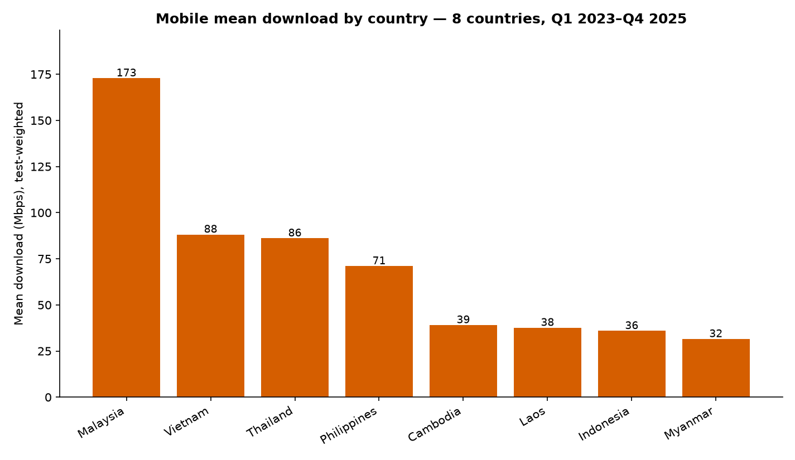
*02 — คู่ของ 01 ฝั่งมือถือ*

*03 — เมืองหลวง vs ค่าเฉลี่ยประเทศ*

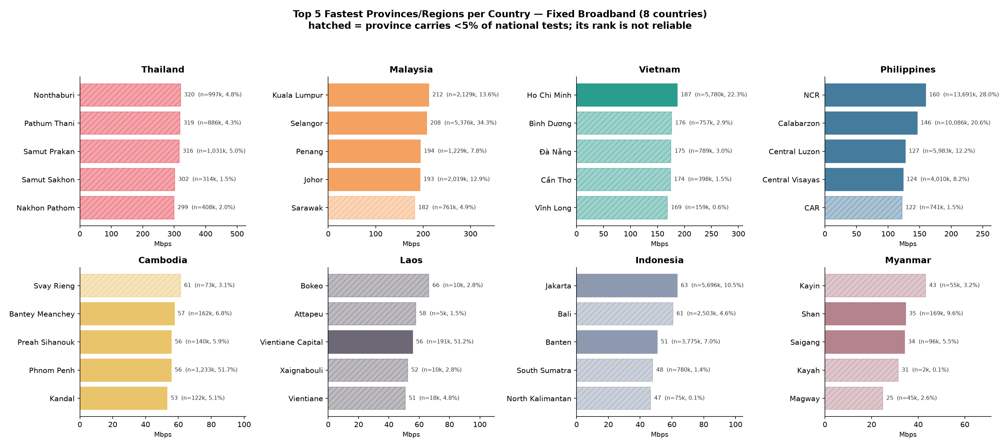
*04 — ท็อป 5 จังหวัดต่อประเทศ (แท่งลายทาง = จังหวัดข้อมูลบาง <5% ของ tests)*

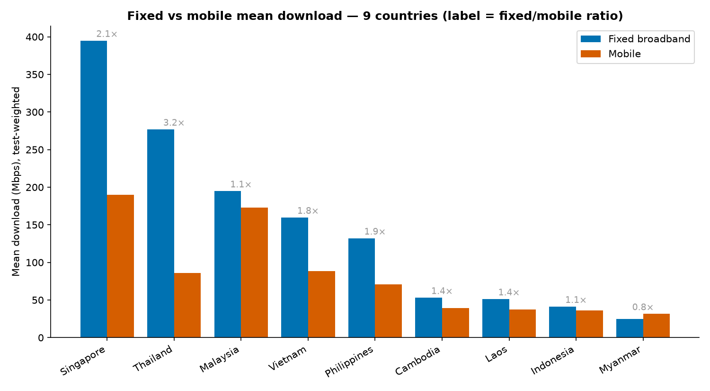
*05 — fixed vs มือถือ ต่อประเทศ*

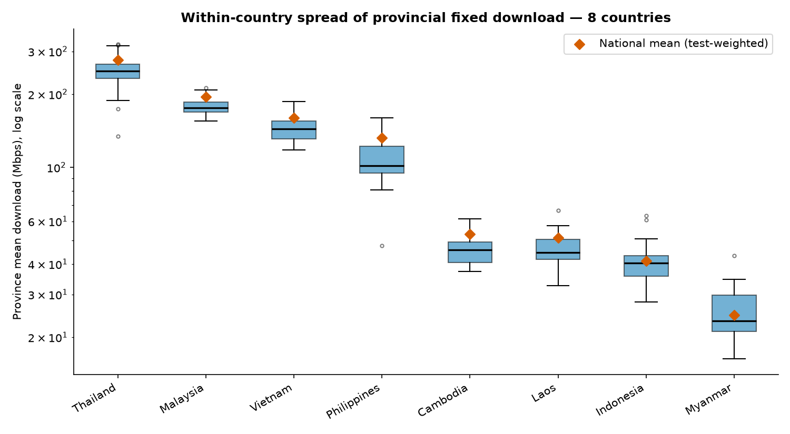
*06 — การกระจายความเร็วรายจังหวัด (boxplot, log scale)*

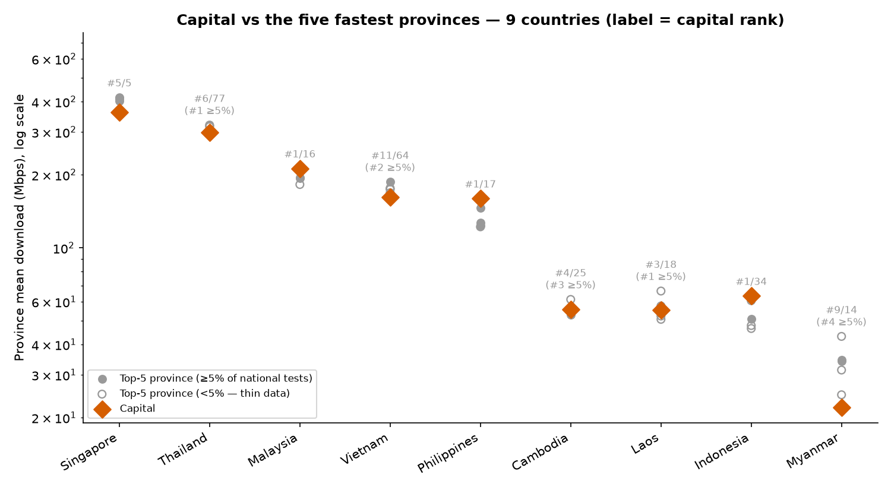
*09 — เมืองหลวงเทียบท็อป 5 จังหวัดเร็วสุด (สิงคโปร์: Central Region อันดับ 5/5 เขต)*

---

## RQ2 — เติบโตแค่ไหน (2023Q1 → 2025Q4)

### RQ2-A. Ookla fixed broadband, median ความเร็วรายจังหวัด, การเติบโต

| country     |   2023Q1 Mbps |   2025Q4 Mbps |   pct_growth |
|:------------|--------------:|--------------:|-------------:|
| Myanmar     |          20.3 |          53.6 |        163.8 |
| Cambodia    |          25.3 |          61.7 |        144.1 |
| Vietnam     |          92.4 |         209.2 |        126.4 |
| Indonesia   |          24.2 |          53.8 |        122.7 |
| Singapore   |         282   |         553.8 |         96.4 |
| Laos        |          32   |          62.2 |         94.4 |
| Malaysia    |         124.6 |         223.6 |         79.5 |
| Thailand    |         207.1 |         294   |         42   |
| Philippines |          96.4 |         119.1 |         23.6 |

**สิงคโปร์ฐานสูงสุดในภูมิภาคอยู่แล้ว (282 Mbps) แต่ยังโต +96.4% เร็วกว่าไทย (+42.0%) และฟิลิปปินส์ (+23.6%)** — ฐานสูงไม่ได้แปลว่าโตช้าเสมอไป

### RQ2-B. NDT7 fixed broadband, median ความเร็วรายจังหวัด, การเติบโต (n = จำนวนจังหวัดที่มีข้อมูล reliable ไตรมาสนั้น)

| country     |   n_2023Q1 |   n_2025Q4 |   2023Q1 Mbps |   2025Q4 Mbps |   pct_growth |
|:------------|-----------:|-----------:|--------------:|--------------:|-------------:|
| Vietnam     |         57 |         55 |          23.4 |          78.6 |        235.5 |
| Malaysia    |         14 |         12 |          57.5 |         130.6 |        127   |
| Singapore   |          3 |          5 |         133.3 |         298.2 |        123.8 |
| Indonesia   |         34 |         32 |          13.6 |          26.4 |         93.2 |
| Laos        |          3 |          3 |          14.8 |          27.8 |         87.3 |
| Cambodia    |          2 |          2 |          17.8 |          26.5 |         48.6 |
| Philippines |         17 |         17 |          46.8 |          64.8 |         38.5 |
| Thailand    |         77 |         67 |          64.4 |          84.8 |         31.7 |
| Myanmar     |          7 |          6 |          11.5 |          14.5 |         26.2 |

⚠️ n เล็กมากในหลายประเทศ (Singapore n=3-5, Cambodia n=2, Laos n=3) — ตัวเลข NDT7 growth นี้อ่อนไหวต่อ province ที่มีข้อมูลน้อย ใช้ Ookla (RQ2-A) เป็นหลักถ้าต้องเลือกแหล่งเดียว

**Source:** `notebooks/comparison/rq2_trends.ipynb` (rerun 2026-08-19, commit `901635b`)

### รูป RQ2 (2 รูป)

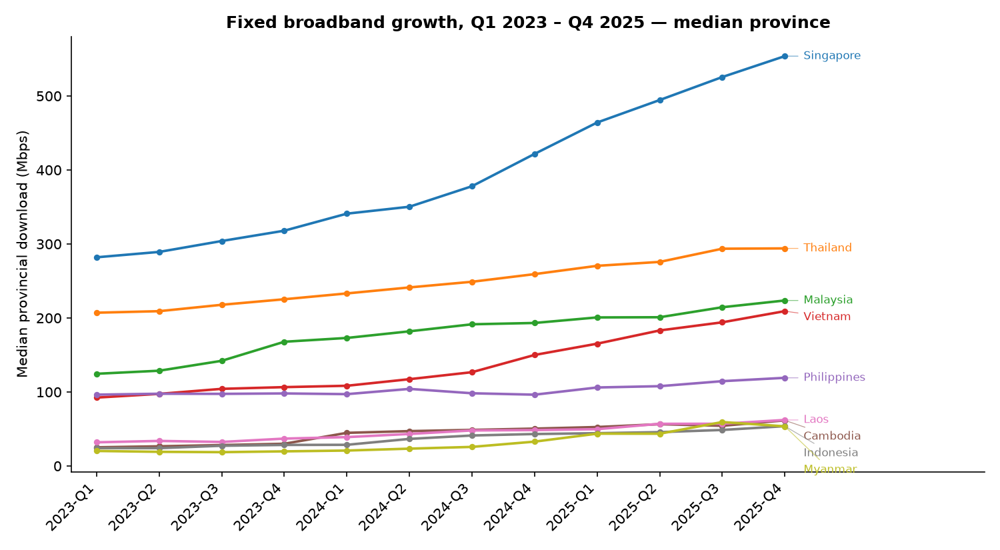
*07 — เส้นทางการเติบโตรายไตรมาส ทุกประเทศโตต่อเนื่อง ไม่มีใครแบน/ลด*

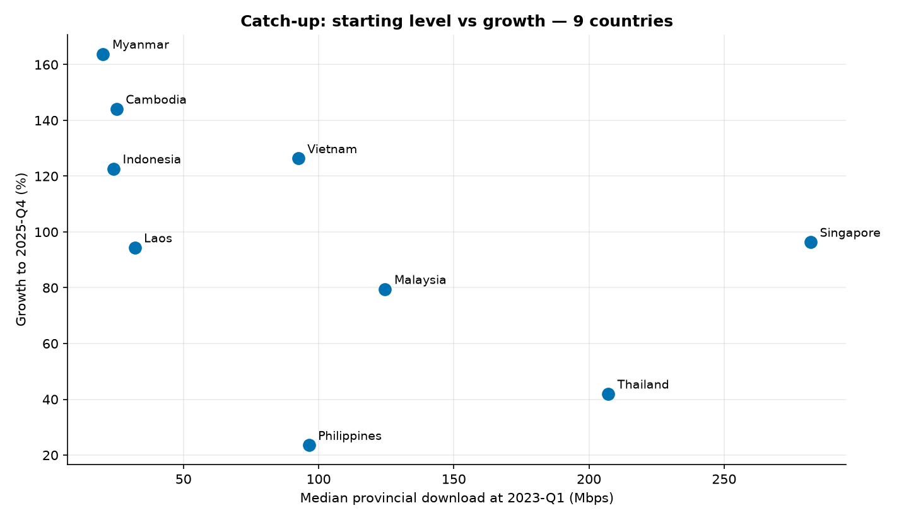
*08 — ความเร็วตั้งต้น vs % การเติบโต (สิงคโปร์ข้อยกเว้นชัดที่สุด)*

---

## RQ3 — ชั่วโมงเร่งด่วน (busy hour 19:00–22:00 vs off-peak 03:00–05:00)

### RQ3-A. สรุป peak-hour ทั้ง 9 ประเทศ

| country     | tz        | busy_hour   |   total_tests |   broadband_busy_mbps |   broadband_offpeak_mbps |   broadband_degr_fixed |   broadband_degr_p10 |   cellular_busy_mbps |   cellular_offpeak_mbps |   cellular_degr_fixed |   cellular_degr_p10 |
|:------------|:----------|:------------|--------------:|-----------------------:|--------------------------:|------------------------:|----------------------:|----------------------:|--------------------------:|------------------------:|----------------------:|
| Thailand    | UTC+7     | 20:00       |      34805933 |                  34.94 |                     39.15 |                    0.893 |                 0.544 |                  7.97 |                     14.33 |                   0.556 |                 0.543 |
| Vietnam     | UTC+7     | 11:00       |      11804903 |                  30.46 |                     49.34 |                    0.617 |                 0.279 |                 15.17 |                     32.33 |                   0.469 |                 0.307 |
| Philippines | UTC+8     | 20:00       |     145765500 |                  24.09 |                     51.92 |                    0.464 |                 0.203 |                  5.83 |                     19.19 |                   0.304 |                 0.175 |
| Singapore   | UTC+8     | 22:00       |      12174460 |                  90.43 |                     72.19 |                    1.253 |                 0.514 |                 49.42 |                     67.78 |                   0.729 |                 0.346 |
| Indonesia   | UTC+7 WIB | 20:00       |     189108236 |                   8.18 |                     11.17 |                    0.732 |                 0.541 |                  8.87 |                     22.28 |                   0.398 |                 0.242 |
| Malaysia    | UTC+8     | 20:00       |       3363921 |                  42.04 |                     62.49 |                    0.673 |                 0.397 |                  9.27 |                     22.05 |                   0.42  |                 0.19  |
| Myanmar     | UTC+6:30  | 21:00       |       1136064 |                   9.01 |                     15.46 |                    0.583 |                 0.2   |                  5.94 |                     22.69 |                   0.262 |                 0.196 |
| Cambodia    | UTC+7     | 12:00       |        420898 |                  15.44 |                     18.26 |                    0.846 |                 0.622 |                  5.53 |                     23.86 |                   0.232 |                 0.122 |
| Laos        | UTC+7     | 20:00       |         66339 |                  16.14 |                     27.08 |                    0.596 |                 0.437 |                  5.89 |                     18.37 |                   0.32  |                 0.281 |

⚠️ **เวียดนามพีค 11:00 น. (เที่ยงวัน) กัมพูชาพีค 12:00 น.** ไม่ใช่ตอนเย็นแบบ 7 ประเทศที่เหลือ — `rq3_bot_diagnostic.png` ชี้ว่าน่าจะเป็น automated test ไม่ใช่พฤติกรรมคนจริง ต้องระวังตอนตีความ RQ3 ของสองประเทศนี้

degr_fixed = อัตราส่วน busy/off-peak หน้าต่างคงที่ 19:00-22:00 vs 03:00-05:00, degr_p10 = อัตราส่วนเดียวกันของ percentile ที่ 10 (10% ช้าสุด) แทน median, <1 = ความเร็วตกช่วงพีค **มือถือตกหนักกว่า broadband ทุกประเทศไม่มีข้อยกเว้น**

**Singapore เป็นข้อยกเว้น: degr_fixed=1.253 (broadband) และ 0.729 (cellular)** — busy สูงกว่า off-peak (>1) ฝั่ง broadband แปลว่าไม่มี congestion แบบประเทศอื่น สอดคล้องกับ NDT7 ที่วัดผ่าน server ในประเทศเดียวกันจริง (city-state, ไม่มีทางไกลข้ามพรมแดน)

**Source:** `outputs/ndt7/comparison/rq3_peakhour_summary.csv` จาก `notebooks/comparison/rq3_peakhour.ipynb` (ไฟล์ CSV แก้ล่าสุด 2026-08-14; notebook rerun 08-19 ใน `901635b` ไม่มีตัวเลขเปลี่ยน)

### RQ3-B. เมืองหลวง vs รอบนอก, อัตราส่วน degradation (⚠️ 8 ประเทศเท่านั้น)

| country     |   broadband_capital |   broadband_rest |   cellular_capital |   cellular_rest |
|:------------|---------------------:|-------------------:|---------------------:|-------------------:|
| Cambodia    |                0.77  |              1.219 |                0.277 |             0.144 |
| Indonesia   |                0.668 |              0.74  |                0.362 |             0.428 |
| Laos        |                0.63  |              0.921 |                0.351 |             0.251 |
| Malaysia    |                0.581 |              0.774 |                0.428 |             0.404 |
| Myanmar     |                0.611 |              0.568 |                0.283 |             0.222 |
| Philippines |                0.486 |              0.453 |                0.254 |             0.353 |
| Thailand    |                0.804 |              0.956 |                0.556 |             0.566 |
| Vietnam     |                0.602 |              0.616 |                0.47  |             0.468 |

**สิงคโปร์ไม่มีในตารางนี้จริง ไม่ใช่แค่คำอ้างในเอกสาร** — เช็คแล้วไม่มีไฟล์ `ndt7_peakhour_capital_singapore.csv` ใน `data/exports/` เลย แต่เหตุผลเดิม "ไม่มี periphery ให้เทียบ" ไม่ถูกต้อง — สิงคโปร์มี periphery ให้เทียบได้จริง RQ1-B (ข้างบน) ใช้ **Central Region** เป็นเมืองหลวงเทียบกับอีก 4 planning region ที่เหลืออยู่แล้ว RQ3 แค่ยังไม่ได้ทำ capital/rest split แบบเดียวกันให้สิงคโปร์ เป็นงานที่ยังไม่ทำ ไม่ใช่ทำไม่ได้ — ต้องถามอาจารย์ว่าจะเพิ่มให้ครบหรือปล่อยไว้ 8 ประเทศ

**กัมพูชาข้อยกเว้น:** rest (1.219) แย่กว่า capital (0.77) ช่วง busy — ตรงข้ามกับประเทศอื่นที่ capital มักแย่กว่า

**Source:** คำนวณใน `notebooks/comparison/rq3_peakhour.ipynb` โดยตรง ไม่มี export CSV แยก

### รูป RQ3 (11 รูป)

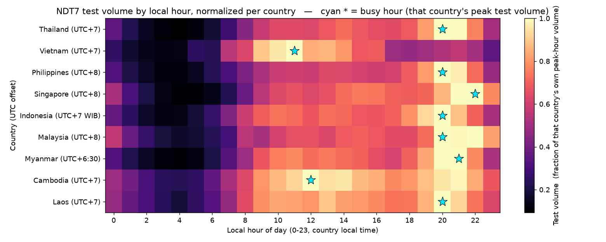
*heatmap ชั่วโมงพีคจริงทั้ง 9 ประเทศ (ดาว = ชั่วโมงพีค)*

*ความเร็ว median รายชั่วโมง 9 แผงย่อย*

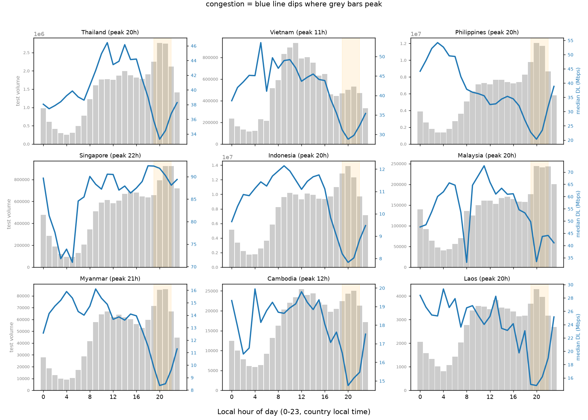
*ปริมาณ test (แท่ง) ทับความเร็ว (เส้น) — cause-effect*

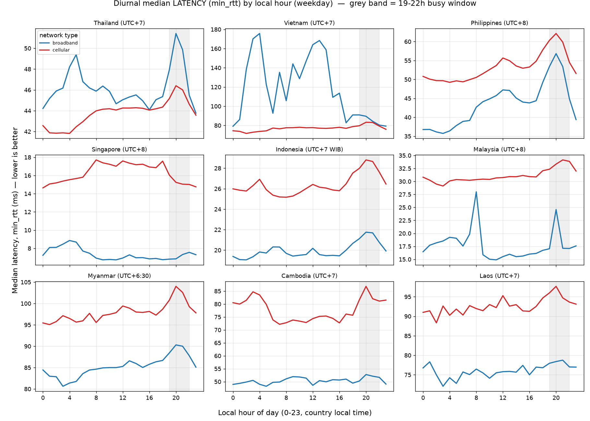
*latency median รายชั่วโมง — หลักฐานที่สองของ congestion*

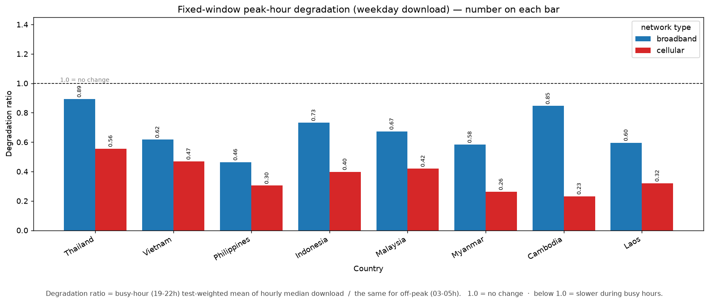
*อัตราส่วน busy/off-peak หน้าต่างคงที่*

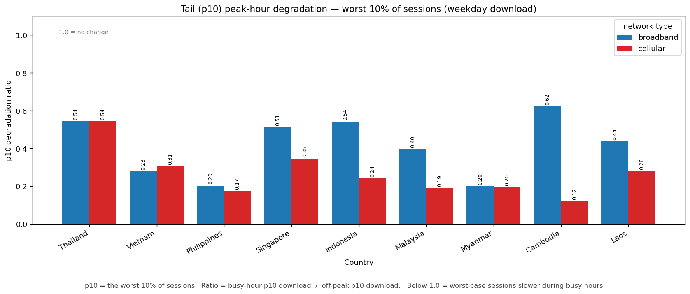
*อัตราส่วนเดียวกันที่ p10 (หางช้าสุด)*

*อัตราส่วนใช้ชั่วโมงพีคจริงของแต่ละประเทศแทนหน้าต่างคงที่*

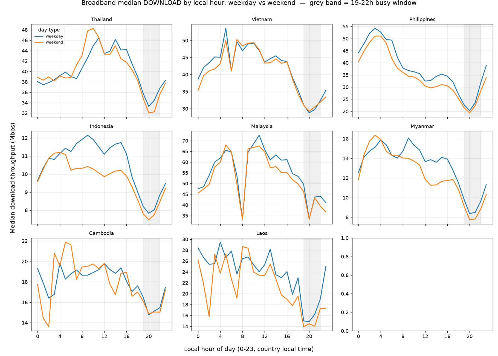
*robustness: วันธรรมดา vs สุดสัปดาห์*

*เมืองหลวง vs รอบนอก รายชั่วโมง (8 ประเทศ)*

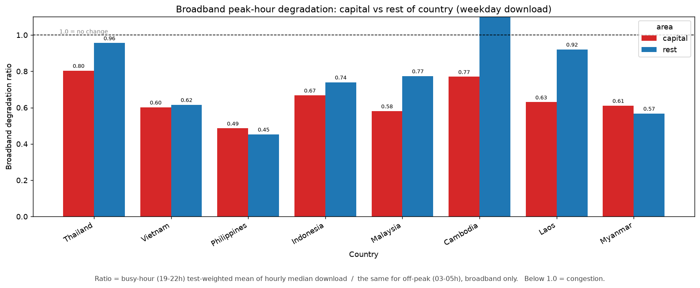
*เวอร์ชันตัวเลขของรูปก่อน (8 ประเทศ)*

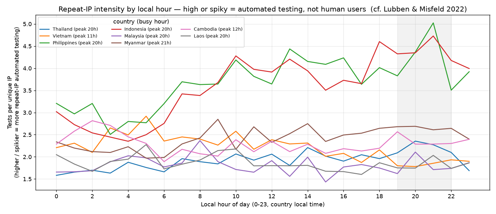
*จำนวน test ต่อ IP รายชั่วโมง — ชี้ bot ในเวียดนาม/กัมพูชา*

---

## RQ4 — โครงสร้างตลาดผู้ให้บริการ (9 ประเทศ ครบสิงคโปร์)

### RQ4-A. ค่ายที่คนใช้เยอะสุด (leader) เทียบค่ายที่เร็วสุด (fastest major, ≥5% share)

| country     | network_type   | label_leader                           |   avg_d_mbps_leader |   share_pct_leader | label_fastest                           |   avg_d_mbps_fastest |   leader_vs_fastest_ratio |
|:------------|:---------------|:----------------------------------------|---------------------:|--------------------:|:------------------------------------------|-----------------------:|----------------------------:|
| cambodia    | broadband      | Metfone                                |               30.26 |              40.89 | ANGKOR DATA COMMUNICATION (AS38235)     |                31.01 |                      1.02 |
| cambodia    | cellular       | Metfone                                |               18.97 |              66.38 | Smart                                   |                23.9  |                      1.26 |
| indonesia   | broadband      | Telkom Indonesia                       |               18.62 |              49.72 | Biznet                                  |                43.33 |                      2.33 |
| indonesia   | cellular       | Telkomsel                              |               25.47 |              43.52 | Telkomsel                               |                25.47 |                      1    |
| laos        | broadband      | Unitel                                 |               42.7  |              48.83 | Unitel                                  |                42.7  |                      1    |
| laos        | cellular       | Unitel                                 |               22.24 |              50.5  | Unitel                                  |                22.24 |                      1    |
| malaysia    | broadband      | TM (4.0 ASN)                           |              113.06 |              50.28 | TIME dotCom                             |               196.27 |                      1.74 |
| malaysia    | cellular       | U Mobile                               |               44.7  |              35.49 | Maxis                                   |                52.58 |                      1.18 |
| myanmar     | broadband      | Mytel                                  |               10.29 |              15.44 | Global Technology Co., Ltd. (AS133384)  |                22.91 |                      2.23 |
| myanmar     | cellular       | MPT                                    |               24.58 |              29.6  | Nine Communications Company  (AS132167) |                26.65 |                      1.08 |
| philippines | broadband      | PLDT (2.0 ASN)                         |               60.64 |              46.27 | Globe (2.0 ASN)                         |                90    |                      1.48 |
| philippines | cellular       | Smart                                  |               20.83 |              46.56 | DITO                                    |                31.17 |                      1.5  |
| singapore   | broadband      | Singtel Fibre Broadband (AS9506)       |              176.33 |              25.43 | MyRepublic Ltd. (AS56300)               |               300.22 |                      1.7  |
| singapore   | cellular       | SINGTEL MOBILE INTERNET SERV (AS45143) |              103.83 |              37.29 | SINGTEL MOBILE INTERNET SERV (AS45143)  |               103.83 |                      1    |
| thailand    | broadband      | True (3.0 ASN)                         |              114.51 |              28.91 | AIS (4.0 ASN)                           |               125.86 |                      1.1  |
| thailand    | cellular       | True (3.0 ASN)                         |               19.81 |              39.44 | AIS (3.0 ASN)                           |                29.37 |                      1.48 |
| vietnam     | broadband      | Viettel (2.0 ASN)                      |               70.98 |              38.95 | Viettel (2.0 ASN)                       |                70.98 |                      1    |
| vietnam     | cellular       | Viettel                                |               39.44 |              33.55 | Viettel                                 |                39.44 |                      1    |

**สรุป:** ค่ายที่คนใช้เยอะสุดไม่ใช่ค่ายที่เร็วสุด ใน 7/9 ประเทศฝั่ง broadband (ยกเว้น laos, vietnam ที่ leader=fastest) รุนแรงสุดที่อินโดนีเซีย (2.33×) และเมียนมา (2.23×)

**Source:** `data/exports/rq4_leaders.csv`, `data/exports/rq4_fastest_major.csv` จาก `notebooks/comparison/rq4_isp.ipynb` (2026-08-19)

### RQ4-B. ช่องว่างค่ายดีสุด/แย่สุด (ค่ายที่ถือ ≥5% share)

| country     | network_type   | worst_brand                    | best_brand                              |   worst_d |   best_d |   gap_ratio |   n_majors |
|:------------|:---------------|:---------------------------------|:-------------------------------------------|-----------:|----------:|-------------:|-----------:|
| cambodia    | broadband      | EZECOM (2.0 ASN)               | ANGKOR DATA COMMUNICATION (AS38235)     |     19.36 |    31.01 |        1.6  |          4 |
| cambodia    | cellular       | Metfone                        | Smart                                   |     18.97 |    23.9  |        1.26 |          3 |
| indonesia   | broadband      | Telkom Indonesia               | Biznet                                  |     18.62 |    43.33 |        2.33 |          2 |
| indonesia   | cellular       | Indosat (2.0 ASN)              | Telkomsel                               |     17    |    25.47 |        1.5  |          3 |
| laos        | broadband      | LTC                            | Unitel                                  |     25.28 |    42.7  |        1.69 |          3 |
| laos        | cellular       | ETL                            | Unitel                                  |     13.28 |    22.24 |        1.68 |          3 |
| malaysia    | broadband      | Celcom                         | TIME dotCom                             |     44.12 |   196.27 |        4.45 |          5 |
| malaysia    | cellular       | Digi                           | Maxis                                   |     37.66 |    52.58 |        1.4  |          4 |
| myanmar     | broadband      | Mytel                          | Global Technology Co., Ltd. (AS133384)  |     10.29 |    22.91 |        2.23 |          6 |
| myanmar     | cellular       | Mytel                          | Nine Communications Company  (AS132167) |     17.83 |    26.65 |        1.49 |          4 |
| philippines | broadband      | PLDT (2.0 ASN)                 | Globe (2.0 ASN)                         |     60.64 |    90    |        1.48 |          3 |
| philippines | cellular       | Smart                          | DITO                                    |     20.83 |    31.17 |        1.5  |          3 |
| singapore   | broadband      | StarHub Ltd (AS4657)           | MyRepublic Ltd. (AS56300)               |    126.58 |   300.22 |        2.37 |          6 |
| singapore   | cellular       | Simba Telecom Pte Ltd (AS4817) | SINGTEL MOBILE INTERNET SERV (AS45143)  |     22.21 |   103.83 |        4.67 |          4 |
| thailand    | broadband      | NT (12.0 ASN)                  | AIS (4.0 ASN)                           |     65.94 |   125.86 |        1.91 |          4 |
| thailand    | cellular       | dtac (3.0 ASN)                 | AIS (3.0 ASN)                           |     18.92 |    29.37 |        1.55 |          3 |
| vietnam     | broadband      | VNPT (2.0 ASN)                 | Viettel (2.0 ASN)                       |     66.71 |    70.98 |        1.06 |          3 |
| vietnam     | cellular       | VNPT                           | Viettel                                 |     29.92 |    39.44 |        1.32 |          3 |

**สิงคโปร์มือถือ 4.67× คือช่องว่างกว้างสุดในงานทั้งหมด** (Simba 22.2 Mbps vs Singtel Mobile 103.8) ตามด้วยมาเลเซีย broadband 4.45× (Celcom vs TIME dotCom)

**Source:** `data/exports/rq4_within_gap.csv`

### RQ4-C. HHI (Herfindahl-Hirschman Index)

| country     |   HHI_broadband |   HHI_mobile |
|:------------|-----------------:|--------------:|
| Laos        |             3640 |          4427 |
| Vietnam     |             3239 |          3078 |
| Philippines |             2818 |          4214 |
| Indonesia   |             2564 |          3346 |
| Malaysia    |             2989 |          2627 |
| Singapore   |             1911 |          2630 |
| Cambodia    |             2094 |          5033 |
| Thailand    |             2245 |          3250 |
| Myanmar     |              706 |          2630 |

**ตรวจสอบสองรอบ** — คำนวณใหม่เองจาก `data/exports/ndt7_isp_<country>_quarterly.csv` (raw per-ASN-per-quarter) ตามสูตรของ `rq4_isp.ipynb` เป๊ะ (as_name exact-match inheritance + case-insensitive base-name merge ที่ครอบคลุมกรณี StarHub Ltd/Starhub Ltd ที่เอกสารเดิมระบุไว้) ได้ตรงกับ `paper_draft.md` §7.1 ตาราง 9 ในทุกช่อง (18 ช่อง broadband+mobile × 9 ประเทศ) คลาดแค่ปัดเศษ — ไม่ได้ก็อปมาจากเอกสาร คำนวณเองจาก raw data สองรอบอิสระ

5 จาก 9 ประเทศเกิน 2500 (concentrated ตามเกณฑ์มาตรฐาน) ฝั่งมือถือทุกประเทศเกิน 2500 หมด กัมพูชามือถือสูงสุด (5033, Metfone 66.4%) เมียนมา broadband ต่ำสุด (706, ไม่มีเจ้าตลาดชัดเจน)

### รูป RQ4

*ช่องว่างค่ายดีสุด/แย่สุดทุกประเทศ×เครือข่าย รวมในรูปเดียว*

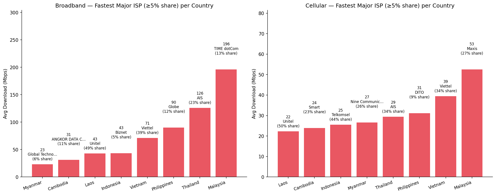
*ความเร็วค่ายที่เร็วสุด แยกประเทศ*

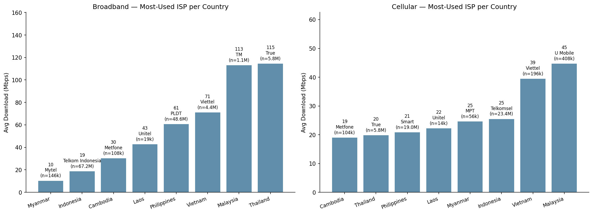
*ความเร็วค่ายที่คนใช้เยอะสุด แยกประเทศ (คู่เทียบรูปก่อน)*

**Market share ตัวอย่าง (จาก 18 ไฟล์ทั้งหมด 9 ประเทศ × 2 เครือข่าย เลือกโชว์ 2 ที่ HHI ต่างกันชัด):**

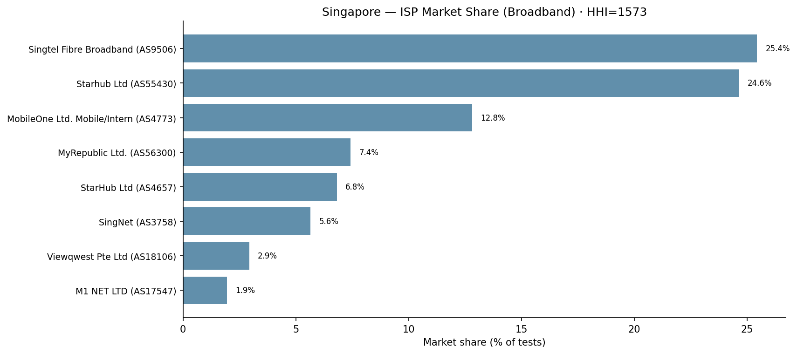
*สิงคโปร์ broadband — HHI ต่ำสุดอันดับ 2 ของงาน (1911), 5 ค่ายแบ่งตลาด*

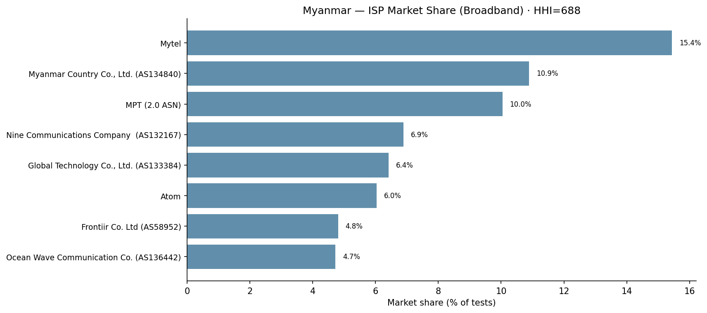
*เมียนมา broadband — HHI ต่ำสุดในงาน (706) แต่ไม่ใช่เพราะแข่งขันดี คือไม่มีเจ้าตลาดชัดเจนในตลาดที่ช้าที่สุดในภูมิภาค*

**Top5 ตัวอย่าง (จาก 9 ไฟล์):**

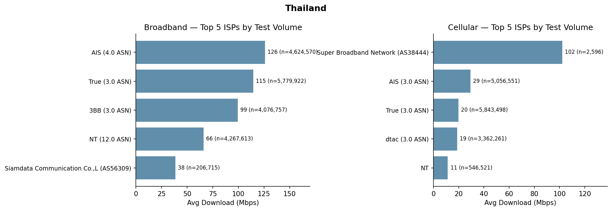
*ไทย — 5 ค่ายบนตามปริมาณ test, broadband+cellular*

---

## Bonus — App Success Rate (median-based), ข้อมูลใหม่ 2026-08-20

สูตร: success_rate = min(city median download / เกณฑ์แอป, 1) × 100 ต่อไตรมาส, เกณฑ์เดียวกับ RQ1 (Voice/HD/UHD/Cloud gaming), แยก national/capital

### ไตรมาสล่าสุด 2025Q4

| country     | quarter   |   nat_Voice |   cap_Voice |   nat_Video HD |   cap_Video HD |   nat_Video UHD |   cap_Video UHD |   nat_Cloud gaming |   cap_Cloud gaming |
|:------------|:----------|-------------:|-------------:|-----------------:|-----------------:|-------------------:|-------------------:|----------------------:|----------------------:|
| Cambodia    | 2025Q4    |         100 |         100 |            100 |            100 |            68.3 |            71.7 |               38.8 |               40.7 |
| Indonesia   | 2025Q4    |         100 |         100 |            100 |            100 |            65.2 |            66.4 |               37.1 |               37.8 |
| Laos        | 2025Q4    |         100 |         100 |            100 |            100 |            91.6 |            98.5 |               52.1 |               55.9 |
| Malaysia    | 2025Q4    |         100 |         100 |            100 |            100 |           100   |           100   |              100   |              100   |
| Myanmar     | 2025Q4    |         100 |         100 |            100 |            100 |            47   |            48.5 |               26.7 |               27.6 |
| Philippines | 2025Q4    |         100 |         100 |            100 |            100 |           100   |           100   |               78.6 |               78   |
| Singapore   | 2025Q4    |         100 |         100 |            100 |            100 |           100   |           100   |              100   |              100   |
| Thailand    | 2025Q4    |         100 |         100 |            100 |            100 |           100   |           100   |              100   |              100   |
| Vietnam     | 2025Q4    |         100 |         100 |            100 |            100 |           100   |           100   |               93.8 |               81.6 |

ชุดข้อมูลเต็ม 8 ไตรมาส (2024Q1–2025Q4) อยู่ที่ `outputs/app_success_rate_median/quarterly_app_success_median.csv`

**Source:** commit `64970b8`, 2026-08-20, Pakkapon (ทีม) — ไม่ได้ทับซ้อนกับ RQ1-A/B/C ข้างบน (ใช้ city median ไม่ใช่ tile-weighted average, cover เฉพาะ 2024-2025 ไม่ใช่ 2023-2025)

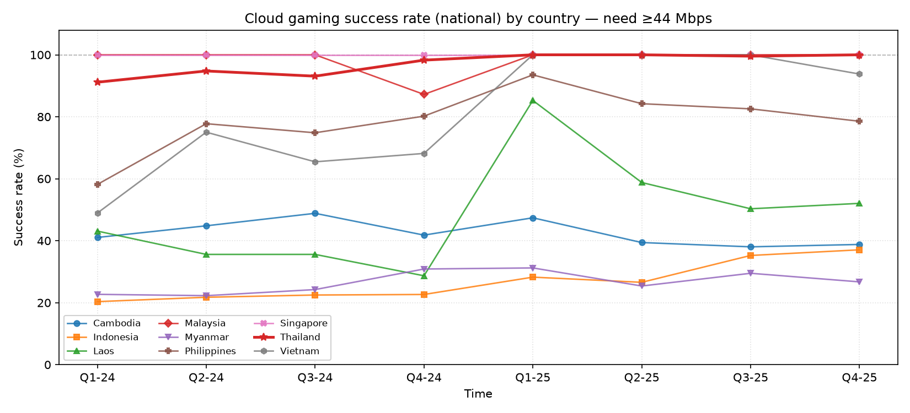
*Cloud gaming success rate รายไตรมาส ทั้งประเทศ*

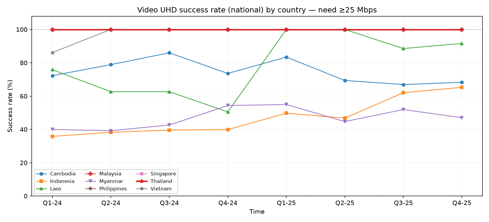
*Video UHD success rate รายไตรมาส ทั้งประเทศ*

---

## Stat Tests — ความต่างข้ามประเทศมีนัยสำคัญจริงไหม

ทุกตัวเลขในหัวข้อนี้คำนวณจาก `scripts/build_stat_tests.py` (รันสด 2026-08-20) อ่าน
`ookla_*_province_quarterly.csv` ทั้ง 9 ประเทศตรง (province-quarter, `is_reliable=True`
เท่านั้น) ไม่ผ่านไฟล์เอกสารใดๆ ผลดิบอยู่ที่ `outputs/stat_tests/`

**Kruskal-Wallis omnibus** — ทดสอบว่า `avg_d_mbps` ต่างกันข้าม 9 ประเทศจริงไหม (n=3,222
province-quarter, k=9): **H=2810.1, p<0.001** ปฏิเสธ null ที่ว่าทุกประเทศมาจาก distribution
เดียวกันได้ชัดเจน ไม่แปลกใจเพราะเห็นจากตารางค่าเฉลี่ยด้านบนอยู่แล้วว่าห่างกันเป็น 10 เท่า
แต่มีไว้ยืนยันว่าความต่างนี้ไม่ใช่ noise

**Mann-Whitney U รายคู่ (36 คู่) + Holm correction** — **35 จาก 36 คู่** ต่างกันอย่างมีนัยสำคัญ
(p_holm < 0.05) คู่เดียวที่ **ไม่ต่าง**กันคือ **กัมพูชา (median 45.7 Mbps) vs ลาว (median 44.3
Mbps)**, p_holm=0.815 — สองประเทศนี้อยู่ในกลุ่มความเร็วเดียวกันจริง ไม่ใช่แค่ตัวเลขบังเอิญใกล้กัน
ทุกคู่อื่นที่เหลือ (รวมคู่ที่ตัวเลขดูใกล้กันอย่างไทย-สิงคโปร์ 245.6 vs 360.4, p=2.5×10⁻²⁹) ต่างกัน
จริงตามสถิติ

**OLS: mean_dl ~ log(GDP ต่อหัว) + log(1+density) + country fixed effects**
(province-clustered SE, n=270 จังหวัดทั้ง 9 ประเทศ, R²=0.966):
- log(GDP ต่อหัว): coef=15.54, **p<0.001**
- log(1+density): coef=4.89, **p<0.001**

ทั้งสองตัวแปรมีนัยสำคัญทางสถิติหลังคุม country fixed effects แล้ว — จังหวัดที่รวยกว่าและหนาแน่นกว่า
เร็วกว่าจริง ไม่ใช่แค่เพราะอยู่ประเทศไหน (R² สูงมากเพราะ country dummy ดูดความแปรปรวนส่วนใหญ่ไป
เนื่องจากช่องว่างระหว่างประเทศใหญ่กว่าช่องว่างภายในประเทศมาก)

**Spearman rank correlation, Ookla fixed UHD pass% vs NDT7 fixed UHD pass%, ข้าม 9 ประเทศ:
ρ=0.89, p=0.001** — คำนวณสดจากทั้งสองแหล่งข้อมูลอิสระ ยืนยันตัวเลขเดิมใน RQ1 ข้างบน (ρ=0.90,
คลาดกันแค่ปัดเศษจากวิธี resample เทียบ) สองแพลตฟอร์มจัดอันดับประเทศตรงกันสูงมาก ไม่ใช่เรื่องบังเอิญ

**Source:** `scripts/build_stat_tests.py`, output ที่ `outputs/stat_tests/{mannwhitney_pairwise.csv, ols_summary.txt, summary.json}`

---

## Provenance table (ไฟล์ต้นทาง → git date)

| Section | Script/Notebook | Export CSV | Last touched (git) |
|---|---|---|---|
| RQ1 | `rq1_thresholds_ookla.ipynb`, `rq1_thresholds_ndt7.ipynb` | `ookla_*_province_quarterly.csv` | 2026-08-19 |
| RQ2 | `rq2_trends.ipynb` | (in-notebook) | 2026-08-19 |
| RQ3 | `rq3_peakhour.ipynb` | `rq3_peakhour_summary.csv` | 2026-08-14 (notebook rerun 08-19, no diff) |
| RQ4 | `rq4_isp.ipynb` | `rq4_leaders.csv`, `rq4_fastest_major.csv`, `rq4_within_gap.csv` | 2026-08-19 |
| RQ4 HHI | (recomputed, this file) | `ndt7_isp_<country>_quarterly.csv` | 2026-08-19 |
| Bonus | (teammate script) | `quarterly_app_success_median.csv` | 2026-08-20 |

## ⚠️ ยังไม่ยืนยัน / ต้องคุยกับอาจารย์

1. ~~RQ3-B สิงคโปร์หายจริง เชิงโครงสร้าง~~ **แก้แล้ว 2026-08-20** — สิงคโปร์มี periphery ให้เทียบได้จริง (RQ1-B ใช้ Central Region เป็นเมืองหลวงเทียบกับ 4 planning region ที่เหลือ) RQ3 แค่ยังไม่ได้ทำ capital/rest split แบบเดียวกัน เป็นงานที่ยังไม่ทำ ไม่ใช่ทำไม่ได้ — คำถามเหลือแค่: จะเพิ่มให้ครบ 9 ประเทศไหม หรือปล่อย RQ3 ไว้ที่ 8
2. **RQ2-B NDT7 growth n เล็กมาก** (Singapore n=3-5, Cambodia n=2) — ตัวเลขไม่มั่นคง แนะนำใช้ RQ2-A (Ookla) เป็นหลักในการเขียน
3. ~~`outputs/mlab/server_site/...` path ผิด~~ **แก้แล้ว** — แก้ทั้งใน `AINTEC_2026_fixed.docx` (path จริง `outputs/ndt7/mlab_server/01_top8_server_share_by_country.png`) แล้ว
4. **Bullet order สลับใน docx (RQ1, รูป 02/03/05)** — text "เหมาะเป็นรูปเปิดหัวข้อความเหลื่อมล้ำ..." เคยขาดกลางคำแล้วไปโผล่เป็น bullet ลอย แก้แล้ว 2026-08-20 (`AINTEC_2026_fixed.docx`)
5. **HHI เมียนมา broadband ไม่ตรงกันข้าม tab** — Elle's tab (Data Analysis-Elle) เขียน 703, ตัวเลขยืนยันสองรอบใน RQ4-C ข้างบนคือ **706** (ตรงกับ `paper_draft.md` เดิม) แก้ docx เป็น 706 แล้ว 2026-08-20
